# Praktisch

## Doelstellingen

* Verwerving van een algemeen-taalwetenschappelijke basiskennis, met bijzondere aandacht voor de belangrijkste theorieën en onderzoeksvragen in de syntaxis, semantiek en pragmatiek
* Verwerving van de vaardigheid om eenvoudige taalkundige problemen te analyseren in het kader van de verschillende taalkundige theorieën


## Inbedding in het curriculum

::: {.fragment}
ATW 1: Analytische geletterdheid 

→ Focus op fonetiek, fonologie, morfologie, syntaxis

:::

::: {.fragment}
ATW 2: Theoretische geletterdheid 

→ Vertrekkend vanuit 20e eeuw

* Focus op syntaxis, semantiek, pragmatiek
* Intern perspectief: nadruk op de structuur van taal
* Extern perspectief: nadruk op taalvariatie en -verandering
:::


## Praktisch

* 12 colleges
* Slides + aanvullende lectuur beschikbaar op **Toledo**
*  Colleges worden opgenomen (onder voorbehoud van goed werkende technische infrastructuur)
  * Opnames blijven het hele jaar beschikbaar.

## Evaluatie

* Schriftelijk examen in januari
  * deels kennisvragen
  * deels toepassingsvragen
  * deels inzichtsvragen
* Open antwoorden, geen meerkeuzevragen
* Voorbeeldvragen worden ter beschikking gesteld op toledo

## Docenten

::: columns
::: {.column width="33%"}
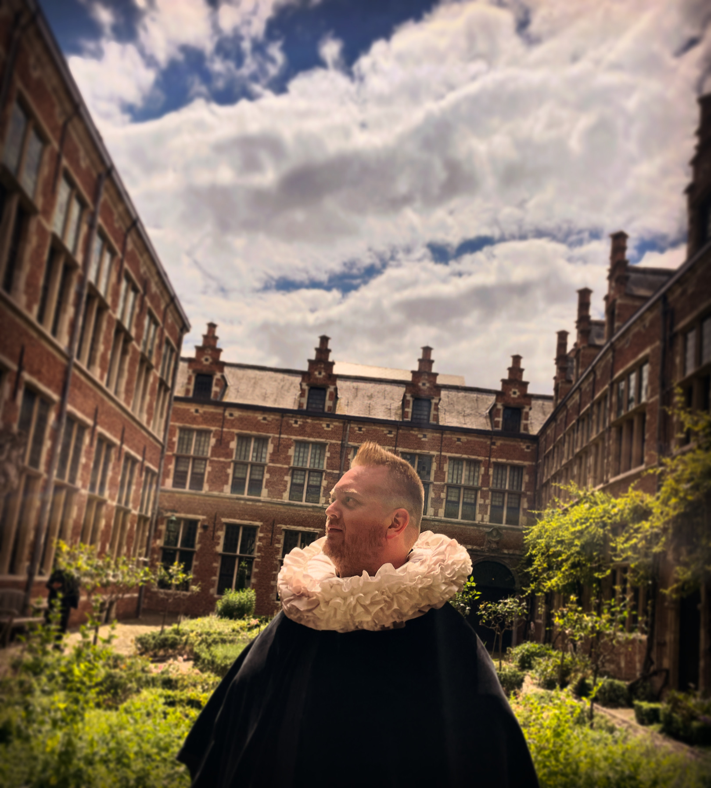{fig-alt="Thomas Van Hoey" height=400 fig-align="left"}

:::{.center}

Thomas Van Hoey

:::

:::

::: {.column width="33%"}
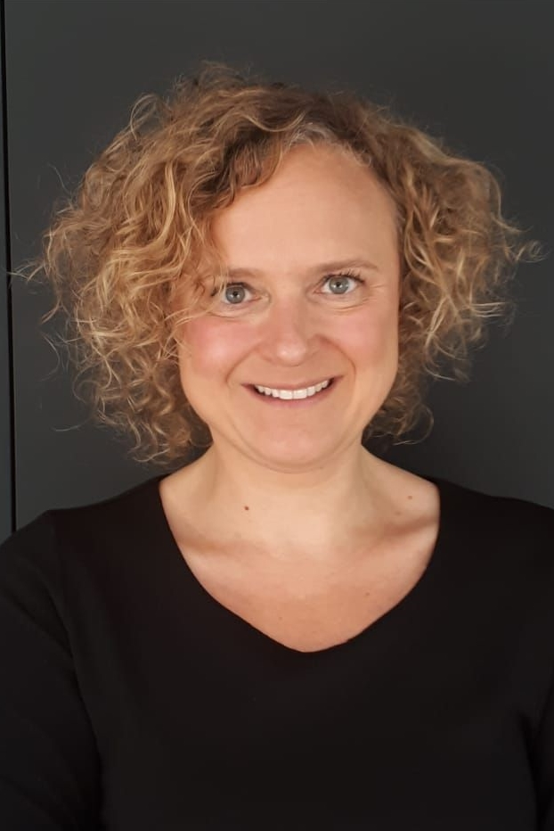{fig-alt="Karen Lahousse" height=400 fig-align="left"}

:::{.center}

Karen Lahousse

:::
:::

::: {.column width="33%"}
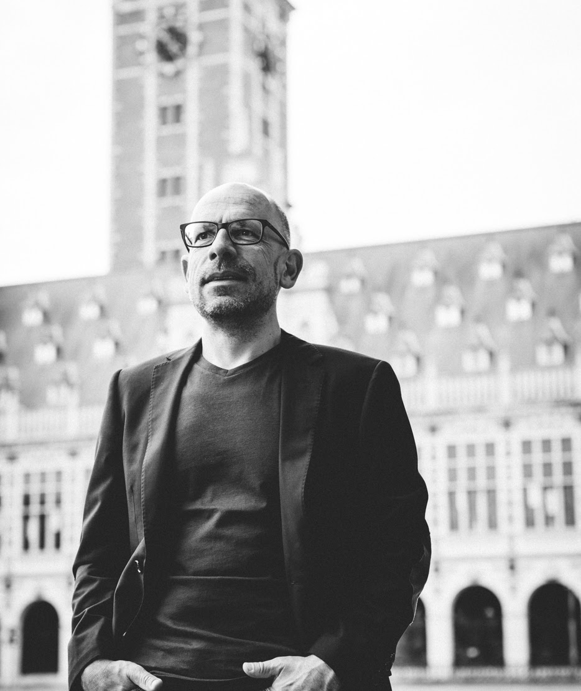{fig-alt="Benedikt Szmrecsanyi" height=400 fig-align="left"}

:::{.center}

Benedikt Szmrecsanyi

:::
:::
:::


## Inhoud colleges

* Inleiding (1 les - vandaag)
* Syntaxis & structuur: 3 colleges (Karen)
* Syntaxis & variatie: 3 colleges (Benedikt)
* Semantiek: 3 colleges (Thomas)
* Pragmatiek: 2 colleges (Thomas)

## Talk

{target="_blank"}](inputfiles/britain.png)

# Een korte geschiedenis van de taalkunde als discipline


## Niveaus van taalkundige beschrijving

```{r}
levels1 <- '

digraph G {
    rankdir="TB"
    graph [fontname = "Sedgwick Ave"];
    node [fontname = "Sedgwick Ave"];
    edge [fontname = "Sedgwick Ave"];

    subgraph cluster_linguistics {
        label = "the scientific study of language";
        labelloc = "t";
        style = "invis";

        taalkunde [shape=rect];
    }

    klank [shape = none];
    structuur [shape = none];
    betekenis [shape = none];

    subgraph cluster_sound {
        style=invis;
        fonetiek [shape = none];
        fonologie [shape = none];
        fonetiek -> fonologie [style=invis];
    }

    subgraph cluster_structure {
        style=invis;
        morfologie [shape = none];
        syntaxis [shape = none];
        morfologie -> syntaxis [style=invis];
    }

    subgraph cluster_meaning {
        style=invis;
        pragmatiek [shape = none];
        semantiek [shape = none];
        pragmatiek -> semantiek [style=invis];
    }

    taalkunde -> klank;
    taalkunde -> structuur;
    taalkunde -> betekenis;
    klank -> fonetiek;
    structuur -> morfologie;
    betekenis -> pragmatiek;
}

'

DiagrammeRsvg::export_svg(DiagrammeR::grViz(levels1)) |>
  cat(file = "inputfiles/levels1.svg")
```


::: columns
::: {.column width="50%"}
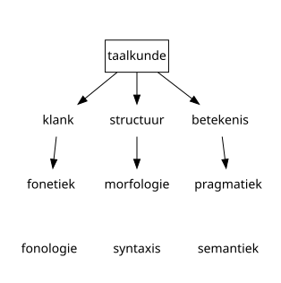


:::

::: {.column width="50%"}
* fonologie: klank
* morfologie: woordstructuur
* syntaxis: zinsstructuur
* semantiek: woordbetekenis, en hoe die te combineren tot een groter betekenisgeheel
* pragmatiek: de betekenis van taaluitingen in een gebruikscontext (discours)

:::
:::


## De Indische traditie

::: columns
::: {.column width="60%"}

Traditioneel wordt Pāṇini beschouwd als de eerste taalkundige.
Zijn *Aṣṭādhyāyī* is een grammatica van het Sanskriet, die bestaat uit 3996 versregels, of sūtra's.

De meeste van die verzen hebben te maken met structurele vormingsregels (fonologie, morfologie, syntaxis).


:::

::: {.column width="40%"}


:::
:::


## De Indische traditie


Enkele termen die je soms nog tegenkomt die uit deze traditie stammen.


::: {.fragment}
Fonologie

* [sandhi]{.alert2}: *√bhū* 'zijn'; *√bhū* + *-a-* + *-ti* \> *bhavati* 'hij is'
* [svarabhaktivocaal]{.alert2}: \<melk\> \[mɛl**ə**k\]

:::

::: {.fragment}
Morfologie

* [tatpuruṣa]{.alert2}samenstelling: endocentrisch, eerste element zegt iets over het tweede element, bv. *komma-neuker*, *mieren-neuker* 
* [dvandva]{.alert2}samenstelling: A en B, bv. *singer-songwriter*
* [bahuvrīhi]{.alert2}samenstelling: exocentrisch, eerste element zegt iets over het tweede element, bv. *rood-borstje*, *dom-oor*

:::

## Griekenland en Rome

* Poëtische en retorische doeleinden, filosofie.
* Plato: basisonderscheid onderwerp-gezegde
* Dionysius Thrax: acht woordsoorten 
  * substantief, verbum, participium, artikel, pronomen, prepositie, adverbum, conjunctie

## Middeleeuwen en renaissance

Zeven vrije kunsten:

* [trivium]{.alert2}: grammatica, logica, retorica
* quadrivium: wiskunde, geometrie, muziek, astronomie

::: {.fragment}

Aandacht voor andere talen naast het Grieks en het Latijn; standaardisatieproces van spreek- en schrijftaal

:::

::: {.fragment}
Speculatieve grammatica's en vergelijkende taalkunde

* Becanus' *Origines Antwerpianae*: Diets / Duyts / Douts = d'oudste taal
* ook al verworpen door tijdgenoten, bv. Justus Lipsius

:::


## Vergelijkende taalkunde (18de-19de eeuw)

::: columns
::: {.column width="80%" .smaller}


> The Sanscrit language, whatever be its antiquity, is of a wonderful structure; more perfect than the Greek, more copious than the Latin, and more exquisitely refined than either, yet bearing to both of them a stronger affinity, both in the roots of verbs and the forms of grammar, than could possibly have been produced by accident; so strong indeed, that no philologer could examine them all three, without believing them to have sprung from some common source, which, perhaps, no longer exists; there is a similar reason, though not quite so forcible, for supposing that both the Gothic and the Celtic, though blended with a very different idiom, had the same origin with the Sanscrit; and the old Persian might be added to the same family.
>
> William Jones (1786)


:::

::: {.column width="20%"}

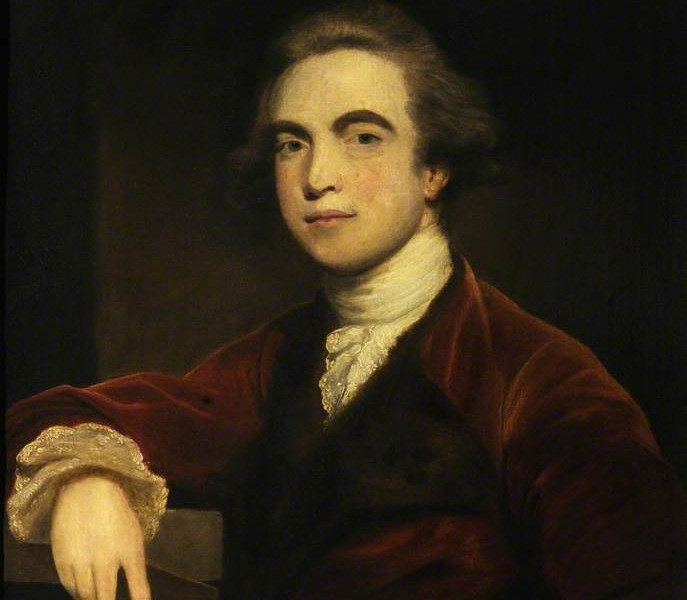


:::
:::

## Vergelijkende taalkunde (18de-19de eeuw)

Interesse in cognaten en taalverwantschap leidt tot inzichten als de [Wet van Grimm]{.alert2}. Voornamelijk de groep van [neogrammatici]{.alert2} ([Junggrammatiker]{.alert2}) wordt geassocieerd met het ontdekken van deze klankwetten.

```{dot}
digraph {
  rankdir=TB;

  Z [ label = "PIE bh dh gh" ]
  K [label="OGM v ð ɣ"]
  Y [label="PIE p t k"]
  L [label = "OGM f θ χ"]
  X [label = "PIE b d g"]
  M [label = "OGM p t k"]
  
  Z -> K;
  Y -> K [label = "Wet van Verner"];
  Y -> L;
  X -> M;
  Y -> M [label = "na stemloze fricatief"];
  
}
```

## Stamboommodel

```{dot}
graph {
  rankdir=TB;

  A [label = "Proto-Indo-Europees", shape=none]
  B [label = "Proto-Germaans", shape=none]
  C [label = "Romaans", shape=none]
  D [label = "Balto-Slavisch", shape=none]
  E [label = "Keltisch", shape=none]
  F [label = "Noord-Germaans", shape=none]
  G [label = "West-Germaans", shape=none]
  H [label = "Oost-Germaans", shape=none]
  I [label = "Zweeds", shape=none]
  J [label = "Deens", shape=none]
  K [label = "Nederlands", shape=none]
  L [label = "Engels", shape=none]
  M [label = "Duits", shape=none]
  N [label = "Gotisch", shape=none]
  O [label = "Latijn", shape=none]
  P [label = "Italiaans", shape=none]
  Q [label = "Frans", shape=none]
  R [label = "Spaans", shape=none]
  S [label = "Slavisch", shape=none]
  T [label = "Russisch", shape=none]
  U [label = "Pools", shape=none]
  V [label = "Gaelisch", shape=none]
  W [label = "Iers", shape=none]
  X [label = "Brythonisch", shape=none]
  Y [label = "Welsh", shape=none]
  
  A -- B;
  A -- C;
  A -- D;
  A -- E;
  B -- F;
  B -- G;
  B -- H;
  F -- I;
  F -- J;
  G -- K;
  G -- L;
  G -- M;
  H -- N;
  C -- O;
  O -- P;
  O -- Q;
  O -- R;
  D -- S;
  S -- T;
  S -- U;
  E -- V;
  E -- X;
  V -- W;
  X -- Y;
  
}
```

## Stamboommodel


* August Schleicher (1853) meest bekende proponent.
* Doel = genetische classificatie
* Neogrammatici / Junggrammatiker

::: {.fragment}
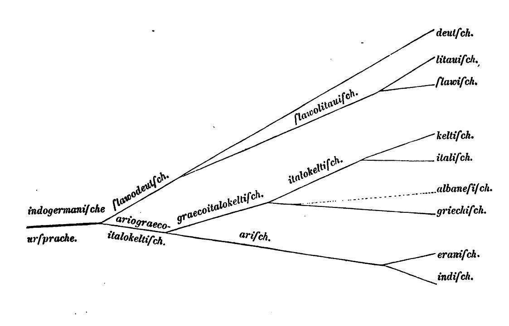{width=70%}

:::

## Stamboommodel

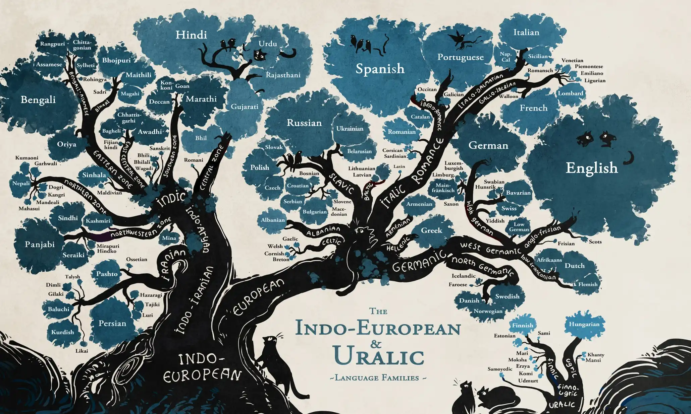


## Golfmodel (*Wellentheorie*)

* Er kwam ook kritiek op het stamboommodel.
* Johannes Schmidt: in plaats van een enkele vooroudertaal, een dialectcontinuüm
* Verklaart bv. waarom de tweede Germaanse klankverschuiving maar in bepaalde delen van de woordschat in verschillende dialecten voorkwamen.
* We zien de na-effecten in [isoglossen.]{.alert2}

::: {.fragment}
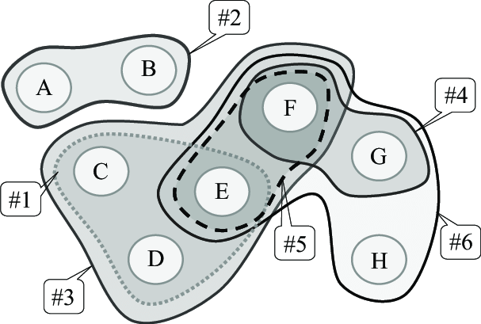

:::


## Structuralisme (begin 20ste eeuw)

::: columns
::: {.column width="80%" .fragment data-fragment-index="1"}

* Traditioneel beginpunt: Ferdinand de Saussure - *Cours de linguistique générale* (1916)
* [signifiant]{.alert2} vs. [signifié]{.alert2}
* *"Un système où tout se tient"* (Antoine Meillet): De betekenis van taaltekens wordt bepaald
door de andere tekens binnen de taalstructuur
* Kernidee: [distinctieve verschillen]{.alert2}

:::

::: {.column width="20%" .fragment data-fragment-index="0"}


:::
:::


## Descriptieve taalkunde (vroege 20ste eeuw)

::: columns
::: {.column width="80%" .fragment data-fragment-index="1"}

* Studie van inheemse Amerikaanse talen, met nadruk op de verschillen
* Linguïstische relativiteit: grammaticale systemen en taalgebruik beïnvloeden de perceptie
* Kernidee: [taal is beschrijving]{.alert2}

:::

::: {.column width="20%" .fragment data-fragment-index="0"}

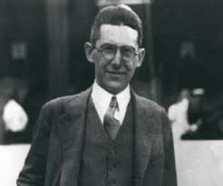

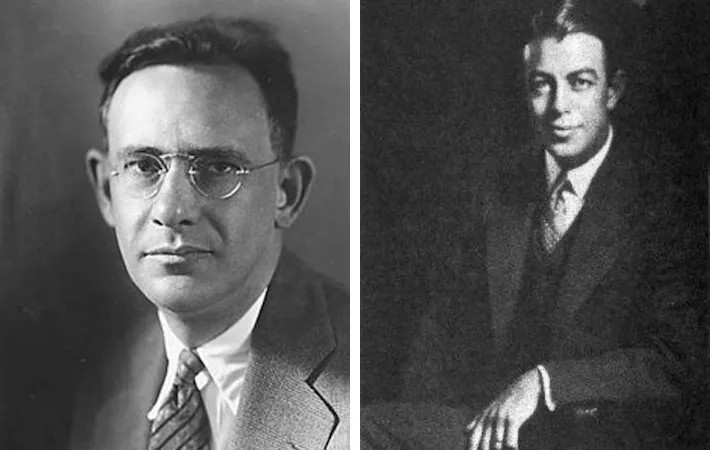


:::
:::


## Generatieve grammatica (1950 - nu)


::: columns
::: {.column width="80%" .fragment data-fragment-index="1"}

* [Universele grammatica]{.alert2}
  * Grammatica als een regelgebaseerd systeem dat grammaticale zinnen (uitsluitend) genereert voor een bepaalde taal
  * [competence]{.alert2} vs. [performance]{.alert2}
  * linguïstische [universalia]{.alert2}
  * Behoefte aan [formalisering]{.alert2} en explicitering
* [LAD]{.alert2}, het Language Acquisition Device
  * ogenschijnlijke discrepantie tussen de complexiteit van natuurlijke talen en het gemak waarmee kinderen die talen leren.
  * taal is aangeboren
  

:::

::: {.column width="20%" .fragment data-fragment-index="0"}


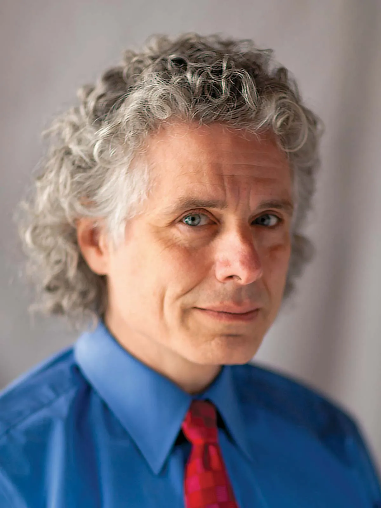


:::
:::

## Generatieve grammatica (1950 - nu)


* Verschillende evoluties
  * Transformational Grammar (1950-1965): deep structures, surface realizations
  * Standard Theory (en de Extended Standard Theory) (1965-1980): rol semantiek in het model
  * [Government and Binding]{.alert2} Theory (1980-1985): taal bestaat uit modules (X-bar, Case, Theta)
  * [Principles and Parameters]{.alert2} (1985-1995): universele principes, taalspecifieke parameters
  * Minimialist Program (1995-nu): architectuur taal zo klein mogelijk, (phase theory)


  
## Functioneel-cognitieve grammatica (1980 - nu)


::: columns
::: {.column width="80%" .fragment data-fragment-index="1"}

* Reactie tegen de isolering van de grammatica
* Taal is niet autonoom, maar ingebed
  * in zijn gebruikscontext
  * in de algemene cognitieve capaciteiten van de mens
* Systemic functional linguistics (Michael Halliday)
* [Cognitive linguistics]{.alert2} (George Lakoff, Eleanor Rosch)


:::

::: {.column width="20%" .fragment data-fragment-index="0"}

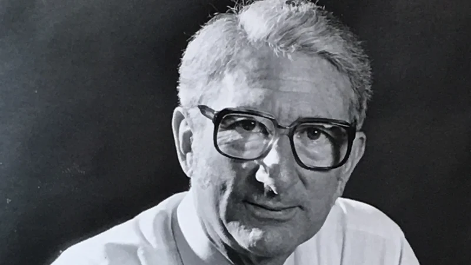

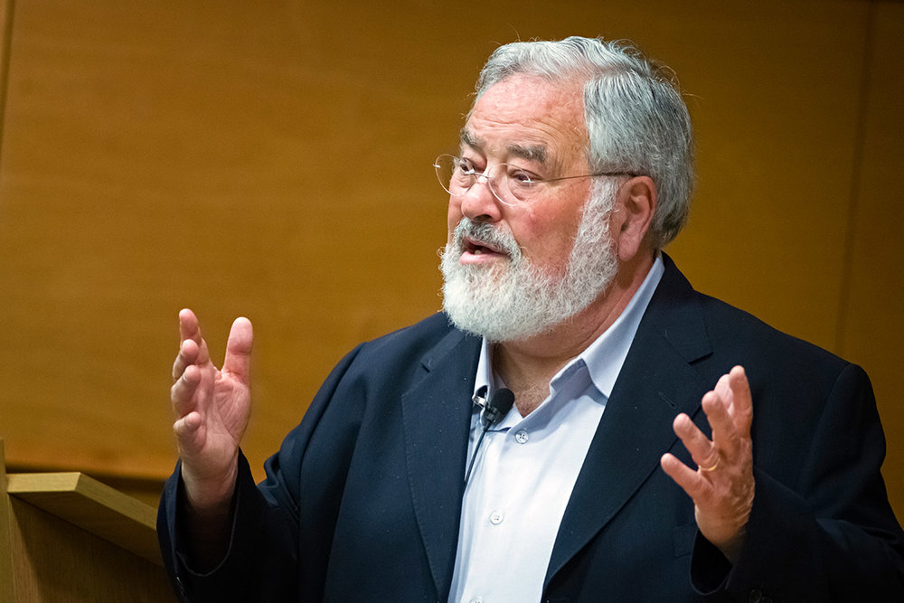

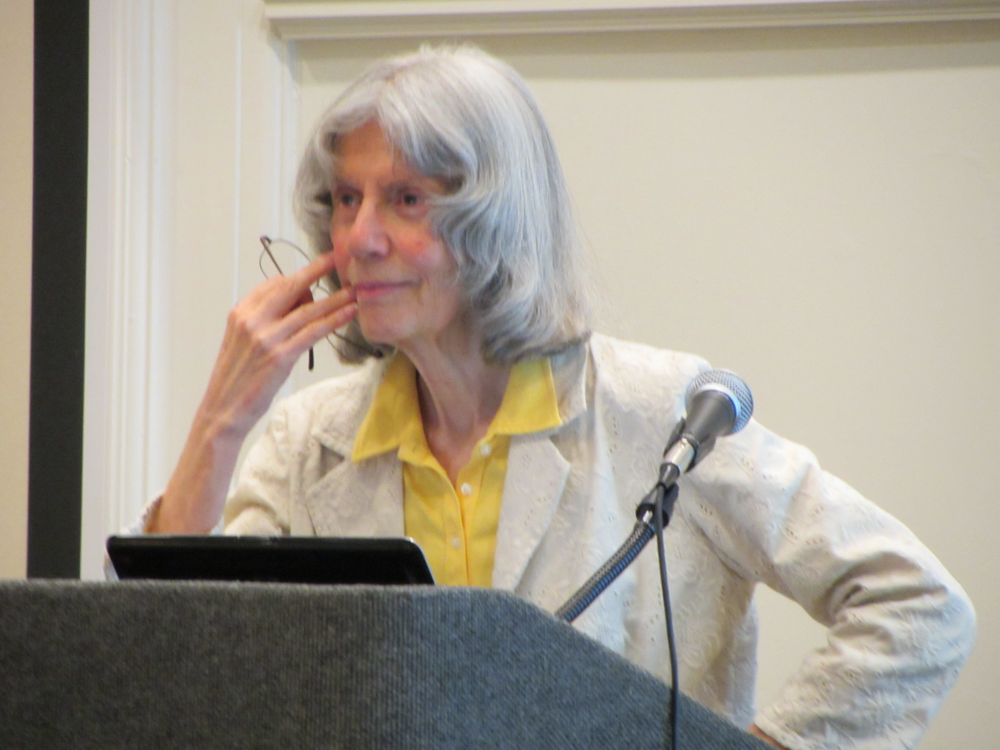


:::
:::

## Taalkundig empirisme (1980s - nu)

::: columns
::: {.column width="80%" .fragment data-fragment-index="1"}

* Opkomst van experimenteel en corpuslinguïstisch onderzoek
  * beschikbaarheid van digitale tekstverzamelingen
  * toenemende mogelijkheden voor breedschalige datagerichte analyse
  * methode bij uitstek voor beschrijving van taalgebruik (vs. introspectie voor analyse van taalstructuur)
  * nadruk op *reproducibility* en *replicability*
* Bekende corpora
  * [BNC]{.alert2}: British National Corpus
  * [COCA]{.alert2}: Corpus of Contemporary American English

:::

::: {.column width="20%" .fragment data-fragment-index="0"}

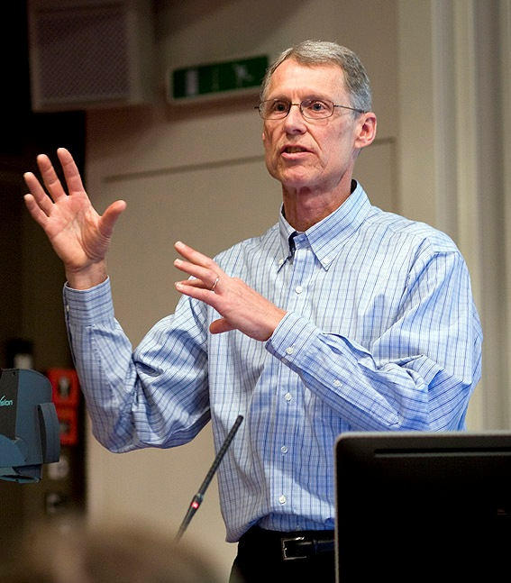

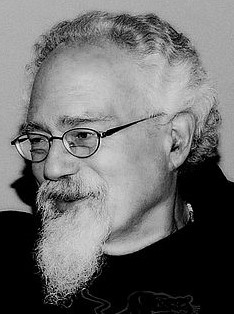


:::
:::


## de "Quantitative turn"

::: columns
::: {.column width="80%" .fragment data-fragment-index="1"}

* Belang van statistiek
  * linguïstische regelmaat wordt gevat in termen van [waarschijnlijkheid]{.alert2} (in plaats van deterministische regels)
  * taalkunde als exacte(re) wetenschap: hypotheses die getoetst worden aan experimentele observaties door middel van statistische methodes
    * STEM zou uitgebreid kunnen worden tot MELTS
* Methodologische uitbreiding
  * t-test, ANOVA
  * [Regressieanalyses]{.alert2}
  * Bayesiaans modelleren
  

:::

::: {.column width="20%" .fragment data-fragment-index="0"}

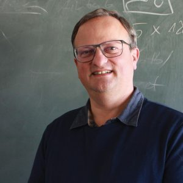

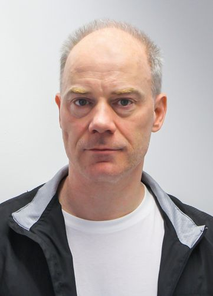


:::
:::


## de "Social turn" (1970s-nu)

::: columns
::: {.column width="80%" .fragment data-fragment-index="1"}

* Taal wordt beïnvloed door sociale relaties, identiteit, verschillen in macht
  * Context, interactie
  * Betekenis is emergent
* Theorieën en frameworks:
  * Discourse Analysis (DA)
  * Critical Discourse Analysis (CDA)
  * [Sociolinguïstiek]{.alert2}

:::

::: {.column width="20%" .fragment data-fragment-index="0"}

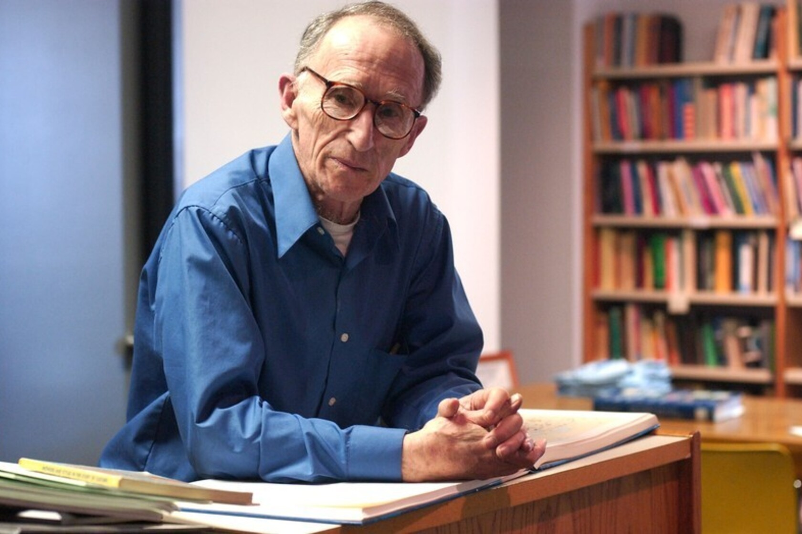

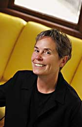

:::
:::

## Psycholinguïstiek

::: columns
::: {.column width="80%" .fragment data-fragment-index="0"}

* Mentale processen die aan de gang zijn bij taal en taalvewerving
* Experimenten (*behavioral data*)
  * fMRI (functional magnetic resonance imaging)
  * EEG (elektro-encefalografie), ERP (event-related potentials)
  * eye-trackers
  * reactietijden
  * [N400 en P600]{.alert2}

:::

::: {.column width="20%" .fragment data-fragment-index="1"}

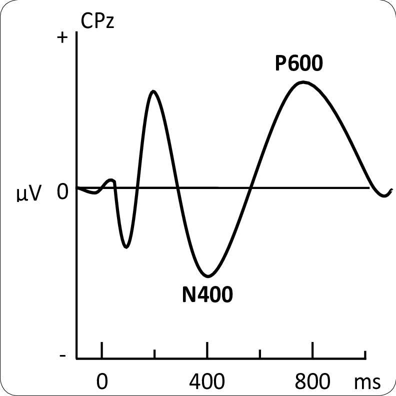

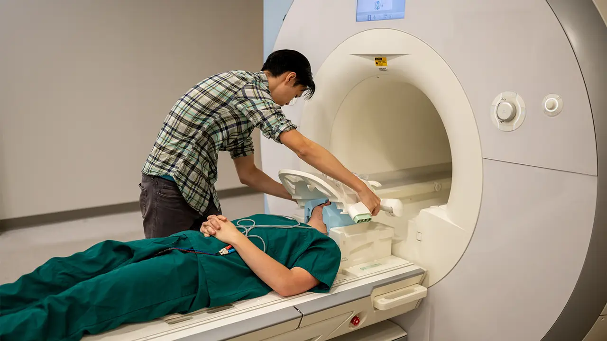

:::
:::


## Neurolinguïstiek


::: columns
::: {.column width="60%"}

* De hersenen zijn het primaire studieobject
  * ontdekken welke regio's actief zijn voor welke taken
* Experimenten
  * fMRI, EEG, ERP, ...

:::

::: {.column width="40%" .fragment}

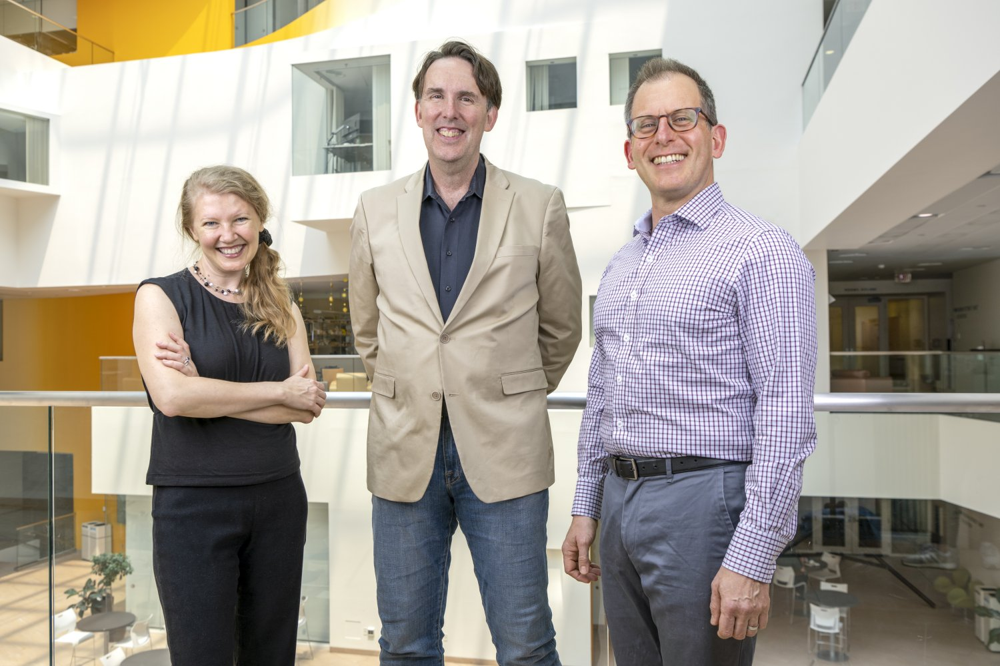

:::
:::


## Taal en wiskunde

::: columns
::: {.column width="80%" .fragment data-fragment-index="1"}


* Sterke vooruitgang op het vlak van kunstmatige intelligentie, zeker met betrekking tot taalverwerking
  * Recente modellen voor taalverwerking gebaseerd op wiskundige representaties
  * Huidige state of the art: taalverwerking met [neurale netwerken]{.alert2}
* Rol van taalkunde:
  * Steeds minder expliciete linguïstische kennis in computationele taalmodellen
  * Is linguïstische kennis impliciet aanwezig, en kunnen we daar iets uit leren voor de linguïstiek in het algemeen?

:::

::: {.column width="20%" .fragment data-fragment-index="0"}

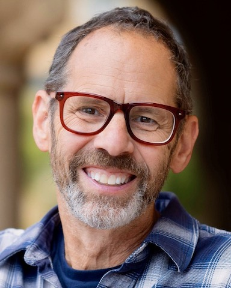

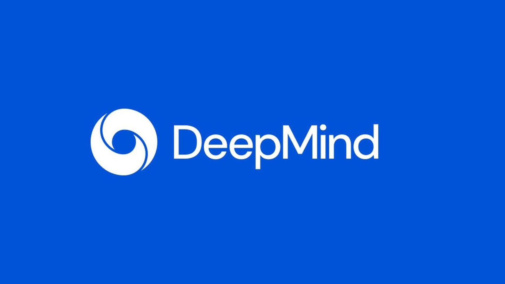

:::
:::

# Verschuivingen binnen de taalkunde

## Niveaus van taalkundige beschrijving

Algemeen


## Niveaus van taalkundige beschrijving

Focus van dit vak


```{r}
levels1 <- '

digraph G {
    rankdir="TB"
    graph [fontname = "Sedgwick Ave"];
    node [fontname = "Sedgwick Ave"];
    edge [fontname = "Sedgwick Ave"];

    subgraph cluster_linguistics {
        label = "the scientific study of language";
        labelloc = "t";
        style = "invis";

        taalkunde [shape=rect];
    }

    klank [shape = none];
    structuur [shape = none];
    betekenis [shape = none];

    subgraph cluster_sound {
        style=invis;
        fonetiek [shape = none];
        fonologie [shape = none];
        fonetiek -> fonologie [style=invis];
    }

    subgraph cluster_structure {
        style=invis;
        morfologie [shape = none];
        syntaxis [shape = none, fontcolor="#9a2515"];
        morfologie -> syntaxis [style=invis];
    }

    subgraph cluster_meaning {
        style=invis;
        pragmatiek [shape = none, fontcolor="#9a2515"];
        semantiek [shape = none, fontcolor="#9a2515"];
        pragmatiek -> semantiek [style=invis];
    }

    taalkunde -> klank;
    taalkunde -> structuur;
    taalkunde -> betekenis;
    klank -> fonetiek;
    structuur -> morfologie;
    betekenis -> pragmatiek;
}

'

DiagrammeRsvg::export_svg(DiagrammeR::grViz(levels1)) |>
  cat(file = "inputfiles/levels2.svg")
```

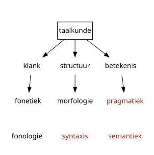

## Fonetiek en fonologie 

* Onderscheid fonetiek / fonologie
  * fonetiek: klanken als akoestisch en articulatorisch object
  * fonologie: klanken op abstract functioneel niveau (betekenisonderscheid)
* */be:r/ vs. /pe:r/*
* Structuralisme


## Morfologie

* Woordstructuur
* morfeem = kleinste betekenisvolle eenheid
* *chocolaa-tje-s*, *ge-wandel-d*
* Structuralisme, Descriptieve taalkunde


## Syntaxis

::: columns
::: {.column width="60%"}

* Hoe kunnen woorden tot zinnen worden samengevoegd?
* Belangrijkste onderzoeksobject van de generatieve grammatica
  * regelgebaseerd
  * [hiërarchisch]{.alert2}
  * formeel, autonoom systeem (onafhankelijk van betekenis)
* breed scala aan syntactische theorieën en representaties zien het licht in de loop van de 20ste eeuw
  * voornamelijk Generatieve Grammatica
  * $\leftrightarrow$ Cognitieve aanpak: grammatica kan niet losgekoppeld worden van betekenis

:::

::: {.column width="40%"}

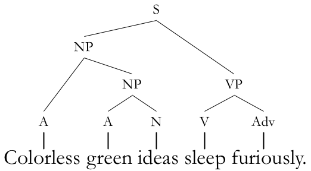

:::
:::

## Semantiek

* lexicale semantiek
  * woordbetekenis
  * [semasiologisch]{.alert2}: van woord naar betekenis
  * [onomasiologisch]{.alert2}: van betekenis naar woord
  * Cognitieve taalkunde
* formele semantiek
  * hoe wordt betekenis opgebouwd door elementen te combineren
  * formele benaderingen
* computationele semantiek
  *  automatische inductie van betekenis door contextvergelijkingen

## Pragmatiek

* Taaluitingen in context
  * taalbetekenis
  * taalgebruik
* ontwikkelt zich als onafhankelijke discipline als reactie op formalisering

## Verschuivende dominante stromingen

* Structuralisme (1900s-1950s)
* Descriptieve taalkunde (1930-1960s)
* Formele taalkunde (1950s-nu)
* Cognitief-functionele taalkunde (1980s-nu)

## Verschuivende modeldisciplines

<!-- Stroming  |   Model  |  Wijze -->
<!-- ----------| -----------------  | --- -->
<!-- Structuralisme | fonologie | betekenisonderscheid van de vorm (*signifiant*)  -->
<!-- Descriptieve taalkunde | morfologie | distributies bepalen alles -->
<!-- Formele taalkunde  |  syntaxis  |  andere disciplines zijn ook hiërarchisch -->
<!-- Cognitief-functionele taalkunde | semantiek | andere disciplines drukken ook betekenis uit (behalve fonetiek) -->

::: {.font80}


```{r}
tibble::tribble(
                          ~Stroming,              ~Model,                                                            ~Wijze,
                   "Structuralisme",         "fonologie",                 "betekenisonderscheid van de vorm (signifiant)",
           "Descriptieve taalkunde",        "morfologie",                                      "distributies bepalen alles",
                "Formele taalkunde",          "syntaxis",                        "andere disciplines zijn ook hiërarchisch",
  "Cognitief-functionele taalkunde",         "semantiek", "andere disciplines drukken ook betekenis uit (behalve fonetiek)"
  ) |>
  gt::gt() |>
  gt::tab_options(
    table.font.size = "xx-large", # make text much bigger
    table.width = gt::pct(95)     # make table fill 95% of slide width
  )

```

:::


## Verschuivend belang van context

* Decontextualisering
  * structuurbeschrijving wordt losgemaakt van de context (structuralisme, descriptieve taalkunde)
  * evolutie naar grammatica als autonoom systeem (generatieve grammatica)
* Recontextualisering
  * grammatica kan niet worden afgezonderd van zijn gebruikscontext
  * taal vervult ook een maatschappelijke rol

## Tegenstellingen

De verschillende kijk op context ligt ten grondslag aan een hele reeks tegenstellingen:

::: columns
::: {.column width="50%"}

[decontextualiserend]{.alert2}

* systeemgebaseerd
* formeel 
* universeel
* aangeboren
* homogeen
* deterministisch
* introspectief

:::

::: {.column width="50%"}

[recontextualiserend]{.alert2}

* gebruiksgebaseerd
* functioneel 
* taalspecifiek
* verworven
* variationistisch
* probabilistisch
* experimenteel

:::
:::

::: {.fragment}

Prof. Lahousse zal de decontextualiserende kant voorstellen; Prof. Szmrecsanyi de recontextualiserende kant.

:::


## Tot over 6 weken

