# Semantische extensie

## Veel voorkomende mechanismen

Enkele intensies en extensies 

::: {.desc}
generalisatie
:   uitbreiding van de betekenis
:   *limonade*, *arriver*

:::

::: {.desc .frag}
specialisatie
:   verening van de betekenis
:   Nl *vogel* vs. En *fowl*
:   NL *dier* vs. En *deer*

:::

## Veel voorkomende mechanismen

::: {.desc}
metafoor
:   Gelijkenis
:   *Gij zijt een echt varken!* 
:   [people are animals]{.smallcaps}

:::

::: {.fragment}

Wat met *artillerie*?

Oorspronkelijke extensie 'bogen, katapulten' > nadien 'geweren, kanonnen'

:::

::: {.desc .fragment}
gelijkenis
:   *artillerie*

:::

::: {.fragment}
$\rightsquigarrow$ We moeten dus figuurlijke gelijkenis (die verschillende domeinen overschrijdt) onderscheiden van letterlijke gelijkenis.

:::

## Veel voorkomende mechanismen

::: {.desc}
metonymie
:   contiguïteit

:::

Enkele subtypes (kan vaak in twee richtingen)

::: {.desc .fragment}
ruimte vs. ruimtelijk gesitueerde
:   *winkel*, *heel het huis staat in rep en roer*

recipient vs. inhoud
:   *een glas drinken*

deel vs. geheel
:   *de koppen tellen*, *de haard ('huis')*

tijd vs. temporeel gesitueerde
:   *tijdens covid*

product vs. materiaal
:   *blik, glas*

middel vs. resultaat
:   *stempel*, *schrijven met een mooie hand*

...

:::

## Woede: een conceptuele metafoor?

(@) She had reached the boiling point.
(@) He lost his cool.
(@) You make my blood boil.
(@) He's just letting off steam.
(@) Billy's a hothead.
(@) He got red with anger.
(@) I was fuming.
(@) Those are inflammatory remarks.
(@) He was consumed by his anger.

$\rightarrow$ welke conceptuele metafoor zien we hier?

## Woede: een conceptuele metafoor?

Kövecses (1989) beweert dat woede vaak wordt conceptualiseerd als 
[anger is the heat of a fluid in a container]{.smallcaps} en dat het abstracte domein van de woede enkel te begrijpen valt d.m.v. fysiologische processen.

Maar dat is misschien niet het enige dat er aan de hand is.

Geeraerts et al. (1995) verbinden uitdrukkingen van woede, boosheid ook aan de theorie van de vier humoren (we kijken hier eerst naar).

## De vier humoren

|                     | slijm (flegma) | zwarte gal     | gele gal       | bloed          |
|---------------------|-----------------|-----------------|----------------|----------------|
| **kenmerk**         | koud en vochtig | koud en droog   | warm en droog  | warm en vochtig |
| **element**         | water           | aarde           | vuur           | lucht          |
| **temperament**     | flegmatisch     | melancholisch   | cholerisch     | sanguïnisch    |
| **orgaan**          | brein/blaas     | milt            | lever/maag     | hart           |
| **kleur**           | wit             | zwart           | geel           | rood           |
| **smaak**           | zout            | zuur            | bitter         | zoet           |
| **seizoen**         | winter          | herfst          | zomer          | lente          |
| **windrichting**    | noord           | west            | zuid           | oost           |
| **planeet**         | maan            | Saturnus        | Mars           | Jupiter        |
| **dier**            | schildpad       | mus             | leeuw          | geit           |

## Uitdrukkingen gelinkt aan de vier humoren

| humor        | Engels                                                                  | Frans                                             | Nederlands                                          |
|--------------|--------------------------------------------------------------------------|---------------------------------------------------|-----------------------------------------------------|
| **slijm (flegma)**    | *phlegmatic* ‘kalm, koel, apathisch’                                  | *avoir un flegme imperturbable* ‘onverstoorbaar zijn’ | *valling*                         |
| **zwarte gal** | *spleen* 'orgaan'; ‘verdriet’           | *mélancolie* ‘zwaarmoedigheid’       | *zwartgallig* ‘depressief’ |
| **gele gal** | *bilious* ‘boos, prikkelbaar’                                         | *colère* ‘woede’                                | *z’n gal spuwen* |
| **bloed**    | *full-blooded* ‘krachtig, levendig, sensueel’                         | *avoir du sang dans les veines* ‘lef hebben’ | *warmbloedig* ‘hartstochtelijk’ |

$\rightsquigarrow$ leidt tot meer belangstelling voor culturele frameworks in tandem met het lichaam als brondomein. 

$\rightsquigarrow$ metafoor (*cross-domain mapping*) is misschien toch niet zo eenduidig...

## Blends

Vaak gebruiken we complexere concepten die hun oorsprong vinden in een combinatie van metaforen, metonymieën, generalisaties, en specialisaties. 

Bv. Magere Hein / Pietje De Dood / *The Grim Reaper*  
$\rightarrow$ dit concept vindt zijn oorsprong in een aantal domeinen, maar niet elk domein geeft evenveel input aan dit complexe concept.

Het/hij komt voort uit een [conceptuele blend]{.alert2}.

## Blends

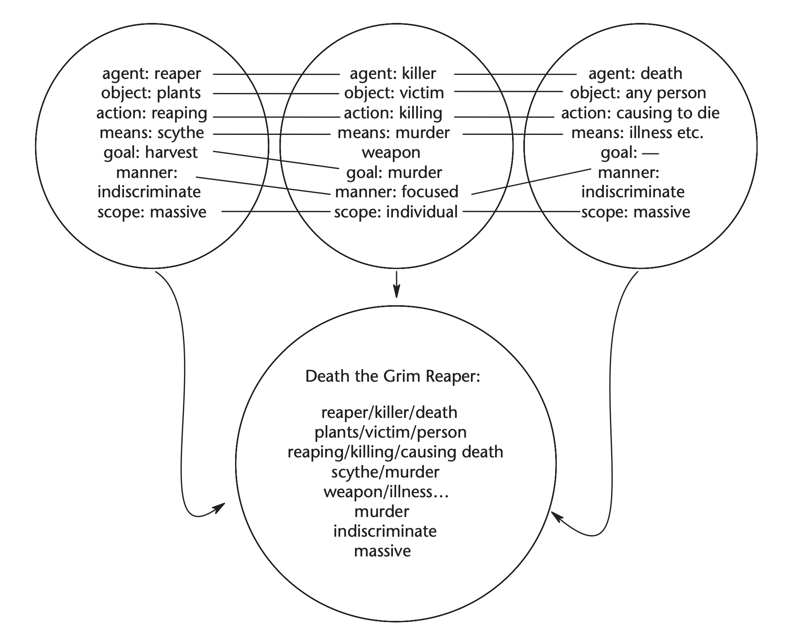

## Semantische extensies: prismamodel

* Wanneer we de semantiek van woorden bestuderen moeten we dus voornamelijk naar de conceptuele kant kijken.
* Om te weten dat *kost* in *dat kost me veel tijd* te begrijpen moeten we trachten te achterhalen dat [tijd]{.smallcaps} hier begrepen wordt in termen van [geld]{.smallcaps} ([time is money]{.smallcaps}).
* Maar hoe zit het met spreekwoorden of samenstellingen?

(@) *schapenkop* 'dom persoon'
(@) *mierenneuker* 'pietlullig persoon'
(@) *hron-rād* 'walvis-weg > zee' (*Beowulf*)

::: {.fragment}
* Vaak bestaan spreekwoorden uit meerdere componenten, en samenstellingen natuurlijk ook.
* Een begrip van zulke uitdrukkingen als geheel stoelt eigenlijk op een aantal semantische conversies die gebeuren zowel op het niveau van de onderdelen als van de de samenstelling.

:::

## Prismamodel

::: columns
::: {.column width="80%"}
Om zulke uitdrukkingen op te lossen kunnen we gebruik maken van het [prismamodel]{.alert2}

* semantische processen bekijken op verschillende niveaus
* bevat typisch de volgende semantische processen
    * metafoor
    * metonymie
    * generalisatie
    * specialisatie
    * identiteit (er verandert niets)
    
* Theorie van Dirk Geeraerts (1955-)

:::

::: {.column width="20%"}
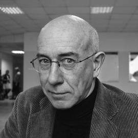

:::
:::

## Voorbeeld: Schapenkop

::: {.r-stack}

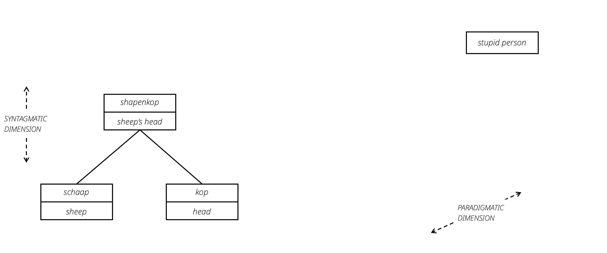{.fragment data-fragment-index="1"}

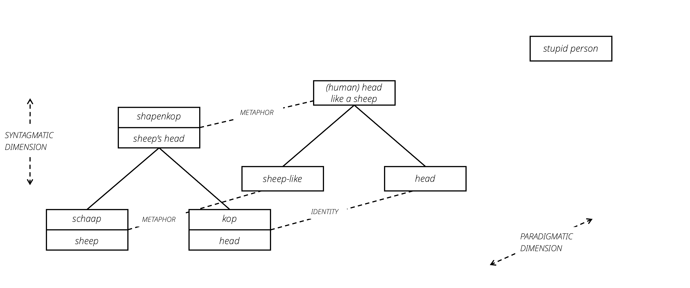{.fragment data-fragment-index="2"}

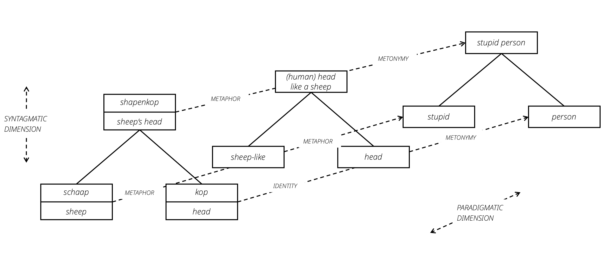{.fragment data-fragment-index="3"}

:::

## Voorbeeld in kennings

::: columns
::: {.column width="60%"}
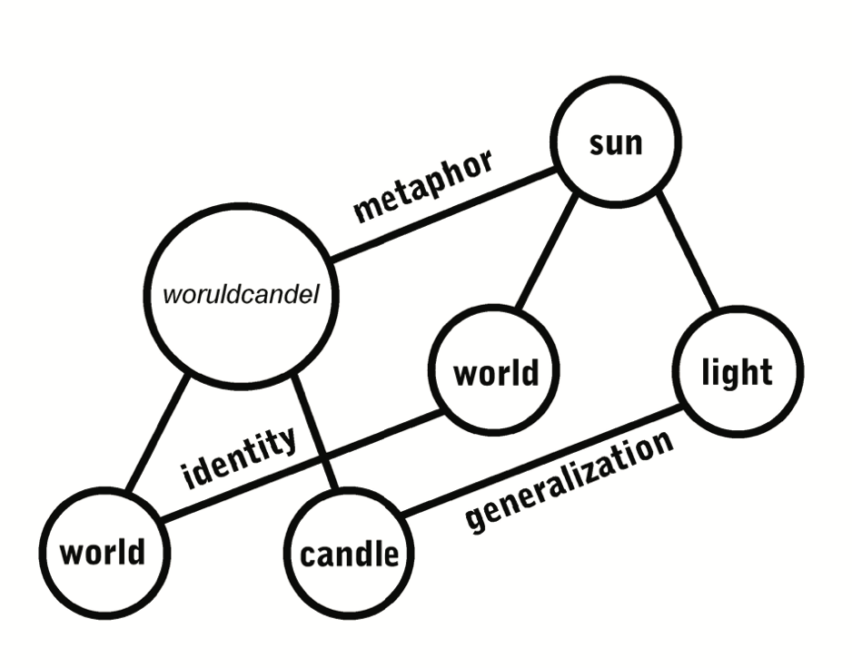

:::

::: {.column width="40%"}
Kennings zijn meerledige samenstellingen die op gelijkaardige wijze werken en vaak als stijlfiguur worden beschouwd in de Germaanse, Angelsaksische, en Keltische literatuur.

(@) *woruld-candel* 'wereld-kaars > zon'

:::
:::

## Aspecten van cognitieve benaderingen tot nu toe

We hebben nu al de volgende kenmerken van cognitieve benaderingen geïllustreerd:

* aandacht voor categorisatie als gradiënt fenomeen (prototypiciteitskenmerken)
* aandacht voor figuratief taalgebruik: taal is een reflectie van conceptuele intepretaties (metafoor, metonymie en dus ook blending- en prismamodel)
* aandacht voor [embodiment]{.alert2}: abstracte concepten worden vaak begrepen in termen van meer concrete concepten, en er is niets meer concreet dan onze fysieke interacties met de wereld.

Zulke ontwikkelingen in de jaren 1980 leidden tot het ontstaan van de Cognitieve Taalkunde. 

In tegenstelling tot het Structuralisme en het Generativisme wordt semantiek hier als modeldiscipline beschouwd.

<!-- (@) Netanyahu doet alsof zijn neus bloedt. -->

## Cognitieve taalkunde: Key commitments

* George Lakoff (een van de founding fathers van de cognitieve taalkunde) stelt dat cognitieve taalkunde twee cruciale engagementen vooropstelt:

* [Generalisation commitment]{.alert2}: "a commitment to the characterisation of general principles that are responsible for all aspects of human language"
* [Cognitive commitment]{.alert2}: "a commitment to providing a characterisation of general principles for language that accords with what is known about the mind and brain from other disciplines"

## Cognitive commitment

* Algemene cognitieve principes, geen cognitieve principes die eigen zijn aan taal
* Voorbeeld: aandacht ("spotlight")
    * Algemene cognitieve eigenschap om aandacht te focussen op een bepaald deelaspect van een scène
    * Analyse van taaluitingen in termen van attentie
    * *de jongen duwt de vaas omver* vs. *de vaas wordt omvergeduwd* vs. *de vaas valt aan diggelen*

* Voorbeeld: embodiment
    * *de kat zit voor de boom*
    * De manier waarop we de wereld waarnemen en in taal vatten wordt bepaald door onze menselijke belichaming

## Generalisation commitment

* Alle taalfenomenen (fonetisch, syntactisch, semantisch, pragmatisch, ...) volgen *dezelfde algemene principes*
* $\leftrightarrow$ modulaire aanpak van formele grammatica

* Drie voorbeelden:
    * Polysemie
    * Metaforen
    * Categorisatie

## Generalisation commitment: Polysemie

* Semasiologisch perspectief
* Polysemie: bepaald linguïstisch element heeft meerdere verschillende maar gerelateerde betekenissen
* Traditioneel: beperkt tot het beschrijven van woordbetekenis
* Cognitieve taalkunde: fundamenteel kenmerk van taal, ook op andere niveau's
    * Lexicon: de betekenissen van *hoofd*
    * Syntaxis: polysemie van ditransitieve constructie (Subj - Verb - Obj1 - Obj2):

## Generalisation commitment: Metafoor

* Volgens cognitieve taalkundigen zijn metaforen een fundamenteel kenmerk van menselijk taalgebruik
* Een bepaald conceptueel veld wordt gestructureerd in termen van een ander conceptueel veld
* Eveneens breed toegepast voor verschillende taalfenomenen:
    * Lexicon: [macht/controle is boven]{.smallcaps}
        * *ze scheert hoge toppen*
        * *haar aanzien steeg zienderogen*
    * Syntaxis: [causale gebeurtenis is fysieke overdracht]{.smallcaps}
        * *de regen gaf ons wat meer tijd*
        * *dat late doelpunt bezorgde hen de overwinning*

## Generalisation commitment: Categorisatie

* Cognitieve psychologie: categorisatie is niet gebaseerd op criteria, i.e. een verzameling noodzakelijke voorwaarden die samen voldoende zijn
* Categorieën zijn vaag, met meer centrale leden en meer perifere leden van een categorie
* Centraliteit wordt beïnvloed door de functie

* $\rightarrow$ Zelfde principe geldt niet enkel voor semantiek, maar ook voor syntaxis, morfologie, fonetiek, ...
    * Voorbeeld 1: bachelor
    * Voorbeeld 2: ditransitieve constructie
    
## Bachelor (revisited)

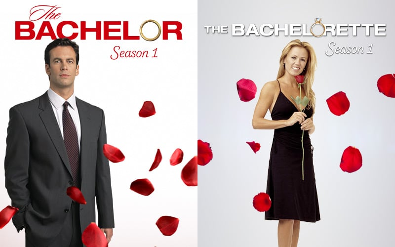

## Bachelor (revisited)

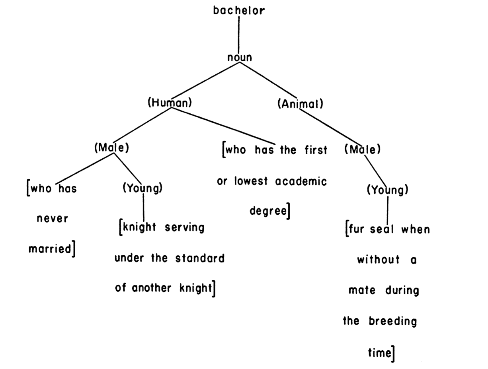

## Bachelor (revisited)

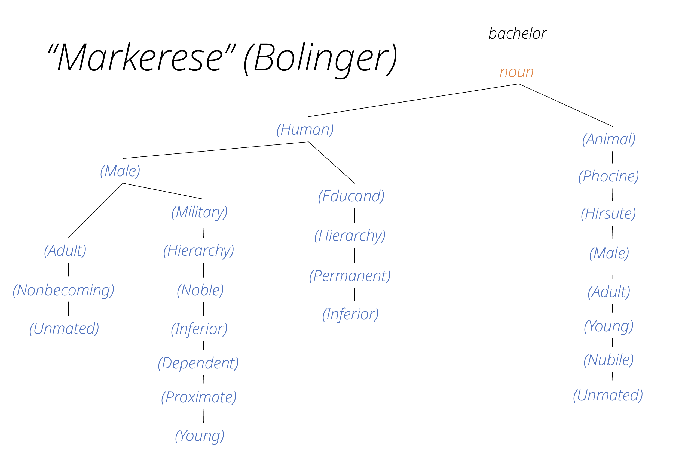

## Bachelor (revisited)

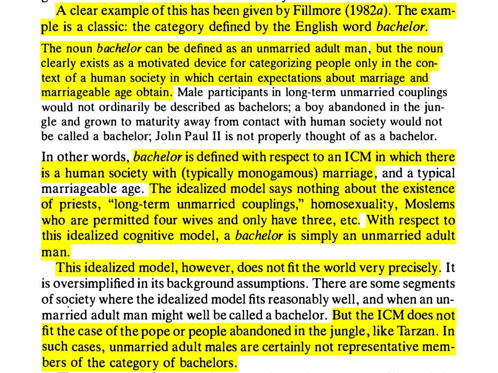

We conceptualiseren dingen vaak t.o.v. een [ICM]{.alert2}  (idealized cognitive model.)

## Ditransitieve constructie

(@) John gave Mary the book.
(@) John gave the book to Mary.

vs.

(@) John gave her the book.
(@) John gave the book to her.

vs.

(@) John gave her it.
(@) John gave it to her.

## Generalisation commitment: Categorisatie

* Prototypische ditransitieve constructie:
    * heeft een ontvanger die animaat en kort is, en al bekend in het discours
    * heeft een thema dat lexicaal uitgedrukt wordt, dat langer is dan de ontvanger, dat niet animaat is, en dat onbepaald is (nog niet bekend in het discours)

* Prototypische prepositionele datiefconstructie is het spiegelbeeld van de ditransitieve constructie
* Maar: niet-prototypische voorbeelden worden ook gevormd

## Ditransitieve constructie

(@) ? John gave Mary, the Queen of Scotland, the creeps.
(@) John gave the creeps to Mary, the Queen of Scotland.
(@) John gave Mary, the Queen of Scotland, the creeps, served on a nice and shiny platter.

* $\rightarrow$ We hebben veel intuïties over welke variant wanneer wordt gebruikt. 
* We kunnen die ook functioneel in een vacuüm proberen te verklaren.  
* Maar in productie worden de distinctieve kenmerken vaak wegggesleten.  
* $\rightarrow$ zoektocht naar probabilistische *constraints*, zoals hier, het Principle of Endweight (zie ook lessen prof. Szmrecsanyi).

## Generalisation commitment

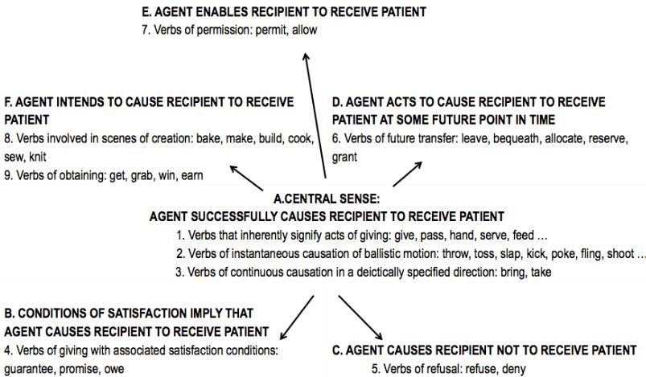

# Betekenis als hoeksteen van de grammatica

## Cognitieve benadering van de grammatica

formele taalkunde |  cognitieve taalkunde
------------------|----------------------
de grammatica is vormgebaseerd | de grammatica vertrekt van betekenis en functie
de grammatica is abstract | lexicon en grammatica zijn geïntegreerd 
de grammatica is een autonoom systeem | de grammatica is gebruiksgebaseerd en niet-modulair

## Cognitieve benadering van de grammatica

Twee uitgangspunten:

* [Symbolisch principe]{.alert2}: basiseenheid van de grammatica is koppeling van vorm en betekenis
* [Gebruiksgebaseerd principe]{.alert2}: mentale grammatica wordt gevormd door een abstractie van symbolische eenheden op basis van specifieke gevallen van taalgebruik

## Symbolisch principe

::: columns
::: {.column width="40%"}
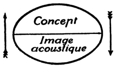

:::

::: {.column width="50%"}
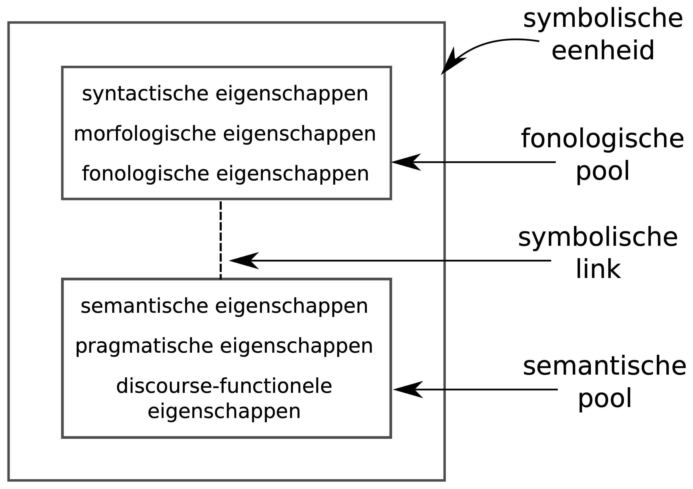

:::
:::

* Het Saussureaanse talig teken wordt een Langackeriaans symbool.
* Betekenis (in brede zin) is fundamenteel onderdeel van de grammatica

## Lexicaal-grammaticaal continuüm

* Symbolische eenheden zijn niet louter woorden
* Ook grammaticale vorm van een zin is gekoppeld aan een bepaalde (schematische) betekenis
* Studie van de grammatica omhelst de volledige spanwijdte van de taal
* Geeft aanleiding tot een [lexicaal-grammaticaal continuüm]{.alert2}

## Gebruiksgebaseerd principe

* Mentale grammatica van een spreker is een abstractie van symbolische eenheden die gevormd wordt op basis van herhaald taalgebruik (["entrenchment"]{.alert2})
* Geen principieel onderscheid tussen taalkennis en taalgebruik (i.e. geen onderscheid tussen competence en performance zoals bij Chomsky)
* Taalkennis vloeit voort uit taalgebruik

## Cognitieve Grammatica (Langacker)

::: columns
::: {.column width="80%"}
* Ronald Langacker (1942)
* Een van de eerste en meest complete manieren om een model van grammatica te ontwikkelen dat zowel de generalisation commitment als de cognitive commitment in acht neemt.
* Bedoeling is om post-hoc te verklaren wat er in taal aan de hand is, door gebruik te maken van algemene cognitieve principes en hoe taal die uitbuit om betekenis uit te drukken.
* Diagramstijl om principes te verduidelijken
    * conceptuele basis 
    * [construal]{.alert2} ("meaning is construal")
    * asymmetrieën in taal: [trajector]{.alert2} vs. [landmark]{.alert2}
    * perspectief in taal
    * niveau van granulariteit

:::

::: {.column width="20%"}

:::
:::

## Cognitieve Grammatica (Langacker)

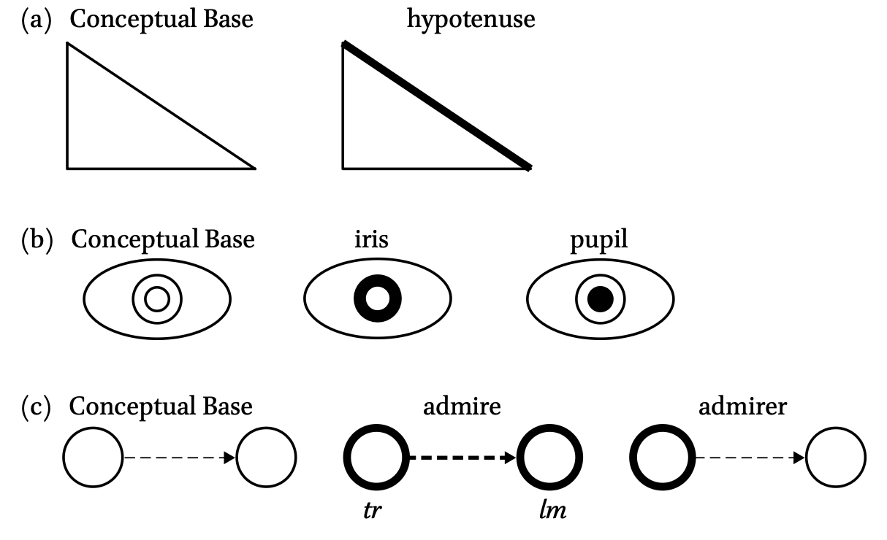

## Cognitieve Grammatica (Langacker)

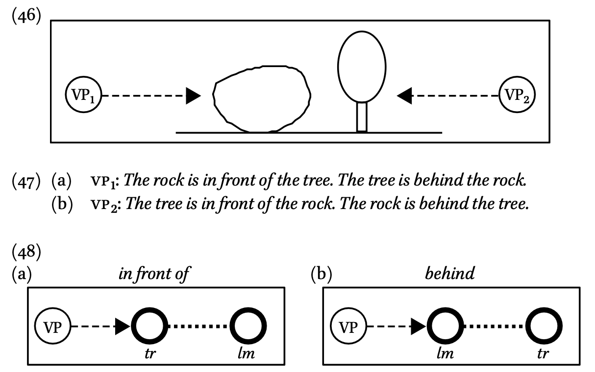

## Cognitieve Grammatica (Langacker)

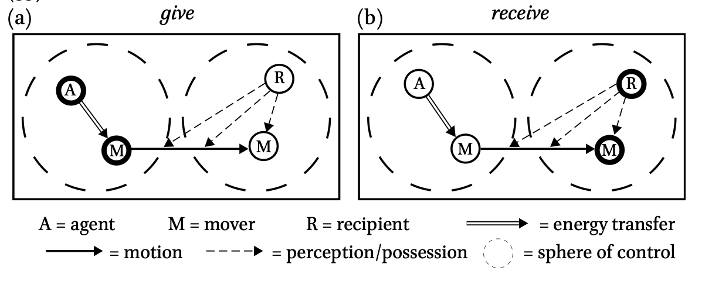

## Frame semantics

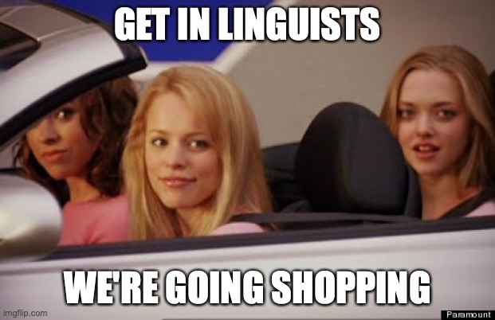

## Frame semantics (Fillmore)

::: columns
::: {.column width="80%"}
* Charles Fillmore (1982)
* Semantische benadering: wat is de kennisstructuur die gepaard gaat met lexicale elementen?
    * Semantisch model met implicaties voor de grammaticale structuur
    * Gerelateerd aan constructiegrammatica (zie hierna)
* Semantische [frames]{.alert2}

:::

::: {.column width="20%"}
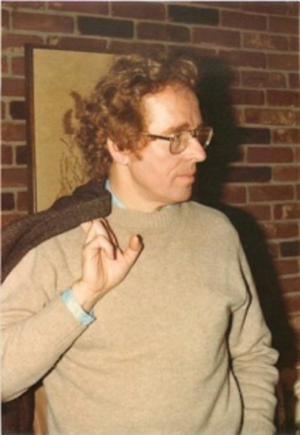

:::
:::

## Semantisch frame

* Conceptuele, schematische abstractie van onze ervaring
* een [frame]{.alert2}, semantisch kader, staat voor vaak terugkerende gebeurtenis of situatie
* Geeft coherente samenhang tussen gerelateerde concepten weer
* Voorbeelden
    * Commerciële transactie
    * Restaurantbezoek
    * Voetbalmatch
* wordt soms ook "script" genoemd, of "idealized cognitive model" (Lakoff)
* zelfde principe als Langackers construal over een conceptuele basis

## Voorbeeld: korting

* Hoe definieer je *korting*?

::: {.fragment}
* Als een [verkoper]{.alert2} aan een [koper]{.alert2} bepaalde [goederen]{.alert2} aanbiedt voor een verlaagde [prijs]{.alert2}, dan noemen we het verschil tussen de normale prijs en de verlaagde prijs de *korting*

:::

::: {.fragment}
* Het woord *korting* kan enkel begrepen worden tegen de achtergrond van een commerciële uitwisseling van geld en goederen

:::

::: {.fragment}
* Je moet het semantisch frame kennen om de betekenis van *korting* te vatten

:::

## Woorden als trigger ('frame-evoking elements')

* Woorden roepen een semantisch frame op:

(@) *Sofie blies eerst de kaarsjes uit. Pas daarna opende ze haar cadeautjes.*

::: {.fragment}
Frame: [verjaardag]{.alert2}

:::

::: {.fragment}
* Een persoon heeft een geboortedatum
* Die datum wordt elk jaar gevierd, meestal met familie en vrienden
* De persoon krijgt geschenken
* De persoon krijgt een verjaardagstaart
* Op een verjaardagstaart staan kaarsjes; het aantal kaarsjes komt vaak overeen met het aantal levensjaren van de persoon
* De betrokkene wordt verondersteld de kaarsjes uit te blazen

:::

## Voorbeeld: [commerciële transactie]{.smallcaps}

* [koper]{.smallcaps}
* [verkoper]{.smallcaps}
* [goederen]{.smallcaps}
* [geld]{.smallcaps}

::: {.r-stack}
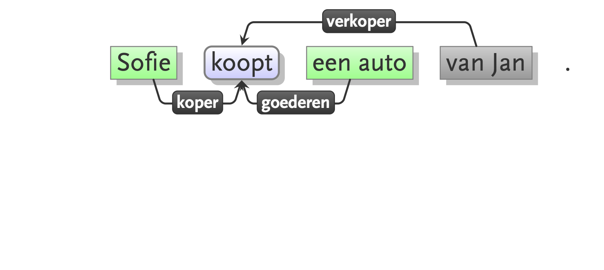{.fragment data-fragment-index="1"}

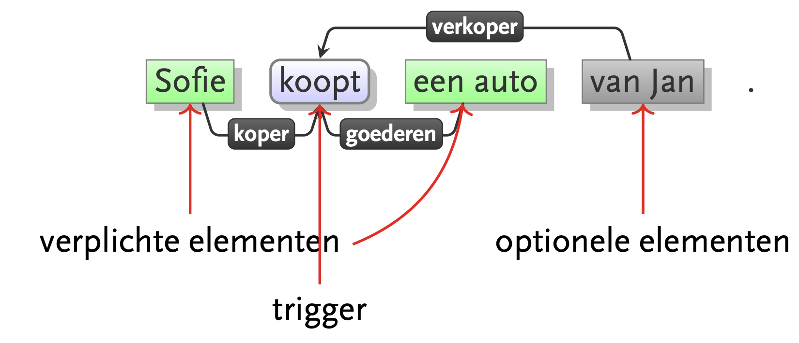{.fragment data-fragment-index="2"}

:::

## Voorbeeld: [commerciële transactie]{.smallcaps}

|   | [koper]{.smallcaps} | [verkoper]{.smallcaps} | [goederen]{.smallcaps} | [geld]{.smallcaps} |
|:--|:--|:--|:--|:--|
| **kopen** | subject | (oblique) | object | (oblique)  |
| **verkopen** | (oblique) | subject | object | (oblique) |
| **betalen₁** | subject | (i-object) | (oblique) | object  |
| **betalen₂** | subject | (oblique) | (oblique) | object |
| **kosten** | (i-object) | ∅ | subject | object  |

(@) *Sofie koopt de auto (van de verkoper) (voor 15000 euro).*
(@) *Sofie verkoopt de auto (aan Karel) (voor 15000 euro).* 
(@) *Karel betaalt (Sofie) 15000 euro (voor de auto).*
(@) *Karel betaalt 15000 euro (aan Sofie) (voor de auto).*
(@) *De auto kost (hem) 15000 euro.*

## Perspectivering

* Zelfde gebeurtenis kan op verschillende manieren voorgesteld worden
* Verschil in [perspectief]{.alert2}
* Voorbeeld: werkwoorden *kopen* en *verkopen* triggeren hetzelfde frame (commerciële transactie), maar de voorstelling van de deelnemers is verschillend:

* kopen: koper is de agent, actief en controllerend
* verkopen: verkoper is de agent, actief en controllerend

## Link met grammatica

* Semantisch frame bepaalt hoe lexicale elementen gebruikt kunnen worden ([profiling]{.alert2})
* Invloed op syntactische argumenten van het werkwoord

(@) De hackers beroofden de gebruikers (van hun geld).
(@) \*De hackers beroofden het geld (van de gebruikers).
(@) De hackers stalen het geld (van de gebruikers).
(@) \*De hackers stalen de gebruikers (van hun geld).

## Frames en grammaticale constructies

* Ook zinspatronen kunnen een soort van basisframe weergeven
* Voorbeeld: ditransitieve constructie
* [subj werkwoord obj1 obj2]{.smallcaps}
    * *Sofie geeft Karel een boek*
    * *Hanne schrijft Michel een brief*
    * *Mark vertelt Sofie een verhaal*
    * *Anna koopt haar dochter een ijsje*
* Kan ook creatief gebruikt worden:
    * *Veerle bakt hem een taart*
    * *Stefanie googelt hem een oplossing*
* Idee wordt verder uitgewerkt in de constructiegrammatica

## Constructiegrammatica (CxG)

::: columns
::: {.column width="80%"}
* Grammaticale theorie waarbij de [constructie]{.alert2} de basis vormt
* Pioniers: Charles Fillmore, Paul Kay, George Lakoff (1988)
* Verder uitgebouwd door Adele Goldberg (1995)

:::

::: {.column width="20%"}

:::
:::

## Idiomatische uitdrukkingen

* Traditioneel grammaticaal model gaat uit van woorden en regels (cf. formele grammatica)
* Autonoom syntactisch model, gevold door betekeniscomponent die de overkoepelende betekenis opbouwt aan de hand van de betekenis van individuele woorden, en hoe die gecombineerd worden (principe van compositionaliteit)
* Maar: 
    
::: {.fragment}
(@) iemands nekharen gaan overheind staan van iets
(@) de moed zakt iemand in de schoenen

:::
    
::: {.fragment}
* Idiomatische uitdrukkingen vormen een probleem: betekenis is niet-compositioneel
* Betekenis is niet af te leiden uit individuele delen, dus moet apart geleerd worden
* Lexicon moet ook idiomatische uitdrukkingen bevatten

:::

    
## Idiomatische constructies: een X van een Y

* Maar: ook meer abstracte constructies vertonen idiomatische trekken
* Daarbij gaat men, net zoals bij conceptuele metaforen, inductief te werk
* Een aantal uitdrukkingen bekijken, en daar een constructie bovenop generaliseren.

::: {.fragment}
(@) een schat van een kind
(@) die kast van een huis
(@) een reus van een hond

:::

::: {.fragment}
$\rightsquigarrow$ cxn ("constructie"): [Det - N$_1$ - van - (een) - N$_2$]

:::

## Idiomatische constructies: de *way*-constructie

(@) Hij baande zich een weg door de massa
(@) PSV combineert zich een weg door de Friese defensie
(@) Ze tennist zich een weg naar de top

::: {.fragment}
$\rightsquigarrow$ cxn: [ NP – refl – een weg – V – PP/Adv ]

:::

## Goldberg: argumentstructuur

::: columns
::: {.column width="80%"}

* Zinspatronen met een werkwoord en verschillende nominale structuren
* Idee: zelfs abstracte  patronen zonder lexicale elementen hebben betekenis
* Betekenis weerspiegelt een soort van basistypes van
              gebeurtenissen geworteld in menselijke ervaring

:::

::: {.column width="20%"}
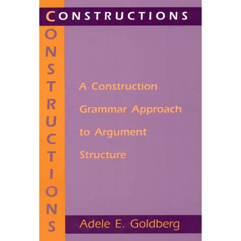

:::
:::

## Valentie van een werkwoord

* Welke argumenten selecteert een werkwoord?
    * intransitief: *slapen*
    * transitief: *drinken*
    * ditransitief: *zenden*
* Traditioneel wordt valentie beschouwd als onderdeel van het lexicon
* Maar: werkwoorden kunnen ook creatief gebruikt worden, in syntactische contexten waar ze normaal niet voorkomen:

(@) Bob speelde de piano aan stukken
(@) Katrien niesde het schuim van haar cappuccino

$\rightarrow$ Als valentie deel uitmaakt van het lexicon, zouden we die constructies eveneens moeten opnemen

## Alternatieve verklaring: coercie

* Syntactische context zorgt voor specifieke interpretatie van het werkwoord
* [Coercie]{.alert2}:
* Als de betekenis van een lexicaal element niet overeenkomt met de syntactische context, dan wordt de betekenis aangepast aan de structuur waarin het element ingebed wordt

::: {.fragment}
* Voorbeeld: *spelen* $\rightarrow$ resultatiefconstructie

(@) Bob speelt piano
(@) Bob speelt de piano aan stukken

:::

## Alternatieve verklaring: coercie

* Voorbeeld *niezen* $\rightarrow$ verplaatsingsconstructie

(@)  Katrien niest
(@)  Katrien niest het schuim van haar cappuccino 

* Betekenis wordt toegevoegd door abstracte constructie:  
  $[$ NP$_1$ – V – NP$_2$ – PP/Adv $]$

## Taalkennis = constructies

> C is a [construction]{.alert2} iff$_{def}$ C is a form-meaning pair $<$F$_i$, S${_i}$$>$ such that some aspect of F$_i$ or some aspect of S$_i$ is not strictly predictable from C’s component parts or from other previously established constructions. (Goldberg 1995: 4)

* Een constructie is een koppeling van vorm en betekenis
* Verschillende soorten constructies, van concreet tot abstract:
    * Morfemen: *-s*, *-en*
    * Woorden: *kat*, *wandelen*, *mooi*, *sprankelend*
    * Collocaties: *tot later*, *luidkeels roepen*
    * Semi-vaste uitdrukkingen: *de moed zinkt X in de schoenen*, NP - zijn - VP$_{inf}$
    * Abstracte syntactische patronen: SUBJ VERB OBJ$_2$ OBJ$_1$

## Netwerk van constructies

> The totality of our knowledge of language is captured by a network of constructions: a `construct-i-con.' (Goldberg 2003:219)

* Constructicon: een grote verzameling vorm/betekenis-paren, die de taalkennis van de sprekers vertegenwoordigt
* Geen chaotisch geheel, maar hiërarchisch gestructureerd, en met verbanden tussen de verschillende constructies
* Hoe zijn de constructies met elkaar verbonden?

## Netwerk van constructies

* Hiërarchisch: relatie tussen meer abstracte en meer concrete constructies

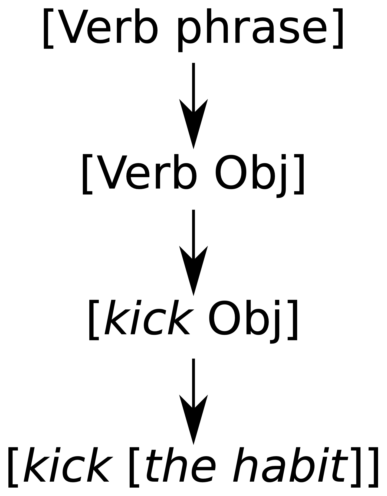

* Polyseem: een vorm die verbonden is met verschillende, aan elkaar verwante betekenissen

* vb.  $[$ NP$_1$ – V – NP$_2$ – PP/Adv $]$
* Zowel resultatiefconstructie als verplaatsingsconstructie

## Kritiek en vooruitgang op de CxG

* CxG zegt graag [usage-based]{.alert2} te zijn
* maar blijft wel vaak bij het manueel goed uitkiezen van voorbeelden

::: {.fragment}
* met de vooruitgang in technologie steeds meer corpusvalidatie
* vorige week zagen we een relatief up-to-date semantische interpretatie van die techonologische vooruitgang (prof. Tim Van de Cruys) 

:::

      

