# TAM

Tense, aspect, modality

## Modaliteit

* Relatie met betrekking tot waarheid of werkelijkheid
* Opdeling (1): wat echt gebeurd is vs. wat kan / zou kunnen gebeuren ([wijs]{.alert2})
* Opdeling (2): verhouding tot de werkelijkheid ([subjectieve modaliteit]{.alert2})

## Modaliteit: wijs

Enkele veel voorkomende wijzen

Wijs | Functie | Voorbeeld
------|------|----------
indicatief  |		realis, echt gebeurd	  |	 ik loop
conjunctief/subjunctief	 |	hypothetisch, meningen, emoties |		if he were hungry
conditionalis	 |	voorwaarde vervuld	 |	..., zou hij lopen
presumptief  |	voorwaarde  |	 (Hindi)
optatief  |		hoop, wens  |		moge hij lopen
imperatief  |		bevel (addressee)	 |	 loop!
jussief  |	bevel (3de persoon)  |	dat hij loopt!
potentialis  |	waarschijnlijkheid  |	 she may go

## Modaliteit: subjectieve modaliteit

* [Epistemisch]{.alert2}: attitude van spreker tegenover waarheid van propositie (mogelijk, waarschijnlijk, zeker, noodzakelijk)
  
(@) Zij kan zich vergist hebben.
(@) Zij heeft zich ongetwijfeld vergist.
(@) Ik vermoed dat zij zich vergist heeft.

* [Deontisch]{.alert2}: wenselijkheid van een handeling (toegelaten, verplicht, verboden)
  
(@) Hij moet zich wat vriendelijker gedragen.
(@) Hij mag gerust langskomen.
  
* [Dynamisch]{.alert2}: welke eigenschappen zijn relevant voor tot stand brengen van een gebeurtenis? (bereidheid, vermogen)
  
(@) Hij kan goed koken.
(@) Hij wil koken.

## Tense (tijd)

Aanduiden van relatie tussen [speech time]{.alert2} (S) en [event time]{.alert2} (E)
  
(@) Ik zag haar gisteren. (E $<$ S)
(@) Ik zie haar nu. (E = S)
(@) Ik zal haar morgen wel zien. (E $>$ S)
  
E wordt gesitueerd tegenover [reference time]{.alert2} R; R wordt gesitueerd tegenover S
  
(@) Toen zijn aankwamen, had ik haar al gezien.(E $<$ R $<$ S)
(@) Wanneer zij zullen aankomen, zal ik haar al gezien hebben.} (S $<$ E $<$ R) 
  
## Tense (tijd)

Kan verschillende vormen aannemen in taal

* geen onderscheid (Chinees, Dyirbal)
* verleden vs. non-verleden (Japans, Nederlands? Engels? Duits?)
* verleden, heden, toekomst (Frans, Spaans, Italiaans, Latijn, Grieks)
* toekomst vs. non-toekomst (Quechua, Greenlandic)
* ...

## Aspect

[Aspect]{.alert2}: de interne temporele structuur van een gebeurtenis

Groot onderscheid tussen

* Lexicaal aspect ([aktionsart]{.alert2}): inherente eigenschap van het werkwoord (met complementen)
  
(@) Zij woont in Leuven. $\leftrightarrow$ Zij eet een appel.
  
* Grammaticaal aspect: uitgedrukt door een bepaalde grammaticale constructie
  
(@) Jan bouwde een huis. $\leftrightarrow$ Jan was een huis aan het bouwen.
  

## Grammaticaal aspect: perfectief vs. imperfectief

* Gebonden aan constructies veeleer dan aan lexicale elementen
* Hoe kijken we naar een gebeurtenis: als volledig voltooid  ([perfectief / aorist]{.alert2}) of onvoltooid ([imperfectief]{.alert2})?
    
(@) Annabelle schreef gisteren een brief.
(@) Annabelle was gisteren een brief aan het schrijven.

* Sommige talen (bv. de Slavische) markeren dit ook morfologisch, bv. Russisch

(@) I stood there for an hour.
(@) Ja stojal tam čas. (perfectief: korte tijd)
(@) Ja postojal tam čas. (imperfectief: lange tijd)

## Grammaticaal aspect: perfect

Verwar "perfectief" niet met "[perfect]{.alert2}".

Perfect (perfectum) betekent dat er een relatie is tot het heden. Vergelijk:

(@) J'ai lu ce livre.
(@) Je lus ce livre.
(@) Je lisais ce livre (, ...)
(@) J'étais en train de lire ce livre.
    
## Lexicaal aspect / Aktionsart

* Vaak [Aktionsart]{.alert2} genoemd ("de aard van de actie")
* Hypothese / intuïtie dat werkwoorden een gebeurtenis inherent indelen op een bepaalde manier.

(@) He believed this.
(@) She painted a picture.
(@) They walked for an hour.
(@) It died.
(@) I sneezed.

## Aktionsart: Vendleriaanse klassen (+)

Theorie van Zendo Vendler (1957, "Verbs and times"), aangevuld met Bernard Comrie (1976, "Aspect")

Drie parameters voor de temporele analyse van een situatie (uitgedrukt door werkwoord + complement)

* process: [statisch]{.alert2} of [dynamisch]{.alert2}: vindt er een verandering plaats?
* [duratief]{.alert2} of [punctueel]{.alert2}: beperkt tot één moment in de tijd?
* [telisch]{.alert2} of [atelisch]{.alert2}: heeft de situatie een inherent, doelgericht eindpunt?

$\rightarrow$ Soort componentiële analyse van lexicaal aspect.

## Aktionsart: Vendleriaanse klassen (+)

(@) He believes this.
(@) She painted a picture.
(@) They walked for an hour.
(@) It died.
(@) I sneezed.

::: {.fragment}
statisch | duratief | telisch | voorbeeld  | groep
---------| ---------| --------| -----------| ------
+  | +  |   -  | *geloven*  | [state]{.alert2}
-  | +  | +  |  *schilderen*  | [accomplishment]{.alert2}
-  | +  | -  | *wandelen*  | [activity]{.alert2}
-  | -  | +  | *sterven*  | [achievement]{.alert2}
-  | -  | -  | *hoesten*  | [semelfactive]{.alert2}

:::

## Aktionsart: een wildgroei aan classificatiesystemen

Veel theorieën gaan uit van Vendlers vier oorspronkelijke klassen (en voegen daar vaak de semelfactief van Comrie aan toe), maar gebruiken andere parameters of verdelen groepen lichtjes anders.

* bv. Comrie gaat uit van drie parameters: [change]{.alert2} (ja of nee), [boundedness]{.alert2} (ja of nee), [duration]{.alert2} (ja of nee).

::: {.fragment}
Benadering  | Klasse 1  |  Klasse 2  | Klasse 3  | Klasse 4
----------- | --------- | ----------- | --------- | -------
Vendler (1957) |  state  | activity  |  accomplishment  | achievement
Kenny (1963)  |  state  | activity  |  performances  | 
Mourelatos (1978)  | state  |  non-states   |  | 
|                 |          |  processes    |  events | 
|                  |         |                | developments  | punctual occurrences

:::

## Aktionsart: testen

* states: *be Polish, be polite, love*
* activities: *sing, dance*
* achievements: *shatter, reach, realize*
* accomplishments: *cross (the road), read (a book)*

::: {.fragment}
* Test 1: Komt voor met de English Progressive?

:::

::: {.fragment}
* Test 2: Komt voor met bijwoorden als *vigorously, actively*?

:::

::: {.fragment}
* Test 3: Komt voor met bijwoorden als *quickly, slowly*?

:::

::: {.fragment}
* Test 4: Komt voor met *for an hour, spend an hour X-ing*?

:::

::: {.fragment}
* Test 5: Komt voor met *in an hour*?

:::

<!-- FIRSTTAKE -->
<!-- ## Aktionsart: testen -->

<!-- Test | States  | Activities  |  Accomplishments  | Achievements -->
<!-- ----- |------ | ----------- | ----------------- | ---------- -->
<!-- 1 progressief  | -  | +  | +  | - -->
<!-- 2 *actively*  | -  |  +  | -  | - -->
<!-- 3 *quickly*  | -  | +  | +  | - -->
<!-- 4 *for an hour*  |  -  | +  | +  | - -->
<!-- 5 *in an hour*  |  -  |  -  | + | - -->

## Formele benadering 1

Dowty (1979:124-125)

* non-intentional Agentive Accomplishments  
  $[[DO(\alpha_1,(\pi_n(\alpha_1,...,\alpha_n)])]CAUSE[BECOME[\rho_m(\beta_1,...,\beta_m)]]]$  
* hierbij zijn $\pi$ en $\rho$ "unary states or stative n-ary relations" en $\alpha$ en$\beta$ argumenten van de predicaten
* weergave van *John broke the window*

## Formele benadering 2

Rappaport Hovav & Levin (1998)

* Activity: $[x ACT_{<MANNER>}]$
* State: $[x <STATE>]$
* Achievement: $[BECOME [x < STATE>]]$
* Accomplishment: $[[x ACT_{<MANNER>} ] CAUSE [ BECOME [ y <STATE> ]]]$ or $[x CAUSE [ BECOME [ y <STATE>]]]$

## Semi-formele benadering

Van Valin (2005) in Role and Reference Grammar (RRG)

* State: $predicate' (x)$
* Activity: $do' (x,[predicate'(x)])$
* Achievement: $INGR predicate' (x)$ or $INGR do' (x,[predicate'(x)])$
* Accomplishment: $BECOME predicate' (x)$ or $BECOME do'(x,[predicate'(x)])$
* Semelfactive: $ SEML (x)$ or $SEML do'(x,[predicate'(x)])$
* (Active accomplishment): $do' (x,[predicate'(x)]$ & $INGR predicate'$

::: {.fragment}
Zonder die machinerie kan RRG niet werken.
Terzelfdertijd worden hier allerlei operatoren uitgedrukt om ermee om te gaan.

:::

## Aktionsart: problemen?

(@) Hij zag de maan.
(@) Hij klom op de berg, en toen zag hij de maan.

Heeft *zag* hier dezelfde Aktionsart?

## Aktionsart: een cognitieve aanpak

William Croft (2012, *Verbs: Aspect and causal structure*) argumenteert dat de Vendleriaanse klassen een goed startpunt vormen, maar wel wat Cognitieve Linguïstiek kunnen gebruiken.

* construal (profiling tegen een bepaalde content)
* een soort *qualitative unfolding of an event across time*
* heuristische diagrammen

Daarbij kunnen we ook de features van ervoor herevalueren:

* [dynamisch]{.alert2} of niet dynamisch
* [permanent]{.alert2} of niet permanent
* [incrementaal]{.alert2} of niet incrementaal
* gericht ([directed]{.alert2}) of niet gericht ([cyclical]{.alert2})

## Aktionsart: directed states

::: columns
::: {.column width="33%"}
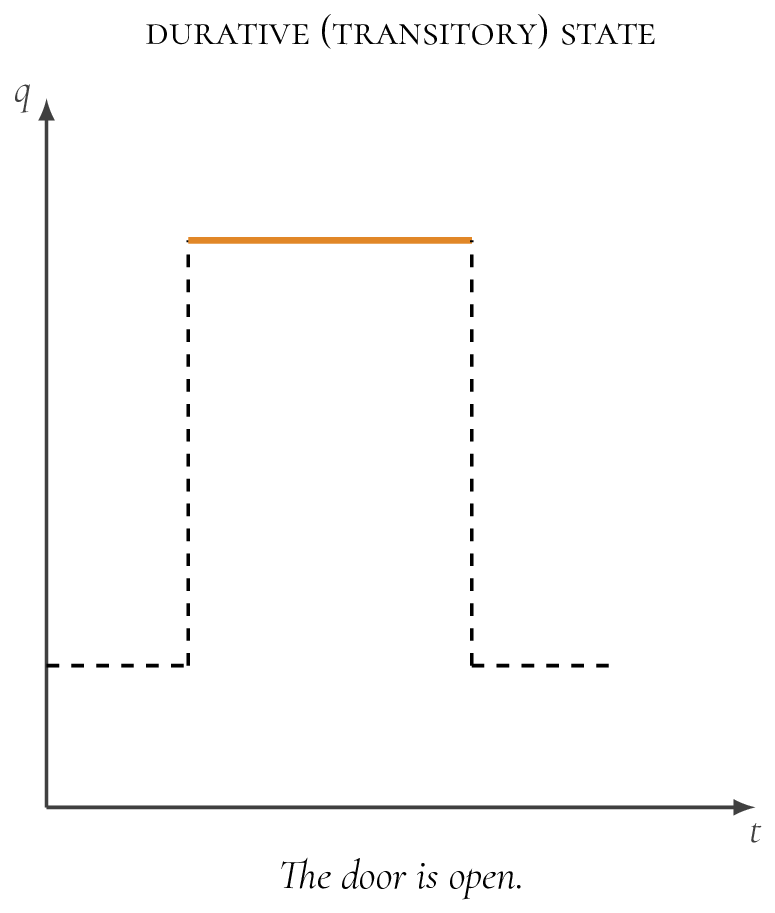

:::

::: {.column width="33%"}
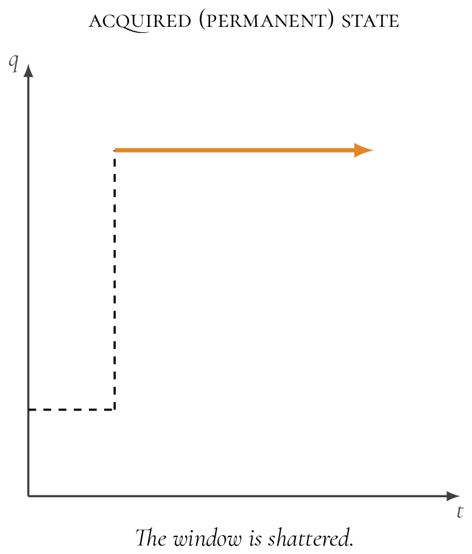

:::

::: {.column width="33%"}
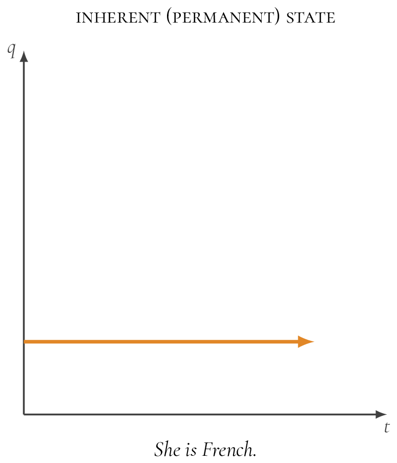

:::
:::

## Aktionsart: directed achievements

::: columns
::: {.column width="33%"}
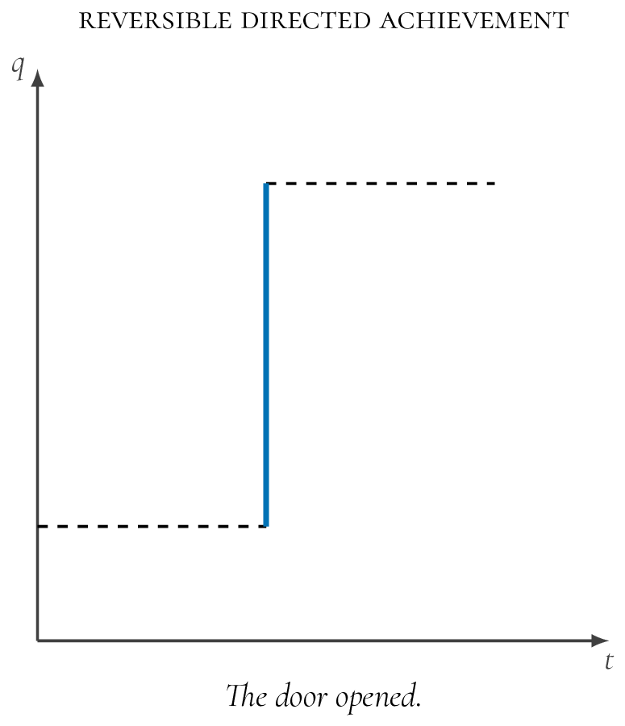

:::

::: {.column width="33%"}
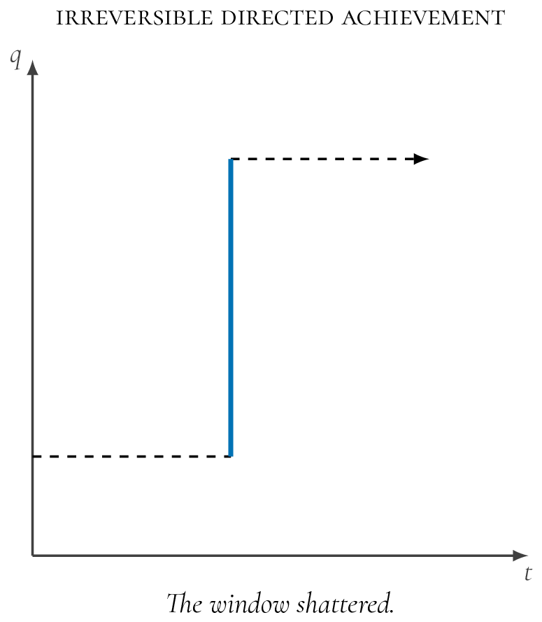

:::

::: {.column width="33%"}

:::
:::

## Aktionsart: directed accomplishments en activities

::: columns
::: {.column width="33%"}
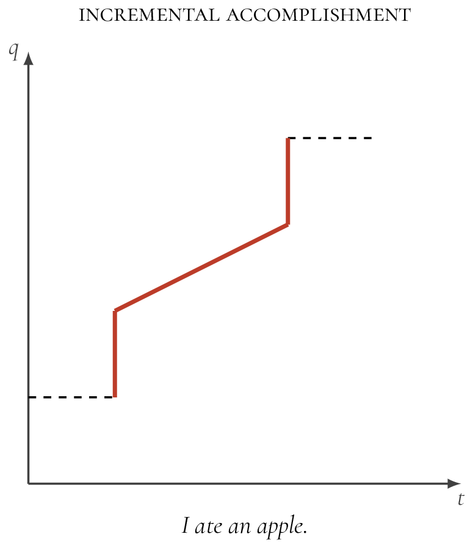

:::

::: {.column width="33%"}
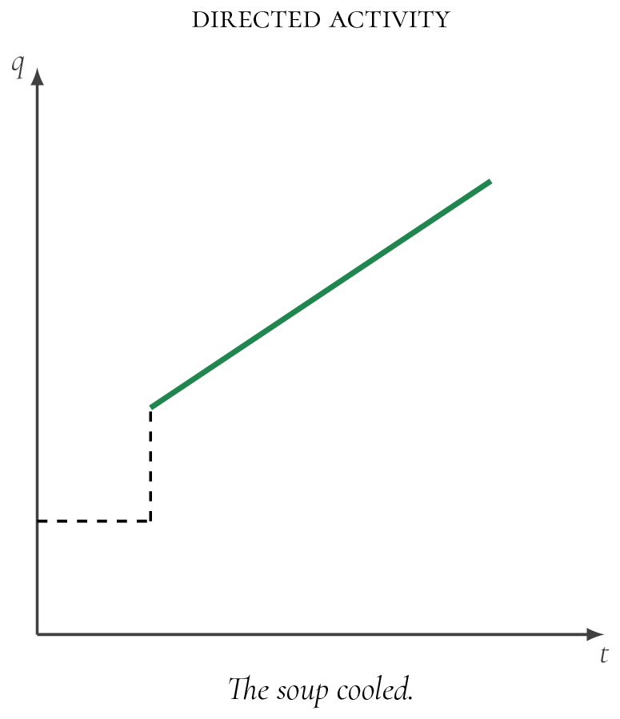

:::

::: {.column width="33%"}

:::
:::

## Aktionsart: cylical versions

::: columns
::: {.column width="25%"}
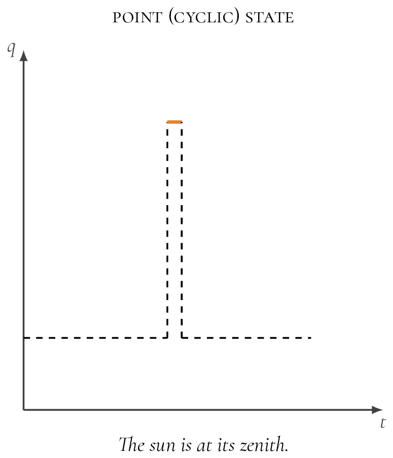

:::

::: {.column width="25%"}
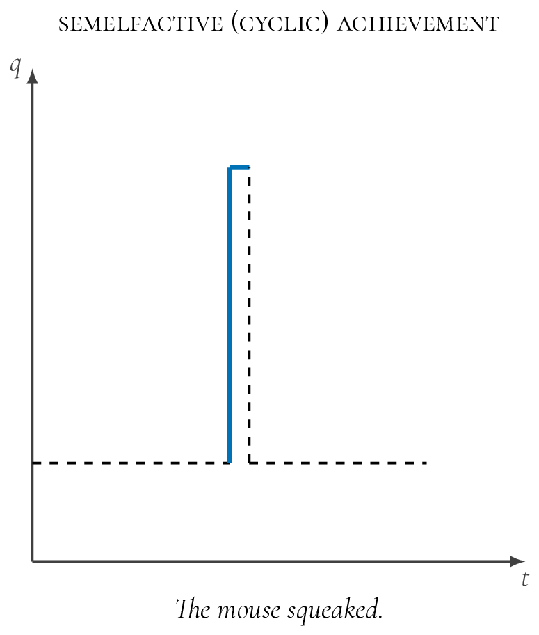

:::

::: {.column width="25%"}
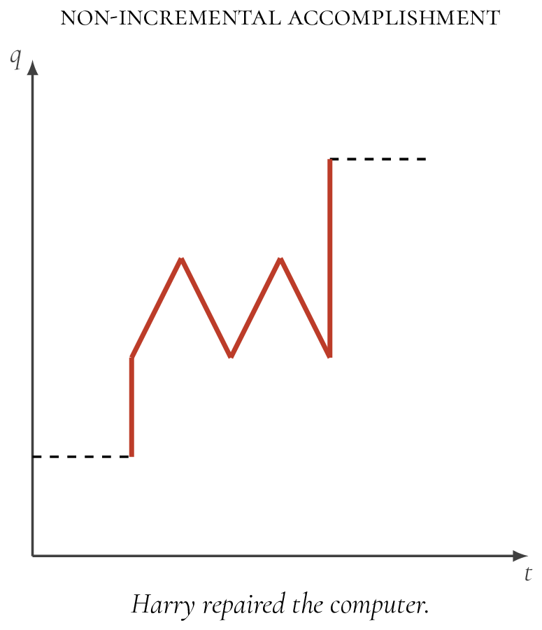

:::

::: {.column width="25%"}
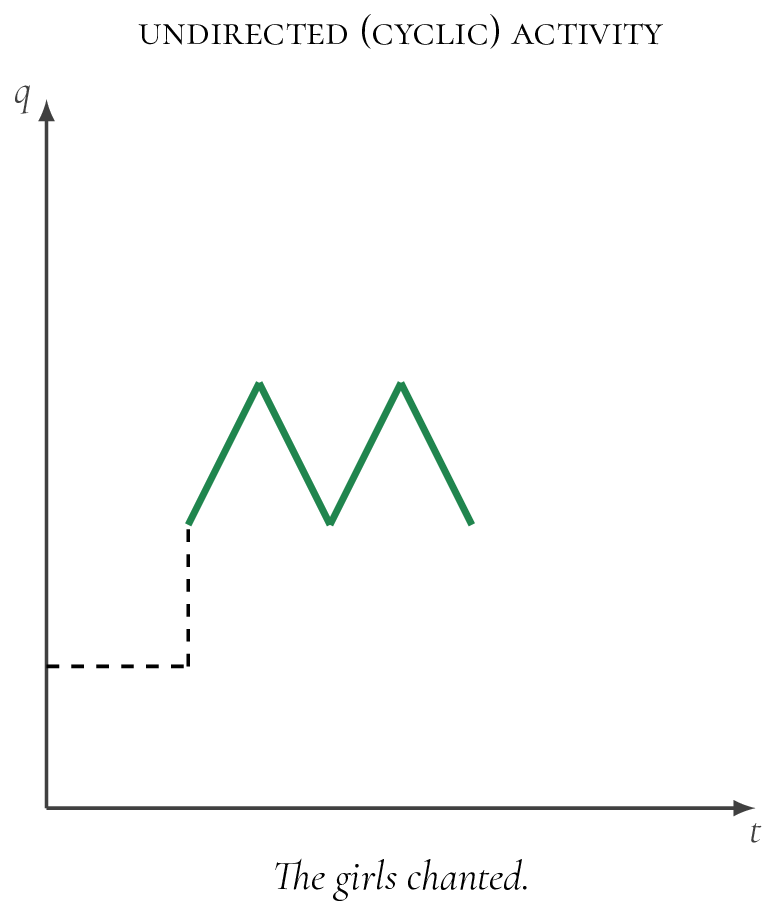

:::
:::

## Aktionsart: relaties tussen de verschillende types

Zie bordschema

Merk op: Croft's features zijn niet per se relevant voor elke categorie (idee van prototypiciteit).

::: {.fragment}
En daarmee komen we ook tot een einde van Aktionsart / lexicaal aspect.

:::

# Conclusies: decontextualisatie en recontextualisatie

## Structuralisme

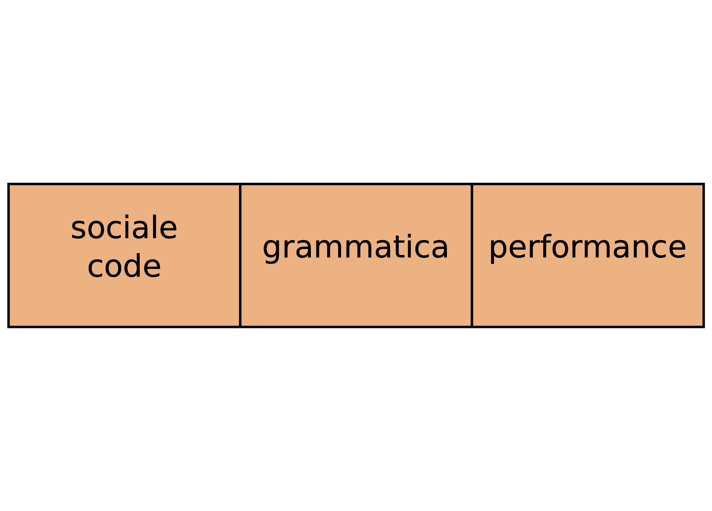

## Chomskyaans model (generativisme)

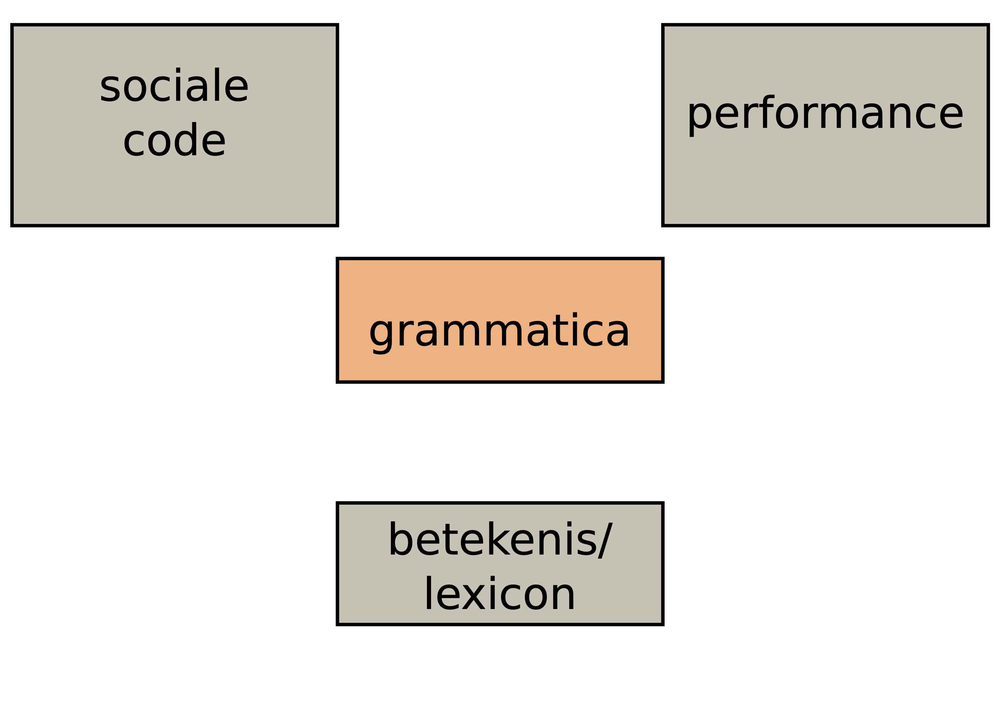

## Cognitief-functionele benaderingen 

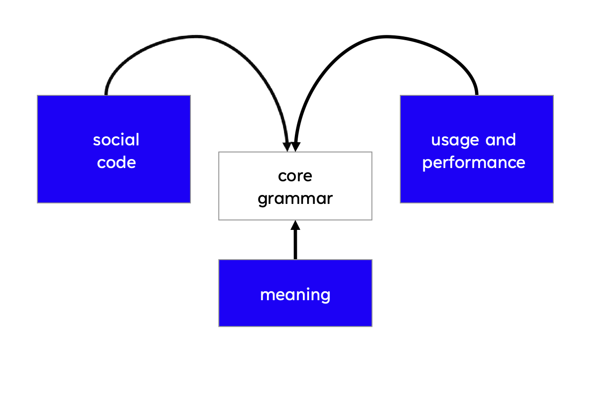

## Recontextualisatie

* Initieel worden de 'uitgestoten' disciplines ontwikkeld als nieuwe, zelfstandige disciplines die los staan van de Chomskyaanse kerngrammatica (1970--1980)
* Daarna: groeiende ontevredenheid wat betreft modulaire aanpak, groeiende tendens tot integrale benadering
* Op zichzelf staande domeinen die autonoom ontwikkeld werden, worden steeds meer geïntegreerd in een overkoepelende grammatica (die niet langer autonoom kan zijn)
* Cognitieve taalkunde is stroming die deze ontwikkeling het meest radicaal doorduwt

  
## Herintegratie van betekenis

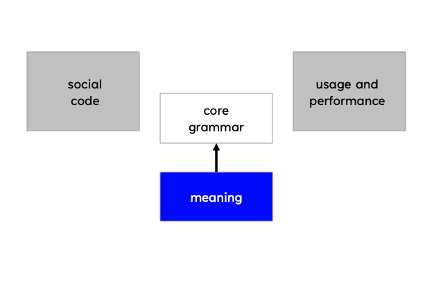

## Herintegratie van betekenis

* Betekenis staat niet op zichzelf, maar maakt een integraal deel uit van taal als geheel
* Integratie in de grammatica: vorm en betekenis kunnen niet los van elkaar gezien worden

::: {.fragment}
* Betekenis geïntegreerd met
    * omgeving: betekenis omvat meerdere perspectieven (*kat voor boom* / *boom achter kat*)
    * lichaam: betekenis is "embodied"
    * sociale wereld: betekenis is cultureel (encyclopedisch)
    * andere cognitieve architectuur: betekenis is niet modulair

:::

## Integratie van betekenis met omgeving

"perspectival"

* Betekenis is *construal*.
* Dus geen directe weergave van de werkelijkheid maar een structuur die geplaatst wordt op de realiteit ("een dialoog met de omgeving").
* Voorbeelden: prototypiciteitstheorie, metaforen, frames
* Gevolg: hernieuwde interesse om relatie tussen taal en denken te onderzoeken (vs. Chomskyaans universalisme)

## Integratie van betekenis met lichaam

* Het lichaam (onze interactie met de werkelijkheid) vormt het eerste uitgangspunt voor categorisatie, de lijflijke ervaring
* Voorbeelden: image schemas, force dynamics (we hebben hier niet echt bij stilgestaan)
* Gevolg: taalkundige vormen zijn ook "embodied". Het talig teken is niet enkel verbaal maar multimodaal.

## Integratie van betekenis met sociale wereld

* Categorieën in een taal reflecteren de cultuur en de geschiedenis van een taal. Betekenis komt voort uit socioculturele en historische ervaring.
* Voorbeelden: culturele verschillen in prototypes of verschillen in metaforen
* Gevolg: interesse voor verschillen in semantische benaderingen

## Integratie van betekenis met cognitieve architectuur

* De soort categorisatie we zien in taal is niet uniek aan taal, maar geïntegreerd met andere cognitieve vaardigheden.
* Voorbeelden: figure/ground (trajector/landmark) asymmetrie, Gestalteffecten
* Gevolg: Cognitieve Taalkunde is een deel van de "tweede cognitieve revolutie".

## De herintegratie van performance

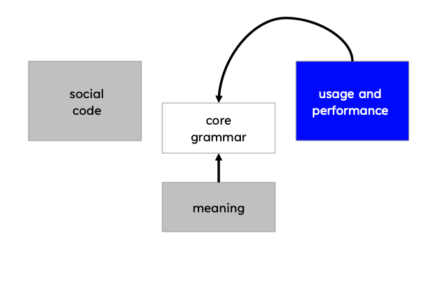

## De herintegratie van performance

* Van bij het begin van de cognitieve taalkunde is er interesse in pragmatische fenomenen
* Groeiende tendens:
    * Herpositionering van de cognitieve taalkunde als een gebruiksgebaseerde benadering
    * Groeiende interesse in toegepaste cognitieve taalkunde: taalverwerving, literatuuranalyse, discoursanalyse, framingonderzoek, ...

## De herintegratie van performance

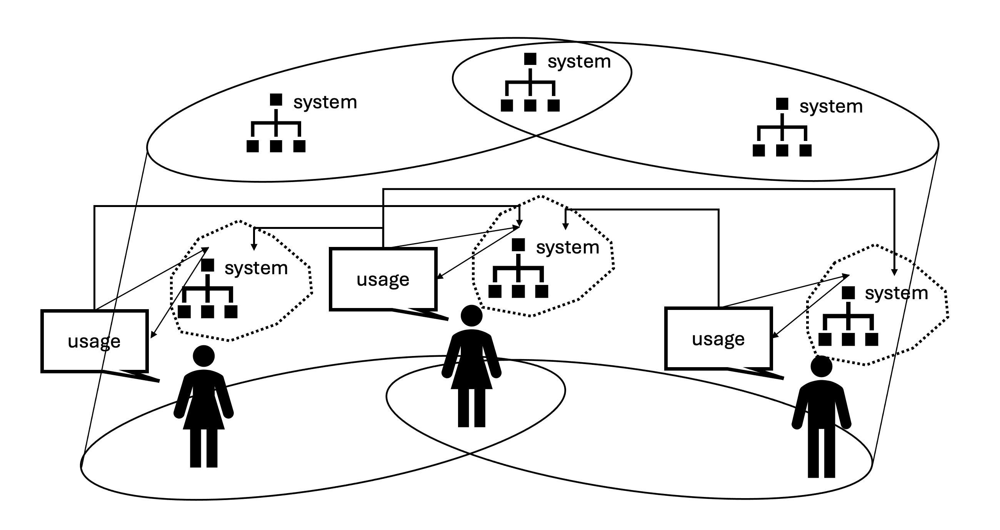

## De herintegratie van de sociale code

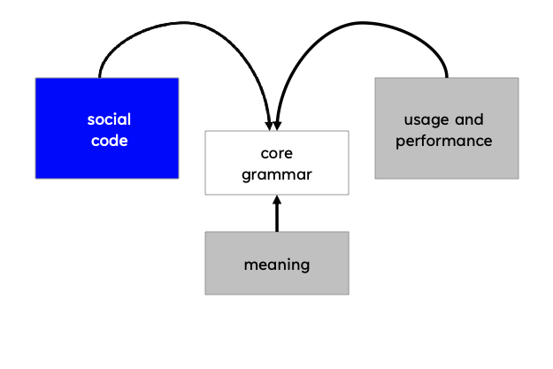

## De herintegratie van de sociale code

* Socio-culturele invulling van betekenis: op welke manier geeft taal de sociale werkelijkheid vorm?
* Cognitieve sociolinguïstiek: cognitieve benadering van lectale variatie (dialectisch, regiolectisch, sociolectisch, stilistisch)
* Hoe beïnvloeden algemene cognitieve principes de taalinterne variatie die het gevolg is van sociale context?
* Een volledig taalmodel moet naast de gebruikelijke cognitieve factoren ook socio-culturele factoren in rekening brengen, en beschrijven hoe die het taalgebruik beïnvloeden
* $\rightarrow$ Socio-culturele factoren die interageren met andere cognitieve factoren binnen het volledige taalmodel
* Actief onderzoeksdomein aan de faculteit

## Een tweede cognitieve revolutie?

domein |  1ste revolutie | 2de revolutie
-------|-----------------|------------
psychologie | mentaal fenomeen | cognitie is een "4E" fenomeen (embodied, embedded, enacted, extended)
informatica | symbolische manipulatie | probabilistische statistiek
taalkunde | generatieve grammatica | cognitieve en usage-based grammatica

## En nu een derde?

Semantiek blijft een belangrijke rol spelen voor de huidige ontwikkelingen, bv. in large language models (LLMs) zoals ChatGPT.

* Kan het succes van doorgedreven usage-based taalkunde de hernieuwde interesse van cognitieve taalkunde voor betekenis voorbijsnellen?
* Komt er een grote splitsing tussen cognitieve taalkunde en usage-based taalkunde?

::: {.fragment}
* Thematisch: verschuiving terug naar fonologie en morfosyntaxis
* Methodologisch: LLMs

* Probleem: huidige LLM modellen vaak "black boxes"...
* Anderzijds: parallellen met psychologie (neural network $\approx$ neurale basis cognitieve processen)

:::

## De toekomst?

* Data-driven linguistics
   * Toenemende beschikbaarheid van digitale tekstverzamelingen (en beschikbaarheid van tools om ze te analyseren)
   * Verdere toename van empirische, statistische analyse als voorkeursmethode van gebruiksgebaseerde benadering 

* Integratie van het neurale paradigma?

    * Grote vooruitgang op het vlak van computationele modellering van taal
    * Vooralsnog weinig weerslag op taalkundig onderzoek
    * Integratie + rol voor de taalkunde

* Functies
    * Stellen van taalkundig geïnformeerde onderzoeksvragen
    * Taalkundig analyse van modelvoorspellingen
    * Plaatsen van kritische kanttekeningen

# 

