# Betekenis

## Semantiek en pragmatiek

Semantiek en pragmatiek bestuderen beide de **interpretatie** van taaltekens

```{r}
library(glossr)

as_gloss(
  "Het boek ligt op de **bank.**"
)

as_gloss(
  "Het geld staat bij de **bank.**"
)
```


## Semantiek en pragmatiek

Semantiek en pragmatiek bestuderen beide de **interpretatie** van taaltekens

```{r}
library(glossr)

as_gloss(
  "Het boek **ligt** op de bank."
)

as_gloss(
  "Het geld **ligt** bij de bank."
)
```

## Semantiek en pragmatiek

Semantiek en pragmatiek bestuderen beide de **interpretatie** van taaltekens

```{r}
library(glossr)

as_gloss(
  "A. Het oud ben jij?"
)

as_gloss(
  "B. Het is niet voor mij, maar voor mijn vader."
)
```


## Semantiek en pragmatiek

Basisonderscheid: conventioneel vs. niet-conventioneel

::: {.fragment}

[Semantiek]{.alert2}

* Conventionele aspecten van interpretatie
* Woordbetekenis en zinsbetekenis
* Vast verbonden met taalteken, onafhankelijk van de context

:::


::: {.fragment}

[Pragmatiek]{.alert2}

*  Niet-conventionele aspecten van interpretatie
*  Gebruik van zinnen in context
*  Afhankelijk van de context

:::


## Refentiële en conceptuele betekenis


[Referentiële betekenis]{.alert2} (*Sinn*)

*  Woord of uitdrukking verwijst naar iets (reëel of imaginair)
*  Betekenis wordt gedefinieerd in termen van [waarheidscondities]{.alert2} (voorwaarden waaraan moet worden voldaan opdat een uiting waar zou zijn)
*  Maar: betekenis kan men niet gelijkstellen aan referent
*  Intensie vs. extensie
    * *snelste dier op aarde* = 'dier dat sneller rent dan eender welk dier' maar ook 'de cheetah'.
    * *de koning van België* vs.  *de koning van Frankrijk*

::: {.fragment}
[Conceptuele betekenis]{.alert2} (*Bedeutung*)

*  Betekenis is geen verwijzing naar de werkelijkheid, maar een mentale voorstelling in de geest van de taalgebruiker
    * *ochtendster* = *avondster* = *de planeet Venus*
    * zelfde referentie, maar andere conceptuele betekenis
    


:::


## Lexicale en grammaticale betekenis

* Lexicale semantiek: betekenis van individuele lexicale elementen (woordbetekenis)
    * Welke betekenissen heeft een woord?
    * Hoe verhouden verschillende betekenissen van eenzelfde woord zich tot elkaar?
    * Hoe verhouden betekenissen van verwante woorden zich tot elkaar?
* Grammaticale semantiek of zinssemantiek: hoe wordt de betekenis van een complexe expressie opgebouwd?
    * Principe van compositionaliteit
    * Semantiek van grammaticale functiewoorden (vb. lidwoorden)
    * Semantiek van gebeurtenissen, tijd, en aspect


## Doelstelling m.b.t. het onderdeel semantiek

*  Theorieën: verschillende historische perspectieven/visies op betekenis
*  Concepten: begrippenapparaat waarmee we betekenis kunnen beschrijven
*  Analysemethoden: op welke manier kunnen we betekenis deconstrueren en vormgeven?


## Stromingen

*  Drie belangrijke periodes in de 20e-eeuwse taalkunde
    *  Structuralistische taalkunde (1916-1960)
    *  Generatieve taalkunde (1960-nu)
    *  Cognitief-functionele taalkunde (1980-nu)

*  Decontextualisering en recontextualisering
    *  [Structuur]{.alert2}beschrijving wordt losgemaakt van de context (structuralisme)
    *  Evolutie naar grammatica als [autonoom systeem]{.alert2} (generatieve taalkunde)
    *  $\leftrightarrow$ Grammatica kan niet afgezonderd worden van zijn [gebruikscontext]{.alert2} en  [maatschappelijke context]{.alert2} (cognitief-functionele taalkunde)


## Overzicht


*  [Structuralistische semantiek]{.alert2} (10/11)
    *  Semantiek & structuur
    *  Lexicale semantiek (woordbetekenis)
    *  Componentiële analyse
*  [Formele semantiek]{.alert2} (17/11)
    *  Focus op referentiële betekenis
    *  Grammaticale semantiek (zinsbetekenis)
    *  Logica
*  [Cognitief-functionele semantiek]{.alert2} (24/11)
    *  Focus op conceptuele betekenis
    *  Metonymie en metaforen
    *  Corpusanalyse
*  [Computationele semantiek]{.alert2} (1/12)
*  [Pragmatiek]{.alert2} (8/12)
*  [Pragmatiek + openstaande vragen]{.alert2} (15/12)

## Voor wie meer wil

::: columns
::: {.column width="80%"}
Een zeer goed boek dat al deze theorieën verder uitwerkt, is *Theories of lexical semantics* van Dirk Geeraerts (2010)


:::

::: {.column width="20%"}
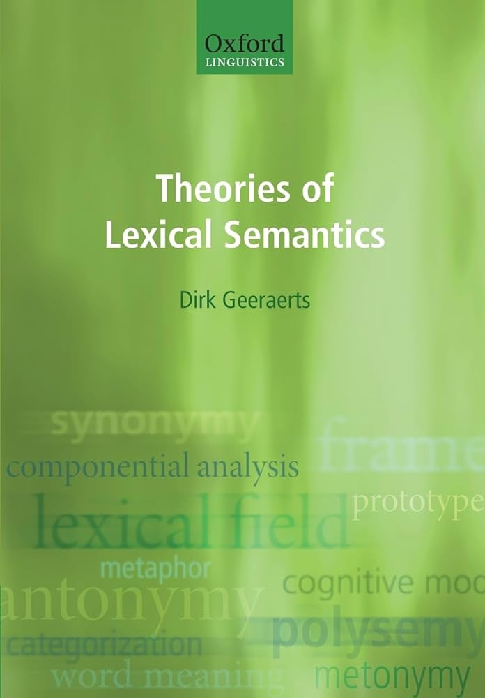

:::
:::


# Structuralisme


## Belangrijke figuren

::: columns
::: {.column width="80%"}
*  [Ferdinand de Saussure]{.alert2}
    *  Zwitsers taalkundige (1857--1913)
    * *Cours de linguistique générale* (1916)


::: {.fragment}

> Chaque langue forme un système où tout se tient
> [Antoine Meillet (1903)]{.alert2}

:::

::: {.fragment}

Synchrone taalkunde als een zelfstandige discipline, niet ondergeschikt aan andere disciplines zoals psychologie.
    
:::

:::

::: {.column width="20%"}
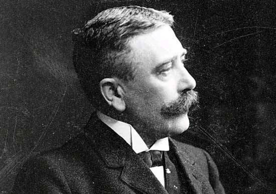

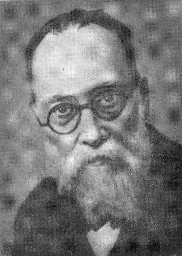


:::
:::

## Taal is zoals schaken (de Saussure)

* [symbolisch]{.alert2} [systeem]{.alert2}: de regels van het spel zijn het belangrijkste
* [conventionaliteit]{.alert2}: de waarde van elk onderdeel volgt bepaalde (afgesproken) regels
* focus op [synchrone]{.alert2} taalkunde: de regels die op dit moment gelden
* andere factoren worden erkend, maar vatten niet de essentie: historisch gegroeid of komt voor bij bepaalde sociale groepen, maar dat is niet de essentie -- de essentie zijn de regels.

Deze redenering gaat in tegen wat ervoor kwam (historisch-filologische benaderingen):

* verschuiving van semantiek zien als een grotendeels individueel psychologisch fenomeen naar een groepsfenomeen 
* [verschuiving van semasiologie naar onomasiologie]{.alert2}
  * d.w.z. van betekenis naar benoeming
* want taal is een [conceptuele laag]{.alert2} tussen de geest en de wereld, en het is die laag die we moeten vatten.

## De taalregels kunnen gevat worden in opposities


Opbouw van een taaltheorie (en afbakening van het terrein van de taalkunde) aan de hand van een aantal conceptuele opposities:

*  signifiant vs. signifié
*  langue vs. parole
*  synchroon vs. diachroon
*  syntagmatiek vs. paradigmatiek

## Het talig teken: signifiant vs. signifié

::: columns
::: {.column width="80%"}
> Le signe linguistique unit non une chose et un nom, mais un concept et une image acoustique.
> (de Saussure 1916:98)

Het talig teken is een eenheid van vorm ([signifiant]{.alert2}) en inhoud ([signifié]{.alert2})

* arbitrair: ongemotiveerd, conventionaliseerd
* concept: niet de buitentalige referent, maar een taal-interne betekenis
* image acoustique: niet de geproduceerde klank, maar het foneem


:::

::: {.column width="20%"}


:::
:::

## Het talig teken: signifiant vs. signifié

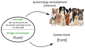


## Langue vs. parole

* [langue]{.alert2}: taalsysteem
* [parole]{.alert2}: taalgebruik
* [langage]{.alert2}: beide samen

::: {.fragment}
Langue is taal als sociaal en collectief systeem;  
parole is taal als individueel en psychologisch gegeven.

In het structuralisme beschrijft men vooral de *langue*.

:::

## Langue vs parole

> Mais qu’est-ce que la langue ? ... C’est à la fois [un produit social]{.alert2} de la faculté du langage et un [ensemble de conventions]{.alert2} nécessaires, [adoptées par le corps social]{.alert2} pour permettre l’exercice de cette faculté chez les individus (de Saussure 1916:25).

> [La langue est] un trésor déposé par la pratique de la parole dans tous les sujets appartenant à une même communauté […] La langue n’est complète dans aucun, elle [n’existe parfaitement que dans la masse]{.alert2} (de Saussure 1916:30).

> La parole est au contraire [un acte individuel de volonté et d’intelligence]{.alert2}, dans lequel il convient de distinguer 1) les combinaisons par lesquelles [le sujet parlant utilise le code de la langue]{.alert2} en vue d’exprimer sa pensée personelle; 2) le [mécanisme psycho-physique]{.alert2} qui lui permet d’extérioriser ces combinaisons (de Saussure 1916:30).

## Synchroon vs. diachroon


Primaat van de synchrone benadering   
(in tegenstelling tot pre-structuralistische benaderingen)

::: columns
::: {.column width="80%"}
> Il est évident que l’aspect synchronique prime l’autre ... S’il [le linguiste] se place dans la perspective diachronique, [ce n’est plus la langue qu’il aperçoit]{.alert2}, mais une série d’événements qui la modifient (de Saussure 1916:128).

:::

::: {.column width="20%"}
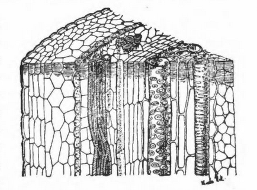

:::
:::


## Syntagmatiek vs. paradigmatiek

*  Syntagmatische relaties
    *  relaties 'in praesentia'
    *  samenvoeging
    *  typisch voor *parole*

*  Paradigmatische relaties
    *  relaties 'in absentia'
    *  associaties
    *  typisch voor *langue*

## Paradigmatische relaties

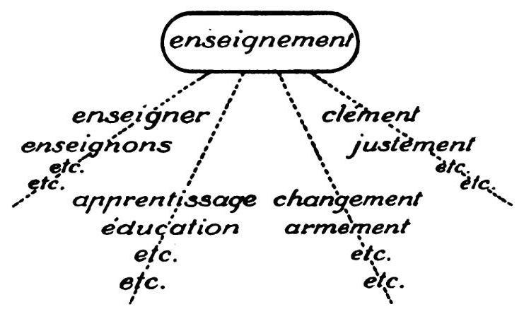

## Samenspel syntagmatiek en paradigmatiek


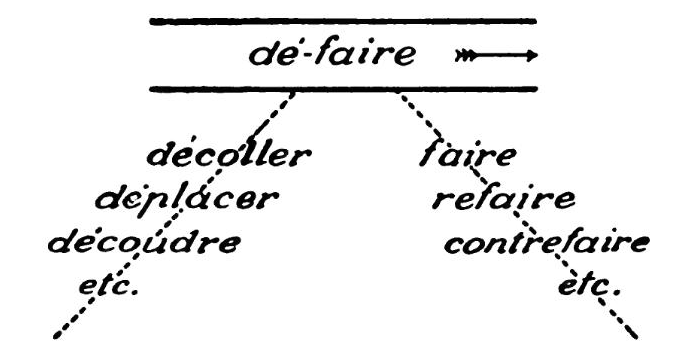

→ Dé-faire 'ongedaan maken' kan enkel geanalyseerd worden als syntagma omdat we paradigmatische opposities hebben met de onderdelen *dé* en *faire*.


# Structuralistische semantiek

## De structuralistische methode

> Tout ce qui précède revient à dire que dans la langue il n’y a que des différences... [Un système linguistique est une série de différences de sons combinées avec une série de différences d’idées]{.alert2} (de Saussure 1916: 166).

::: {.fragment}
* gebaseerd op differentialiteitsthese
*  eerst toegepast in fonologie (*fonologie als modelwetenschap*)
*  later uitbouw naar semantiek (lexicologie)
*  daarna ook toepassing in syntaxis


:::

## De structuralistische methode: fonologie

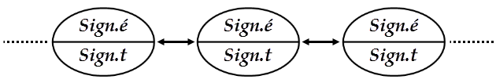

Spraak wordt structuralistisch beschreven a.h.v.

* distinctieve oppositie
  * /beer/ vs. /peer/
  * /mat/ vs. /nat/
* distinctieve kenmerken
  * [± STEMHEBBEND]
  * [± LABIAAL]
* streven naar eenvoudigste beschrijving (methodologisch principe)
* Cercle linguistique de Prague (Roman Jakobson, Nikolak Trubetzkoy)

## De structuralistische methode: lexicologie

Uitbreiding van tructuralistische analyse naar de semantiek

* [woordveld]{.alert2} ("lexical field"): geheel van begrippen die in onderlinge samenhang gedefinieerd moeten worden
* Jost Trier (1931) *Der Deutsche Wortschatz im Sinnbezirk des Verstandes*

## Woordveld voor KENNIS

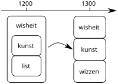

## Woordveld voor KENNIS

::: columns
::: {.column width="20%"}


:::

::: {.column width="80%"}
Rond 1200

* *kunst*: kennis en vaardigheden van de ridders aan het hof
* *list*: kennis en vaardigheden van wie niet tot die nobelen behoort
* *wîsheit*: algemene overkoepelende term, religieuze bijklank (cf. Lat. *sapientia*)

Rond 1300

* *wîsheit*: enkel het persoonlijk kennen van God
* *kunst*: "hogere" kennis zoals wetenschap en Kunst ("hoofdletter K")
* *list*: kreeg negatieve bijklank, 'sluwheid'
* *wizzen*: vervangt *list*: "lagere" kennis (schrijnwerkers e.d.)

:::
:::

## Conceptueel veld

Hoe delen verschillende talen de werkelijkheid in? Zijn er verschillende concepties van de werkelijkheid?

→ Sprong van woordveld (lexicaal veld) naar [conceptueel veld]{.alert2}

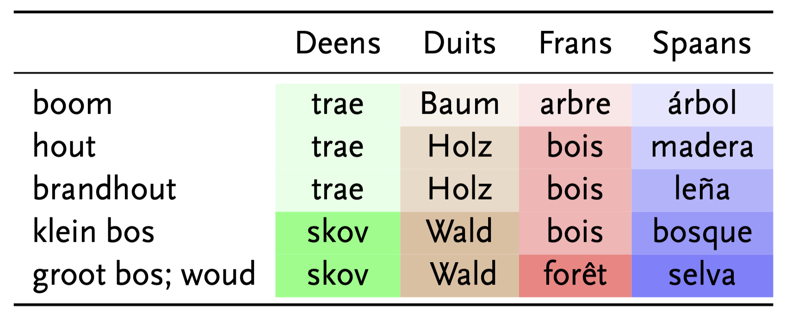


## Conceptueel veld (in een modern jasje)

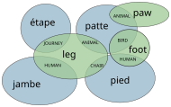

Bekend voorbeeld is ook de [CLICS databank (Cross-LInguistic ColexificationS)](https://clics.clld.org/graphs/infomap_24_LEG){target="_blank"}.

## Oriëntatie naar onomasiologie

In plaats van zich af te vragen wat een bepaald woord betekent, ligt de focus op hoe een bepaald concept uitgedrukt wordt op verschillende (distinctieve) manieren.

::: columns
::: {.column width="50%"}
[Semasiologie]{.alert2}

* ‘leer van de betekenis’
* welke betekenissen heeft een bepaald woord?
* vertrekpunt is de woordvorm; van daaruit naar betekenissen

:::

::: {.column width="50%"}
[Onomasiologie]{.alert2}

* ‘leer van de benaming’
* met welke woorden drukken we een bepaalde betekenis/concept
uit?
* vertrekpunt is betekenis; van daaruit naar woordvorm

:::
:::

## Grenzen tussen de velden: *Stuhl* of *Sessel*

::: columns
::: {.column width="40%"}
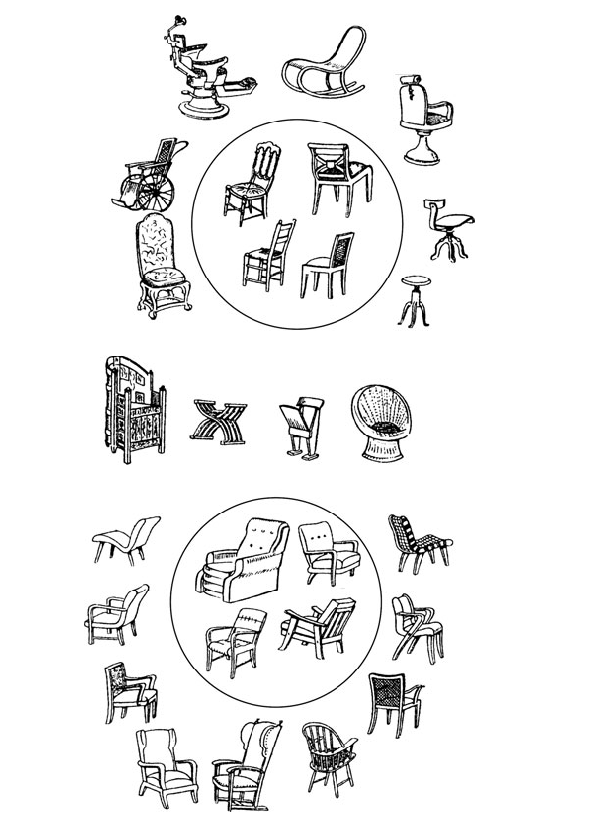

:::

::: {.column width="60%"}
Lexicale velden (als uitdrukking van conceptuele velden) stuiten vaak op problemen.

Bv. het onderscheid tussen *Stuhl* en *Sessel* is niet altijd mooi afgelijnd ("[fuzzy boundary]{.alert2}").

Waar eindigt het ene veld, en waar begint het andere?

::: {.fragment}
Een mogelijke oplossing ligt in het gebruik van een techniek die [componentiële analyse]{.alert2} genoemd wordt.

:::
:::
:::


## Componentiële analyse: MEUBELS OM IN TE ZITTEN (*siège*)

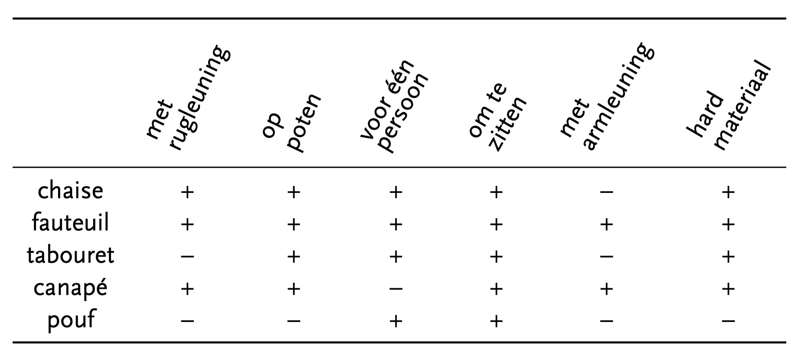


## Componentiële analyse

Om een woordveld/conceptueel veld te begrijpen moet je dus de termen tegenover elkaar plaatsen.


*  beschrijving van de betekenis van woorden (lexemen) beschrijft ook ineens de [structuur van het lexicon]{.alert2}
*  betekenisbeschrijving aan de hand van kleinst denkbare betekenisvolle eenheden
*  decompositie op basis van [distinctieve semantische features]{.alert2}
*  geïnspireerd op fonologische beschrijving: analyse van fonemen op basis van distinctieve features

## Componentiële analyse: VERWANTSCHAP

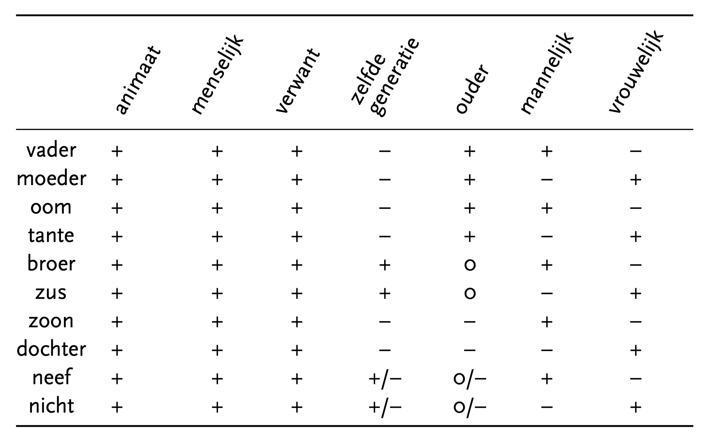

## Componentiële analyse: criteria

Algemeen principe voor structuralistische analyse (cfr. fonologische descriptie)

*  Bovengrens: 
  * niet meer features dan strikt noodzakelijk om elementen van elkaar te onderscheiden
*  Ondergrens: 
  * distinctiviteit moet gerealiseerd zijn, i.e. geen featurebundels die twee woorden ten onrechte als [synoniem]{.alert2} bestempelen

::: {.fragment}
→ Probleem met de vorige analyse van VERWANTSCHAP want niet alle dimensies zijn distinctief!

Hoe kunnen we die verbeteren?

:::


## Componentiële analyse: VERWANTSCHAP 

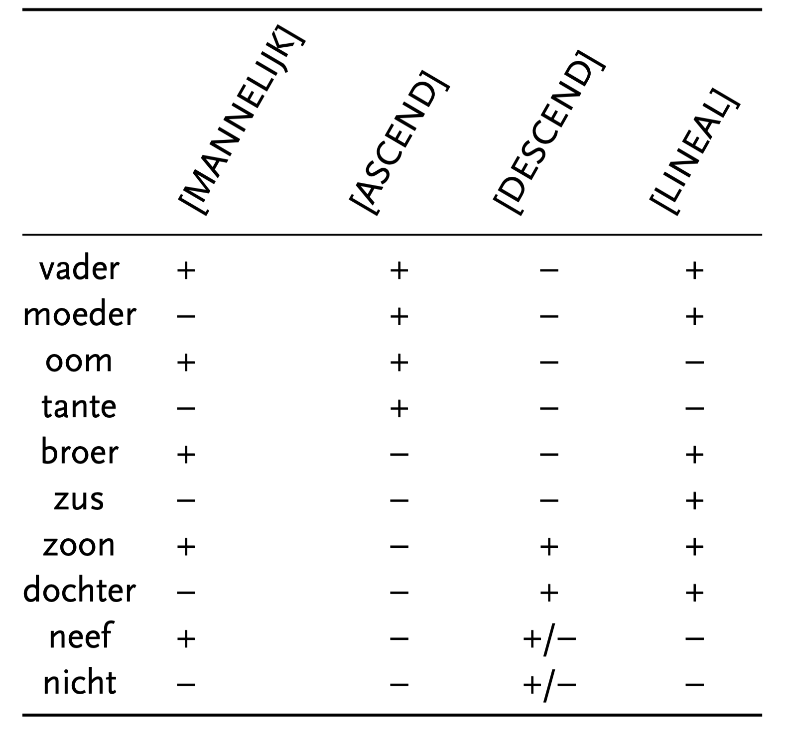


## Relationele semantiek

::: columns
::: {.column width="80%"}
John Lyons (1963) *Structural semantics* bouwt verder op inzichten uit het structuralismen (o.a. door Eugenio Coşeriu) over lexicale relaties tussen woorden (binnen hetzelfde conceptueel veld)

::: {.fragment}
Belangrijkste lexicale relaties:

* hyperonymie en hyponymie
* meronymie
* synonymie en antonymie
* homonymie en polysemie

:::
:::

::: {.column width="20%"}
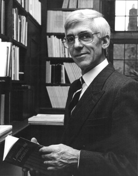

:::
:::

## Verticale relaties: hyperonymie en hyponymie (dmv taxonomie)

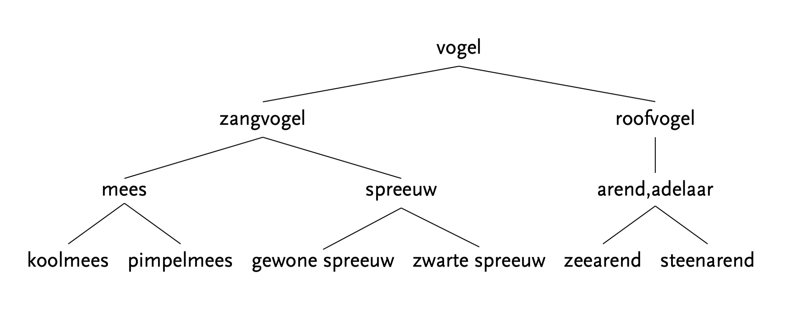

Termen: [hyperniem]{.alert2}, [hyponiem]{.alert2}, [co-hyponiem]{.alert2}

##  Verticale relaties: meronymie

Wanneer er een relatie van deel-geheel is, spreekt men eerder van [meronymie]{.alert2}

bv. relatie *arm* en *elleboog*

* *arm* is een [holoniem]{.alert2}
* *elleboog* is een [meroniem]{.alert2}

## Horizontale relaties: synonymie en antonymie

* [Synonymie]{.alert2}
    *  betekenissen van twee verwante woorden zijn identiek: *taalkundige* vs. *linguïst*
    *  meestal wordt gedoeld op identieke referentie/extensie
    *  absolute synonymie (volledige gelijkwaardigheid) is moeilijk te vinden:
        *  Verschil in connotatie: *gierig* vs. *zuinig*
        *  Verschil in context: *water* vs. $H_2O$
        *  Verschil in register: *vandaag* vs. *heden*
  * maar bij effectief gebruik vervaagt het onderscheidend element soms


*  [Antonymie]{.alert2}
    *  betekenisen van twee verwante woorden zijn tegenovergesteld aan elkaar: *licht* vs. *donker*
    *  binair (*levend/dood*) of uiteinden van een schaal (*kort/lang*)
    *  relationeel (*kopen/verkopen*; *stijgen/dalen*)

## Wel of geen verwante betekenis: homonymie en polysemie

*  [Homonymie]{.alert2}
    *  geen verwantschap tussen betekenissen; vormgelijkenis is louter accidenteel, bv. *bank* 
    *  gevolg van (diachrone) klankontwikkelingen, bv. [*kool*](https://en.wiktionary.org/wiki/kool#Dutch){target="_blank"}

*  [Polysemie]{.alert2}
    *  Duidelijk aanwijsbare relatie tussen betekenissen
    *  typisch bij metonymie, bv. *glas*, *kurk*

Merk op: homonymie is onomasiologisch georienteerd, polysemie semasiologisch.

## Homonymievrees


::: columns
::: {.column width="70%"}
In het Franse dialect uit de Gascogne viel op een bepaald moment het Latijnse *gallus* 'haan' samen met *cattus* 'kat', in de vorm *gat*.

→ *gat* 'haan' wordt vervangen door *azan* (cf. *faisan* 'fazant') of door *bigey* (cf. *vicaire* 'dominee')  
en in sommige gevallen door *pullus* (cf. *poule*)

Dit is een therapeutische reactie die voortkomt uit een vrees voor homonymie (Gilliéron 1912).

:::

::: {.column width="30%"}

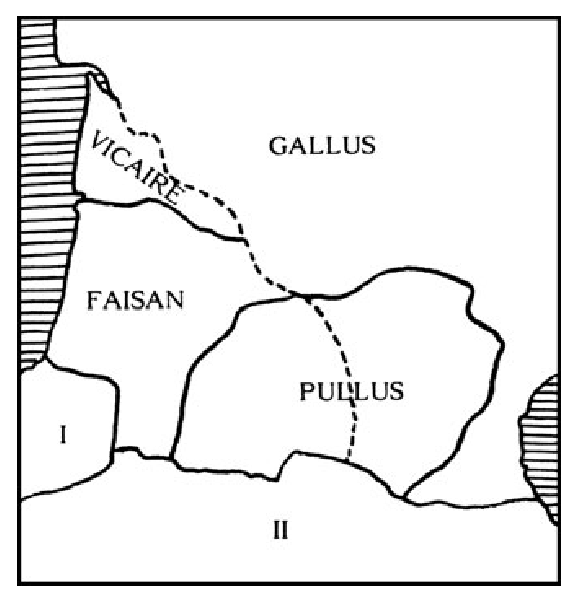

:::
:::

# Afsluitende opmerkingen

## Problemen structuralistische aanpak

Wereldkennis vs. taalkennis

*  Featureselectie
    *  Componentiële definities moeten met een minimaal aantal features distinctief zijn
    *  Hoe kies je die features?
*  Componentiële analyse wil enkel talige kennis vatten; maar features hebben veel weg van encyclopedische kennis
    *  Zijn lexicale relaties zuiver linguïstisch? Of afgeleid van encyclopedische kennis? Wat met meronymie?

Typiciteit

*  Distinctieve features gelden voor typische leden van een categorie, maar wat met atypische leden?
*  Voorbeeld: stoel met armleuning?

## Uitbreiding naar syntaxis

Twee pijlers: 

*  Idee van de distributionele analyse, zoals toegepast in de fonologie, wordt uitgebreid naar syntaxis
*  Introductie van hiërarchische structuren in de syntactische beschrijving $\rightarrow$ distributionele analyse van woordgroepen in plaats van afzonderlijke woorden (constituenten)
*  Dependentiegrammatie (Tesnière)

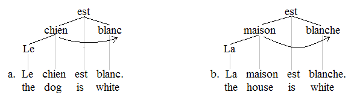

## Lexicale syntagmatiek

::: columns
::: {.column width="80%"}
Walter Porzig

*  *Wesenhafte Bedeutungsbeziehungen*
* Combineerbaarheid van woorden heeft niet alleen met de syntaxis, maar ook met hun betekenis te maken
* bv. *gehen / fahren -- zu Fuss / in einem Wagen*

John Rupert Firth

*  "You shall know a word by the company it keeps" (1954)
*  De context waarin een woord voorkomt, zegt iets over zijn betekenis  
    (we komen hier nog op terug)


:::

::: {.column width="20%"}
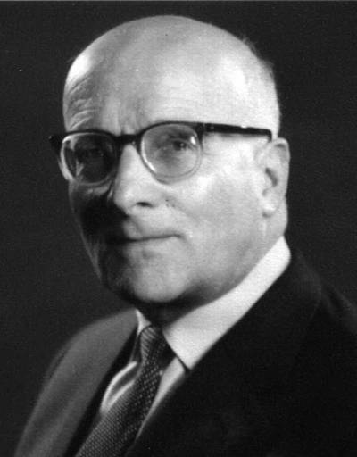

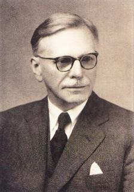

:::
:::


## Belang op langere termijn

Theoretisch

*  syntaxis wordt minder abstract door rekening te houden met de lexicale invulling van algemene categorieën en patronen
*  syntaxis kan niet losgekoppeld worden van betekenis


Methodologisch

*  basis voor statistische corpusanalyse van co-occurrenties van woorden
*  inspiratiebron voor computationele modellen die automatisch betekenis uit teksten afleiden


