## Lexicale en grammaticale betekenis

* Lexicale semantiek: betekenis van individuele lexicale elementen (woordbetekenis)
    * Welke betekenissen heeft een woord?
    * Hoe verhouden verschillende betekenissen van eenzelfde woord zich tot elkaar?
    * Hoe verhouden betekenissen van verwante woorden zich tot elkaar?

* Grammaticale semantiek of zinssemantiek: hoe wordt de betekenis van een complexe expressie opgebouwd?
    * Principe van compositionaliteit
    * Semantiek van grammaticale functiewoorden (vb. lidwoorden)
    * Semantiek van gebeurtenissen, tijd, en aspect

# Logica

## Logica als inspiratiebron

Formeel model van taal geïnspireerd op de logica

Logica omvat

* [Propositielogica]{.alert2}: behandelt de structuur van complexe proposities (uitspraken met waarheidswaarde)
* [Predikatenlogica]{.alert2}: behandelt de interne structuur van enkelvoudige proposities

## Propositielogica

Propositie:

* uitspraak die waar of onwaar kan zijn (bv. *het regent*, *de lamp brandt*, ...)
* voorgesteld door een [variabele]{.alert2} (*p, q, r, \ldots*)
* de waarheid van complexe proposities wordt bepaald door de gebruikte connectoren en de waarheid van de enkelvoudige proposities
*  [connectoren]{.alert2} of [operatoren]{.alert2} worden gebruikt om complexe proposities samen te stellen

::: columns
::: {.column width="10%"}

:::

::: {.column width="90%" .desc}
implicatie
:   $\rightarrow$

conjunctie
:   $\land$

disjunctie
:  $\lor$

negatie
:  $\lnot$

:::
:::

## Waarheidstabel

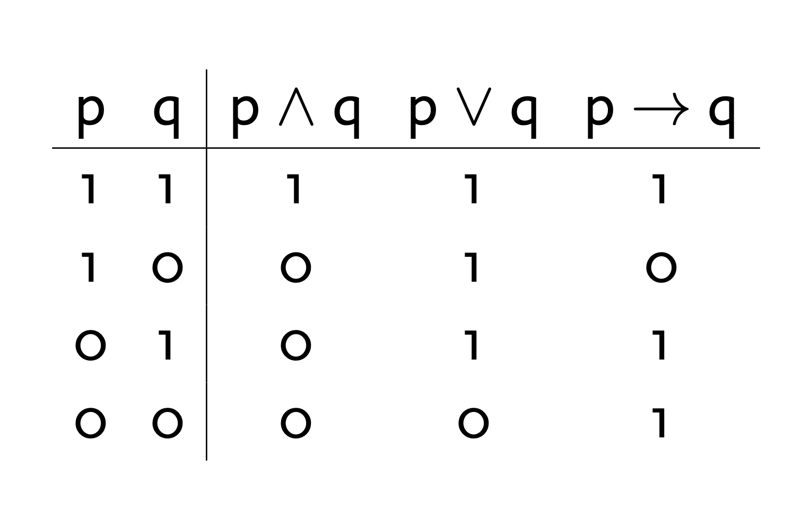

## Predikatenlogica

Enkelvoudige proposities, die in de propositielogica als atomair beschouwd worden, worden in de predikatenlogica verder ontleed

* Enkelplaatsige en meerplaatsige predikaten
    * *Frederik slaapt* &emsp; [slaapt]{.smallcaps}(*Frederik*) &emsp; $S(f)$
    * *Karel ziet Annabel* &emsp;  [ziet]{.smallcaps}(*Karel*, *Annabel*) &emsp; $Z(k,a)$

* [Argumenten]{.alert2} zijn *constanten* of *variabelen*
    * [constanten]{.alert2} zijn identificeerbare individuen
    * [variableen]{.alert2} zijn niet nader geïdentificeerde reeksen van referenten: $P(x)$

* [Kwantoren]{.alert2} bepalen het bereik van variabelen

  * *alle mensen zijn sterfelijk* &emsp;  $\forall x: M(x) \rightarrow S(x)$
  * *sommige dieren zijn zoogdieren* &emsp;  $\exists x: D(x)~\&~Z(x)$

<!-- ## Oefening -->

<!-- NOG MAKEN ZIE GEERAERTS CURSUS -->

<!-- %%   Is de volgende complexe propositie een logische waarheid, i.e. een propositie die onder alle omstandigheden waar is? -->

<!-- %%   \bigskip -->

<!-- %%   \begin{center} -->
<!-- %%   ((p $\rightarrow$ q) $\land$ $\lnot$ p) $\rightarrow$ $\lnot$ q -->
<!-- %%   \end{center} -->

<!-- %%  -->

<!-- %%  -->
<!-- %%## {Oefening} -->

<!-- %%    \begin{center} -->
<!-- %%   ((p $\rightarrow$ q) $\land$ $\lnot$ p) $\rightarrow$ $\lnot$ q -->
<!-- %%   \end{center} -->

<!-- %%    \bigskip -->

<!-- %%   \centering -->
<!-- %%   %\LARGE -->
<!-- %%   \begin{tabular}{c c|c c c c c} -->
<!-- %% p & q & p $\rightarrow$ q & $\lnot$ p & $\lnot$ q & (p $\rightarrow$ q) $\land$ $\lnot$ p & ((p $\rightarrow$ q) $\land$ $\lnot$ p) $\rightarrow$ $\lnot$ q\\  -->
<!-- %% \hline  -->
<!-- %% 1 & 1 & 1 & 0 & 0 & 0 & 1\\ -->
<!-- %% 1 & 0 & 0 & 0 & 1 & 0 & 1\\ -->
<!-- %% 0 & 1 & 1 & 1 & 0 & 1 & 0\\ -->
<!-- %% 0 & 0 & 1 & 1 & 1 & 1 & 1\\ -->
<!-- %% \end{tabular} -->

<!-- %%  -->

<!-- %%  -->
<!-- %%## {Oefening} -->

<!-- %%    \begin{center} -->
<!-- %%   ((p $\rightarrow$ q) $\land$ $\lnot$ q) $\rightarrow$ $\lnot$ p -->
<!-- %%   \end{center} -->

<!-- %%    \bigskip -->

<!-- %%   \centering -->
<!-- %%   %\LARGE -->
<!-- %%   \begin{tabular}{c c|c c c c c} -->
<!-- %% p & q & p $\rightarrow$ q & $\lnot$ q & $\lnot$ p & (p $\rightarrow$ q) $\land$ $\lnot$ p & ((p $\rightarrow$ q) $\land$ $\lnot$ p) $\rightarrow$ $\lnot$ q\\  -->
<!-- %% \hline  -->
<!-- %% 1 & 1 & 1 & 0 & 0 & 0 & 1\\ -->
<!-- %% 1 & 0 & 0 & 1 & 0 & 0 & 1\\ -->
<!-- %% 0 & 1 & 1 & 0 & 1 & 0 & 1\\ -->
<!-- %% 0 & 0 & 1 & 1 & 1 & 1 & 1\\ -->
<!-- %% \end{tabular} -->

<!-- %%  -->

# Generatieve taalkunde: inleiding

## Generatieve taalkunde

::: columns
::: {.column width="80%"}
* dominante stroming in laatste kwart van de 20e eeuw
* geïnitieerd en gedomineerd door Noam Chomsky
* hoofdkenmerken
    * competence vs. performance
    * Language Acquisition Device (LAD)
    * introspectie
    * formalisme (dat voortkomt uit de delen van de logica)

:::

::: {.column width="20%"}
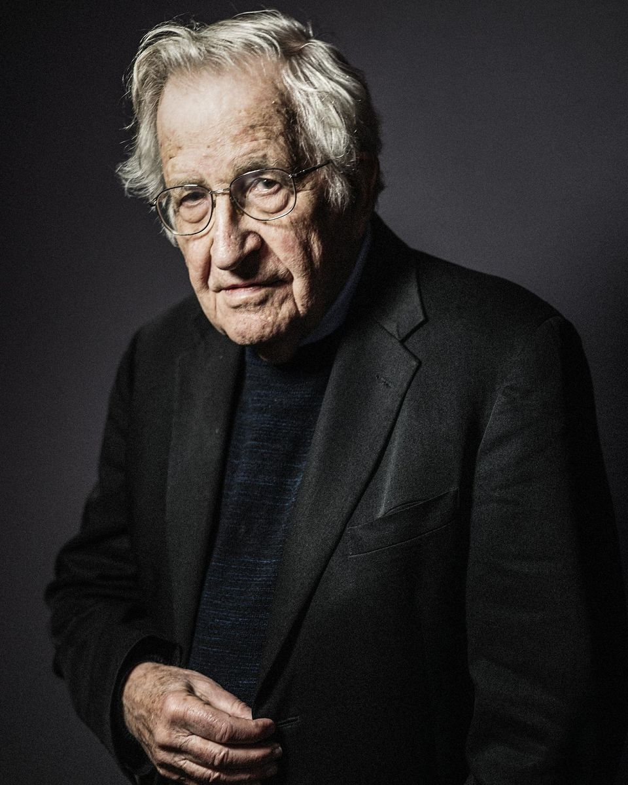

:::
:::

🔎 Zie ook de lessen gegeven door Prof. Lahousse.

## Plaats van de semantiek in de generatieve grammatica

De plaats van de betekenisbeschrijving in de generatieve grammatica zorgt voor een interne strijd

::: {.desc}
1957
:  geen semantiek

1965
:  toevoeging semantische component

post-1965
:  discussie tussen generatieve en interpretatieve semantiek

vanaf 1970
:  minimalistische semantiek

:::

## Evolutie generatieve grammatica

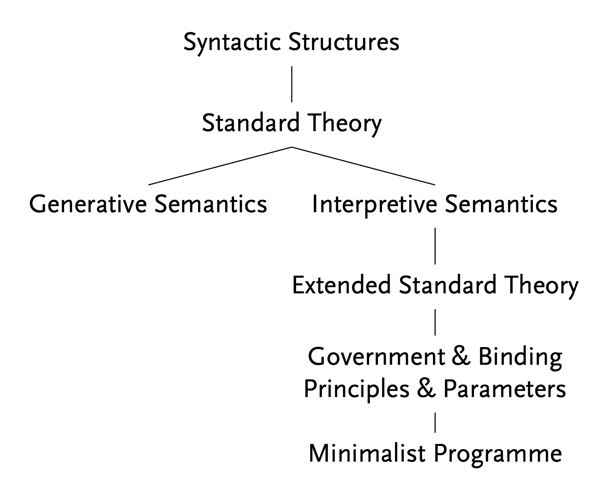

# Syntactic Structures

## Syntactic Structures (1957)

> [...] [the notion *grammatical* cannot be identified with *meaningful* or *significant* in any semantic sense.]{.alert2} Sentences (1) and (2) are equally nonsensical, but any speaker of English will recognize that only the former is grammatical.
>
(@) Colorless green ideas sleep furiously.
>
(@) Furiously sleep ideas green colorless.
>
> It is fair to assume that neither sentence (1) nor (2) (nor indeed any
part of these sentences) has ever occurred in an English
discourse. Hence, in any statistical model for grammaticalness, these
sentences will be ruled out on identical grounds as equally `remote'
from English. Yet (1), though nonsensical, is grammatical, while (2)
is not. [1957:15--16]

## Syntactic Structures (1957)

> I think that we are forced to conclude that
[grammar  is  autonomous  and  independent  of  meaning]{.alert2}, and that
probabilistic  models  give  no  particular  insight  into  some  of  the
basic  problems  of  syntactic structure.'' [1957:17]

* De zin *colorless green ideas sleep furiously* heeft geen betekenis
* Maar we herkennen de zin wel als grammaticaal correct
* Vandaar: een model van de grammatica zonder semantische component

## Syntactic Structures (1957)

Waaruit bestaat het formeel grammaticaal model?

::: {.desc}
Herschrijfregels
:   in de vorm van context-vrije grammatica

* Regels nemen één symbool als input en leveren reeks van symbolen als output
* Zo wordt een boomstructuur opgebouwd

Transformaties
:   genereren afgeleide structuren

* Transformaties nemen een boomstructuur als input, en leveren andere boomstructuur als output
* Staat toe om te generaliseren, en relaties tussen zinnen te vatten
* Voorbeeld: actief/passief

:::

## Herschrijfregels

Een [generatief regelsysteem]{.alert2} 

"$\rightarrow$ the (infinite) set of sentences of a language can be described with a (finite) set of rules"

::: {.fragment}
A mini-grammar with rewrite rules:

* S $\rightarrow$ NP VP
* NP $\rightarrow$ Det N (PP)
* VP $\rightarrow$ V NP
* PP $\rightarrow$ Prep NP

:::

## Actief-passief transformatie

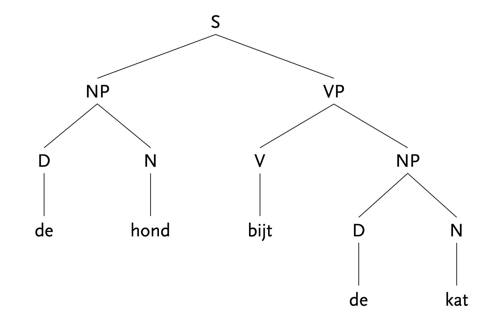

## Actief-passief transformatie

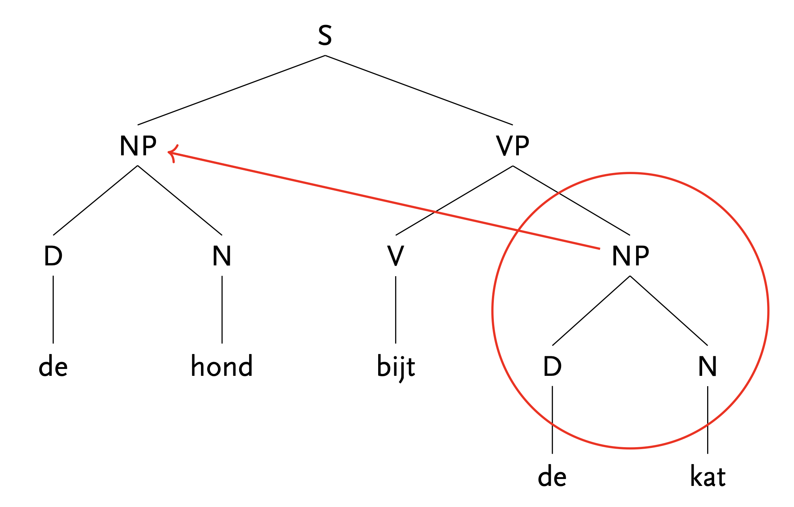

## Actief-passief transformatie

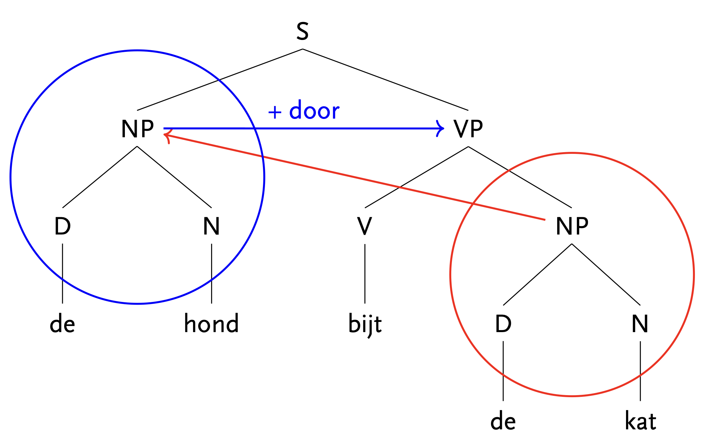

## Actief-passief transformatie

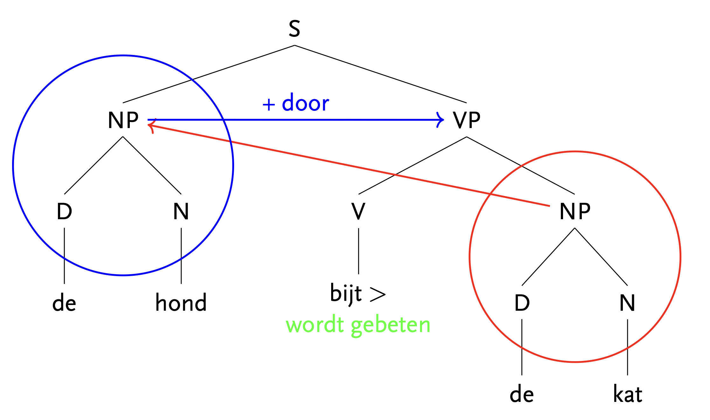

## Actief-passief transformatie

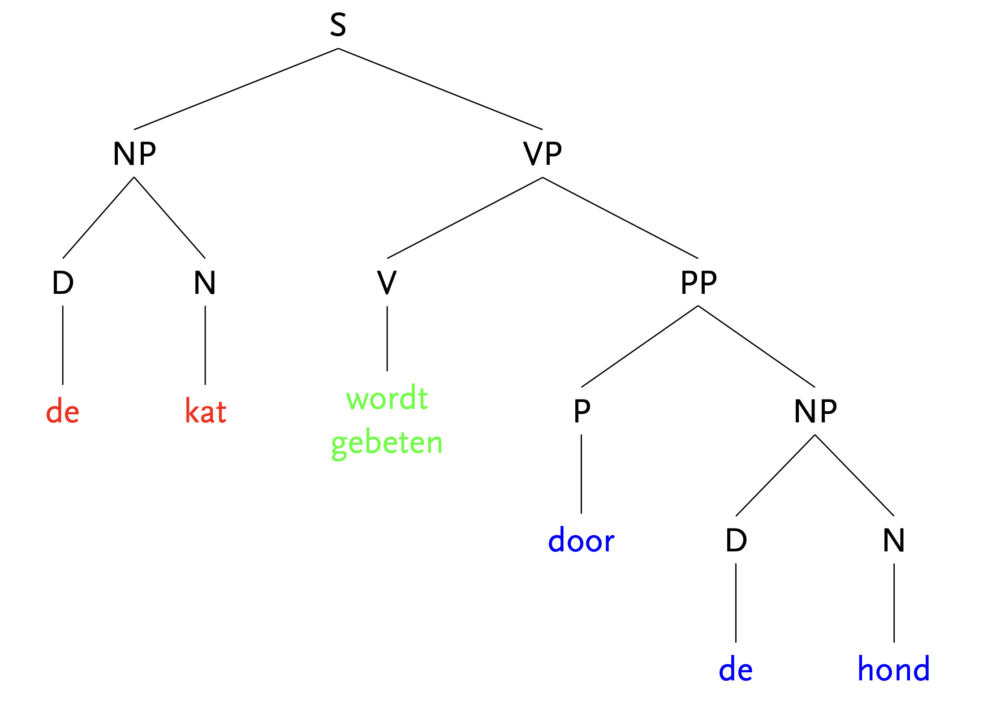

## Syntactic Structures (1957)

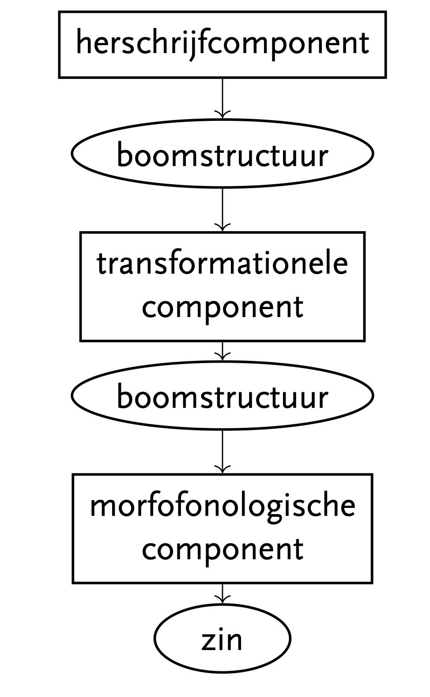

## Logica als inspiratie voor equivalentie van transformaties

Uitgangspunt:
complexe logische formules kunnen dezelfde waarheidswaarde hebben

* bv. $\lnot$ p $\rightarrow$ $\lnot$ q is hetzelfde als ((p $\rightarrow$ q) $\land$ $\lnot$ p) $\rightarrow$ $\lnot$ q
       \
$\rightsquigarrow$ Er bestaan regels voor het vereenvoudigen/omzetten van formules

$\rightsquigarrow$ Syntactische transformaties in het chomskyaanse kader werken op een vergelijkbare manier

* Chomsky heeft het vooral over welgevormdheid (grammaticaliteit) die bewaard wordt bij transformaties
* Tegelijk suggereren voorbeelden (zoals actief/passief) dat de transformaties ook semantisch equivalent zijn

## Mentalisme

Jaren 1950 zien een cognitieve revolutie: anti-behaviorisme in de psychologie en in de cognitieve wetenschappen

* [behaviorisme]{.alert2} (Bloomfield)
    * als methode: wat in de geest gebeurt kan niet direct bestudeerd worden, enkel geïnfereerd in gecontroleerde experimenten 
    * als theorie: de geest ("mind") bestaat niet, alles is stimulus-respons
* [mentalisme]{.alert2} daarentegen (Chomsky)
    * taalkennis kent wel een psychologisch reële symbolische representatie
    * behaviorisme kan niet om met het [*poverty of stimulus*-argument]{.alert2}
    * als methode: eerder intuïtie in Chomskyaanse grammatica dan degelijke methode
    * als theorie: competence eerder dan performance (of langue), en die competence is genetisch!

# Aspects of the Theory of Syntax (1965)

## Aspects of the Theory of Syntax (1965)

Introductie van een semantische component in de grammatica (bovenop de syntactische en fonologische component)

::: columns
::: {.column width="50%"}
[Dieptestructuur (D Structure)]{.alert2}

* gegenereerd op basis van herschrijfregels
*  door transformatieregels omgezet in oppervlaktestructuur
* invoer voor semantische component;

:::

::: {.column width="50%"}
[oppervlaktestructuur (S Structure)]{.alert2}

* invoer voor fonologische component

:::
:::

Hoofdrol voor de [syntaxis]{.alert2} (syntaxis als modeldiscipline)
$\rightsquigarrow$ semantiek en fonologie spelen bijkomende, interpretatieve rol

Dit model heet de [Standard Theory]{.alert2}

## Aspects (1965)

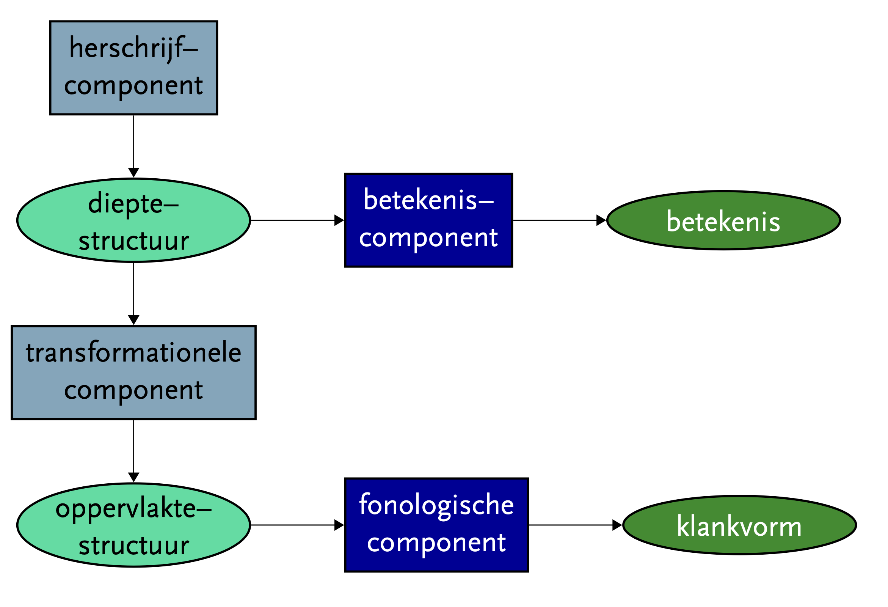

## Transformaties: een splijtzwam

De introductie van transformaties leidt tot twee discussies:

* Zijn transformaties überhaupt nodig in een formele grammatica?
* Zijn transformaties betekenisbehoudend? En meer algemeen: wat is de rol van betekenis in de grammatica?

## Transformaties: een splijtzwam

::: columns
::: {.column width="80%"}
Eerste antwoord geformuleerd door Jerrold [Katz]{.alert2} en Jerry [Fodor]{.alert2}:
transformaties zijn betekenisbehoudend

Chomsky gaat hier *initieel* mee akkoord, maar maakt wel eenduidelijk onderscheid tussen syntactische dieptestructuur en semantische interpretatie als afzonderlijke componenten

:::

::: {.column width="20%"}
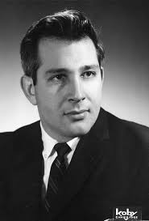

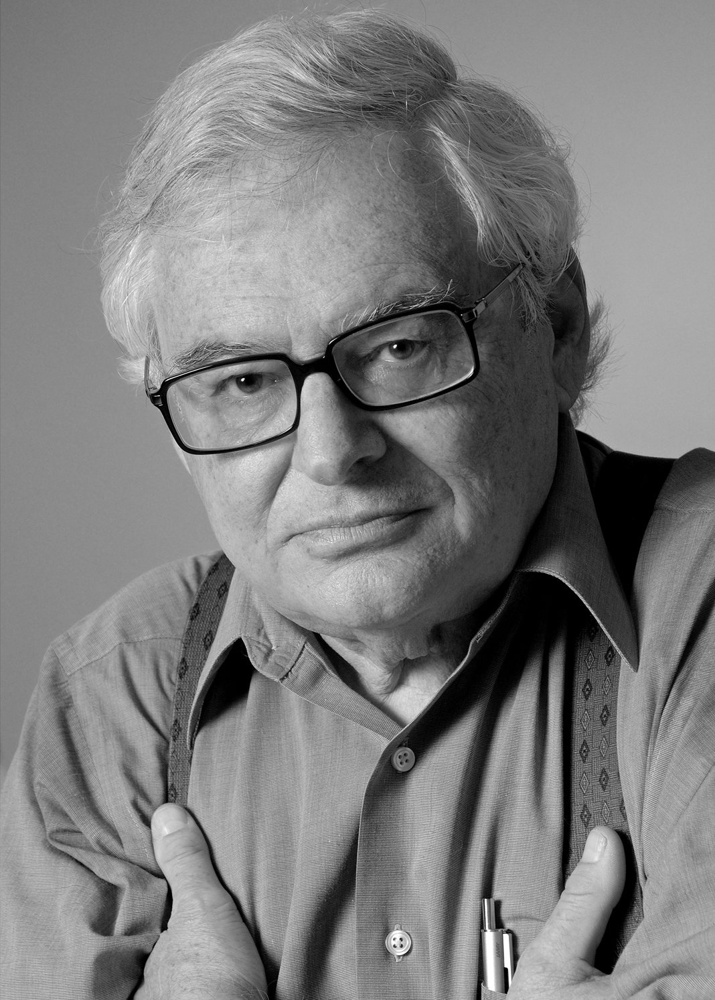

:::
:::

# Linguistics wars

## Transformaties: een splijtzwam

Op dat punt ontwikkelen zich twee verschillende theorieën

1. Generatieve semantiek (Ross, Postal, McCawley, Lakoff):

* Hypothese van Katz-Fodor wordt doorgedreven tot het uiterste
* Als transformaties betekenisbehoudend zijn, en de semantische component grijpt aan op de dieptestructuur, dan is die dieptestructuur eigenlijk gelijk aan de betekenis

2. Interpretatieve semantiek (Chomsky)

* Transformaties zijn helemaal niet betekenisbehoudend
* Semantische component moet geherdefinieerd worden: grijpt veeleer aan op oppervlaktestructuur

## Generatieve semantiek

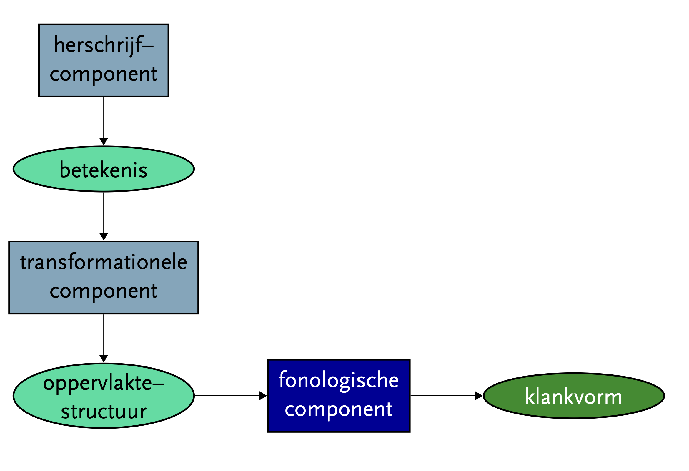

## Generatieve semantiek

Hoe ziet een generatief-semantische betekenisrepresentatie eruit?

* Hiërarchische componentiële analyse
* Boomstructuren
* Predikatenlogica

## Generatieve betekenisrepresentatie

::: {.desc}
Stap 1
:   semantische decompositie van *kill*
:::

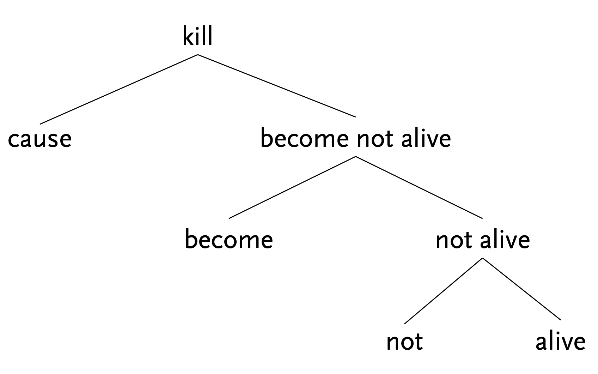

## Generatieve betekenisrepresentatie

::: {.desc}
Stap 2
:   uitbreiding met variabelen en kwantoren / operatoren

:::

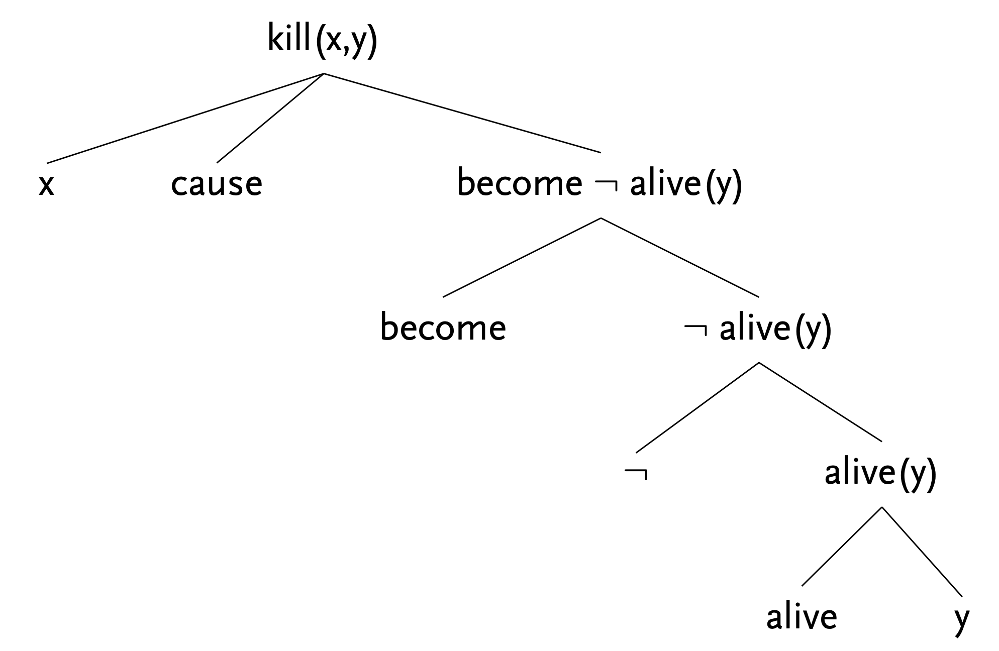

## Generatieve betekenisrepresentatie

::: {.desc}
Stap 3
:   labelen van de knopen in de betkenis presentatie

:::

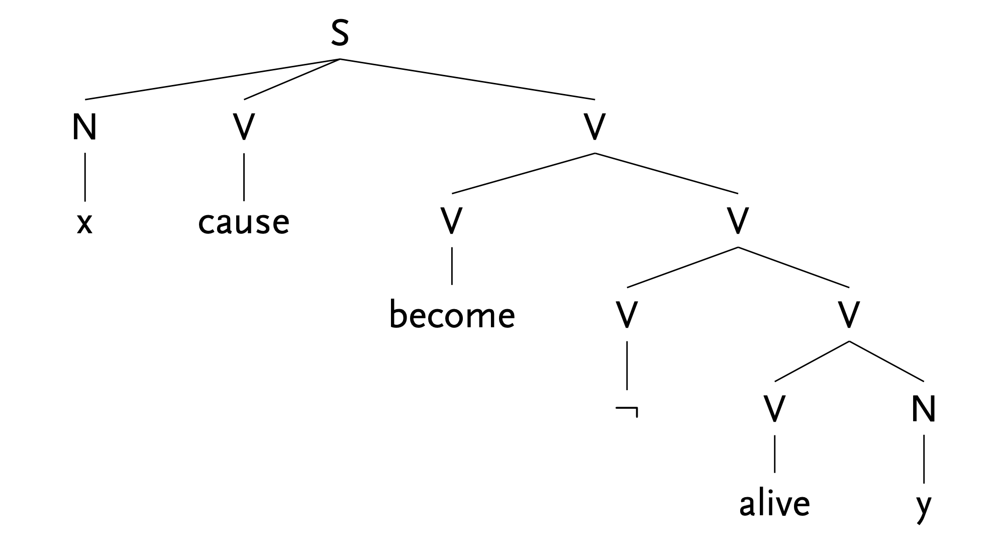

::: {.desc}
S =
:   proposities

N =
:   variabelen en constanten

V =
:   (complexe) predikaten, operatoren en kwantoren

:::

\subsection{Interpretatieve semantiek}

## Interpretatieve semantiek

* Transformaties zijn niet betekenisbehoudend
* Semantische interpretatie vindt plaats op het niveau van de oppervlaktestructuur

## Interpretatieve semantiek

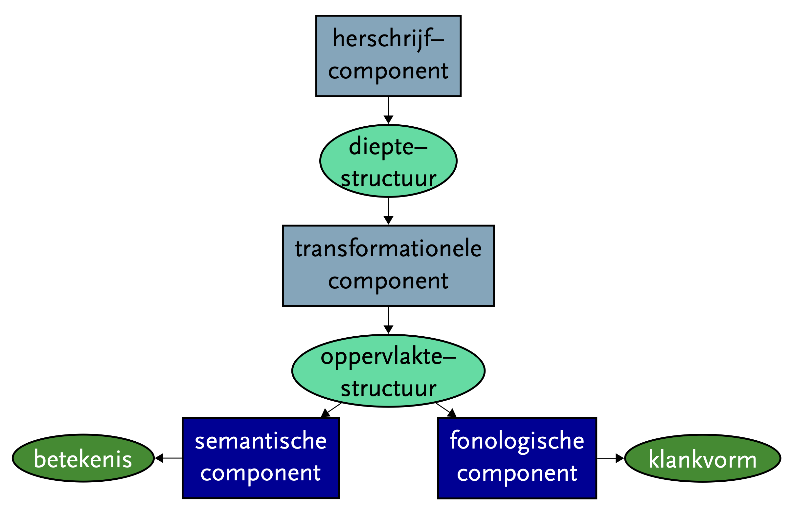

## Linguistics wars (1965-1975): Discussiepunten

::: columns
::: {.column width="80%"}
* Strijd tussen Generative Semanticists en Interpretative Semanticists

Discussiepunten

A. Betekenisrepresentaties van Gen Sem niet geslaagd

* Vreemde syntaxis: adjectieven en partikels als werkwoorden
* Vreemde logica: kwantoren en predikaten als zelfde categorie
* Betekenisbeschrijving wordt steeds uitgebreider, en daarmee onoverzichtelijker

:::

::: {.column width="20%"}
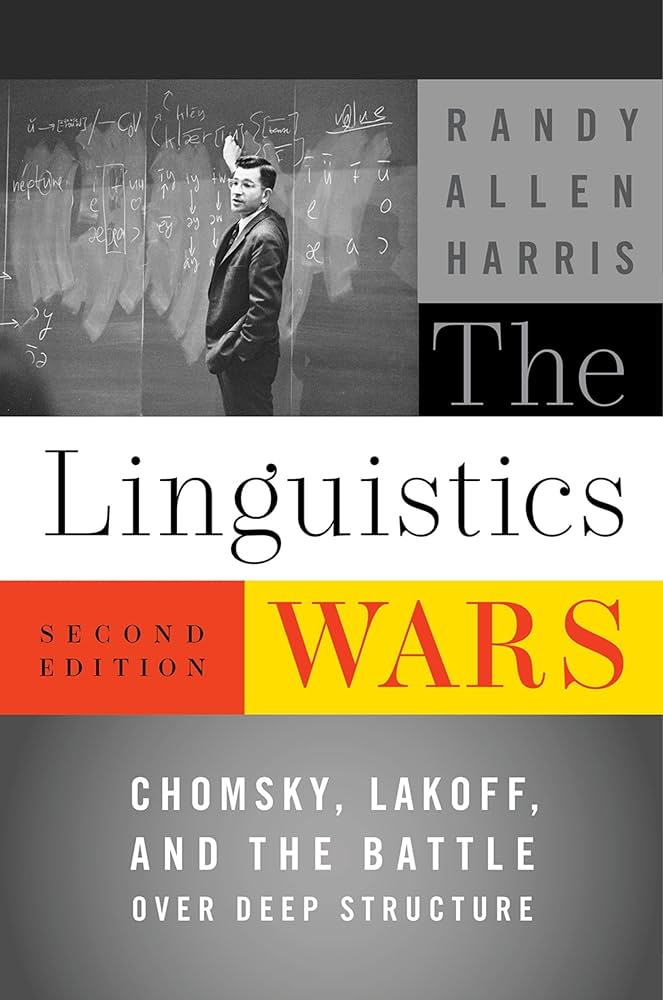

:::
:::

## Linguistics wars (1965-1975): Generative Semanticists

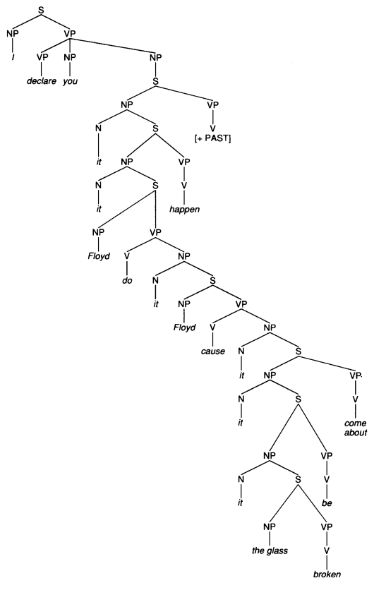

## Linguistics wars (1965-1975): Discussiepunten

B. Universaliteit

* Semantische component als basisrepresentatie maakt het taalmodel minder universeel
* Een minder universele theorie is minder leerbaar
* Omwille van leerbaarheidsvraagstuk hebben we behoefte aan een formele, autonome syntactische beschrijving

* Maar: er zouden andere, niet-universalistische oplossingen voor het leerbaarheidsprobleem ontwikkeld kunnen worden

## Linguistics wars (1965-1975): Discussiepunten

C. Zijn transformaties betekenisbehoudend?

(@) Iedereen in de aula spreekt twee talen.

* zin is ambigu
    * Collectieve lezing: dezelfde twee talen worden door iedereen gesproken
    * Distributieve lezing: elke persoon in de aula spreekt twee talen, maar dat zijn niet noodzakelijk dezelfde talen

(@) Twee talen worden door iedereen in de aula gesproken.

* geen ambiguïteit, het gaat steeds om dezelfde twee talen

## Linguistics wars (1965-1975): Gevolgen

* Strijd tussen Generative Semanticist en Interpretative Semanticists
* Generatieve semantiek delft het onderspit

$\rightsquigarrow$ Chomskyaanse grammatica wordt weer minder op betekenis georiënteerd

::: {.fragment}
Gevolgen op lange termijn

* Semantisch georiënteerde benaderingen buiten de formele grammatica
* Wildgroei aan vormen van formele grammatica zoals:

::: {.desc}
HPSG
:   Head-driven Phrase Structure Grammar

LFG
:   Lexical Functional Grammar

RRG
:   Role and Reference Grammar

:::
:::

# Naar een modulaire grammatica

## Plaats van de semantiek

In de loop van de jaren '70: grammaticale beschrijving valt uiteen in aparte modules

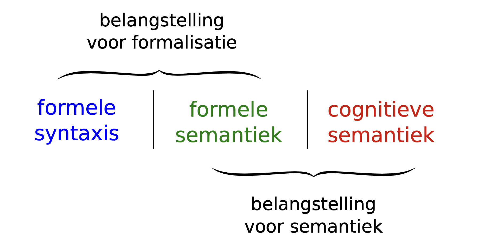

## Inperking van de grammaticale beschrijving

::: {.desc}
1916-1955
:  de [gespleten]{.alert2} grammatica (De Saussure)

1955-1980
:   de [geïsoleerde]{.alert2} grammatica (Chomsky)

1980-nu
:   de [gerecontextualiseerde]{.alert2} grammatica (post-Chomskyaanse linguïstiek)

:::

## Verschuiving

::: columns
::: {.column width="50%"}
Van het Saussureaanse hiaat...

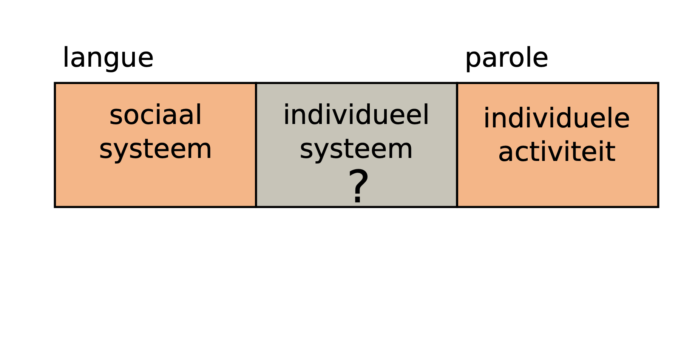

:::

::: {.column width="50%"}
... naar het Chomskyaanse hiaat

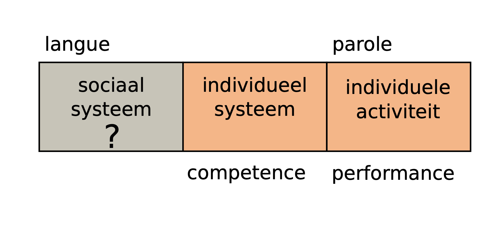

:::
:::

## Isolering van de grammatica als domino-effect

* Als de basis van taalkennis niet sociaal kan zijn, dan moet het taalvermogen genetisch zijn  
$\rightsquigarrow$  Als het genetisch is, dan kan het niet lexicaal of semantisch zijn  
$\rightsquigarrow$  Als het niet semantisch is, dan gaat het om formele taalregels  
$\rightsquigarrow$  Als het om de formele regels gaat, dan is de toepassing en het feitelijke gebruik daarvan irrelevant

## Autonomie van de syntaxis

* Een restrictieve strategie die de autonome syntaxis decontextualiseert, i.e. isoleert
    * van de sociale context
    * van de situationele context van het taalgebruik
    * van de cognitieve context van de ervaring

* Maar de "uitgestoten" disciplines worden in de periode 1970--1980 ontwikkeld als nieuwe, zelfstandige disciplines die los staan van de chomskyaanse kerngrammatica

## Autonomie van de syntaxis

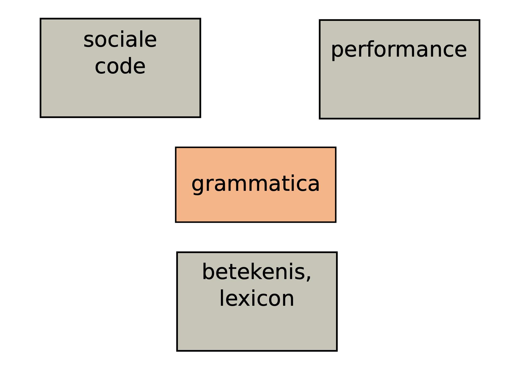

## Ontwikkeling van zelfstandige disciplines

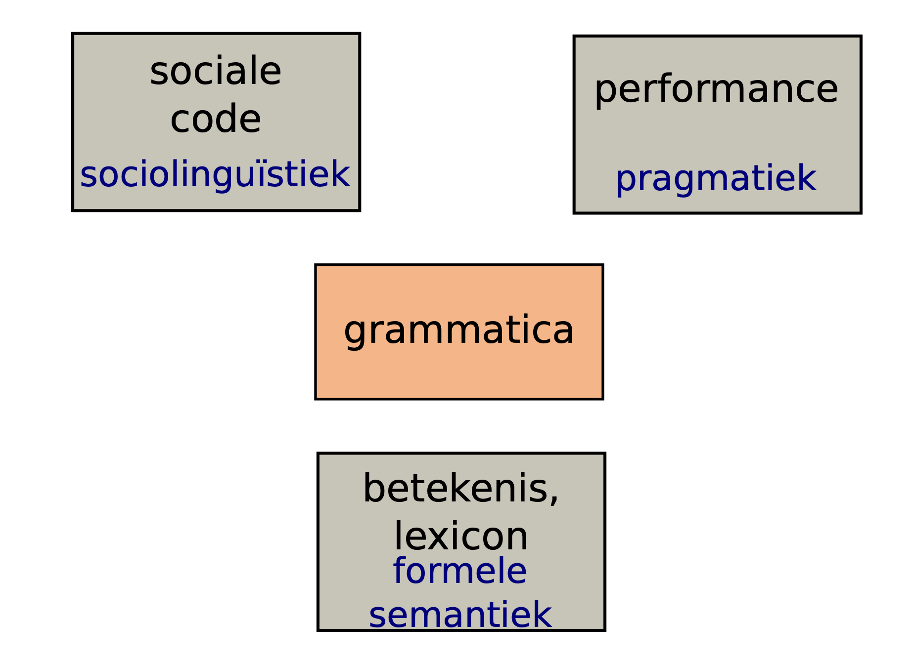

## Modulariteit

* Integratie van de verschillende perspectieven neemt de vorm aan van een [modulaire]{.alert2} grammatica
* Grammatica opgebouwd uit verschillende modules met eigen principes

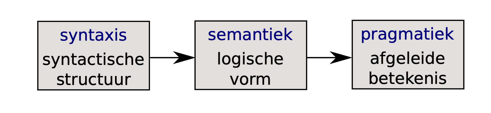

# Formele semantiek

## Montague Grammar

::: columns
::: {.column width="80%"}
* Enkele namen:
  * Richard Montague 1974, *Formal Philosophy*
  * David Dowty 1979, *Word Meaning and Montague Grammar*
  * Barbara Partee 1979, *Semantics: Mathematics or psychology?*

* Als semantiek een aparte module is...
* dan kan ze zelf verder uitgebouwd worden

* $\rightsquigarrow$  Aansluiting bij logische traditie van formalisatie
* "logical semantics"

:::

::: {.column width="20%"}
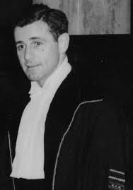

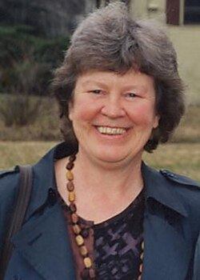

:::
:::

## Semantiek vanuit formeel oogpunt

* Betekenisbeschrijving veronderstelt een verwijzing naar een extralinguïstische werkelijkheid
* Een zin uitspreken is een bewering maken over de wereld
* Hoe weten we of die uitspraak waar is?
* [Waarheidscondities]{.alert2}: betekenis van een uitdrukking is de verzameling condities waaronder de uitdrukking waar is
* $\rightarrow$ truth-conditional semantics

## Bouwsteen 1: categoriale grammatica

Stel, we willen deze zinnen onderzoeken:

(@) Kim lacht.
(@) Kim eet de appel.
(@) Kim duwt Jan.

::: {.fragment}
Stap 1. Definiëren van een [ontologisch lexicon]{.alert2}, bestaande uit

* Basiscategorieën
    * eigennamen (Kim, Jan, ...): NP
    * naamwoorden (appel, stoel, ...): N
* Functiecategorieën
    * lidwoorden (de, het): `NP/N`
    * adjectieven (grote, rode, ...): `N/N`
    * intransitieve werkwoorden (slapen, lachen, ...): `NP\S`
    * transitieve werkwoorden (eten, duwen, ...): `(NP\S)/NP`

:::

## Bouwsteen 1: categoriale grammatica

Stap 2. Opbouwen syntactische constituenten door functie-applicatie

* Voorwaarts: `B/A`
    * een constituent die B wordt wanneer die *rechts* door een constituent A gevolgd wordt

* Achterwaarts: `A\B`
    * een constituent die B wordt wanneer die *links* door een constituent A voorafgegaan wordt

## Voorbeelden categoriale grammatica

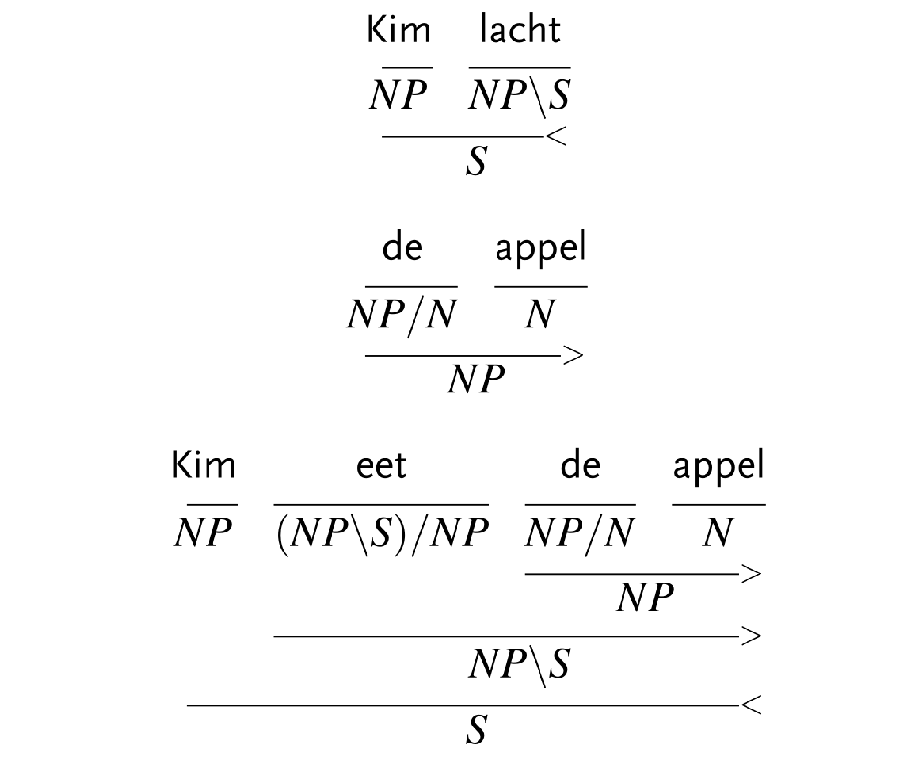

## Bouwsteen 2: compositionele semantiek

 * Betekenis van een volledige uitspraak wordt opgebouwd uit de betekenis van de samenstellende delen, en de manier waarop ze gecombineerd worden
 * Elk lexicaal element is gelinkt aan een semantische representatie (logische expressie)

::: columns
::: {.column width="20%"}

:::

::: {.column width="80%" .desc}
hond
:    $\lambda x.hond(x)$

rood
:   $\lambda x.rood(x)$

slaapt
:   $\lambda x.slaap(x)$

eet
:   $\lambda x.\lambda y.eet(x,y)$

:::
:::

* Door middel van syntactische analyse wordt de semantische representatie van een volledige zin opgebouwd
* Proces van logisch-semantische analyse: [lambda calculus]{.alert2}

## Voorbeeld

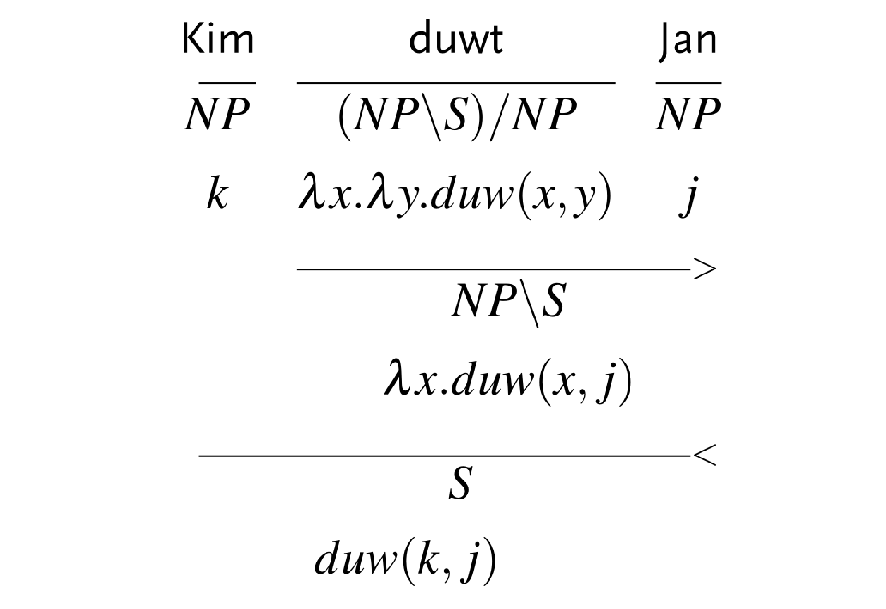

## Compositionele semantiek

Door semantische analyse verkrijgen we de waarheidscondities die moeten gelden om de uitdrukking als waar aan te nemen

Vaak een conjunctie van meerdere waarheidscondities:

(@) *a man loves a woman*
    $\exists x.man(x) \wedge \exists y.woman(y) \wedge loves(x,y)$

::: {.fragment}
[Lees het hier nog eens na](https://medium.com/@focusfronting/formal-semantics-with-as-little-math-as-possible-52e4bd9126ba) in een misschien meer toegankelijk artikel.

:::

## Potentiële bezwaren?

::: {.desc}
trivialiteit
: *"Snow is white" is true only if snow is white* (Alfred Tarski)

* maar het gaat niet om de trivialiteit, maar de compositionele opbouw van betekenissen

beperktheid
:  zegt deze methode iets over pragmatische betekenissen? over psychologische betekenissen gerelateerd aan de menselijke ervaring?

objectivisme
:  reductie tot referentiële verwijzing, wat met metaforen?

:::

# Pragmatiek

## Een pragmatisch perspectief

De betekenis van zinnen wordt in de (formele) semantiek gezien als [compositioneel.]{.alert2}

Maar merk op dat wat beschreven kan worden op die manier veel enger is dan hoe we taal gebruiken.

[Uitingen (utterances)]{.alert2} kunnen natuurlijk ook betekenis bevatten;  
alleen zit die betekenis (volgens bepaalde perspectieven) niet in de taal.

## Uitgangspunt: verschuiving

::: columns
::: {.column width="50%"}
Van het Saussureaanse hiaat...

:::

::: {.column width="50%"}
... naar het Chomskyaanse hiaat

:::
:::

* Een restrictieve strategie die de autonome syntaxis decontextualiseert, i.e. isoleert
    * van de sociale context
    * [van de situationele context van het taalgebruik]{.alert2}
    * van de cognitieve context van de ervaring

* Maar de "uitgestoten" disciplines worden in de periode 1970--1980 ontwikkeld als nieuwe, zelfstandige disciplines die los staan van de chomskyaanse kerngrammatica

## Ontwikkeling van zelfstandige disciplines

::: columns
::: {.column width="60%"}

:::

::: {.column width="40%"}
Drie nieuwe uitgestoten disciplines:

Formele semantiek
:   al behandeld

Pragmatiek
:   behandelen we nu

Sociolinguïstiek
:   behandelen we erna

:::

:::

## Voorlopers: Functional Sentence Perspective

::: columns
::: {.column width="80%"}
* Praagse School, m.n. Vilém Mathesius (1882-1945)
* opvatting over de verdeling van informatie in een zin
    * [topic]{.alert2} ([thema]{.alert2}, datgene wat in de context van tekst of gesprek al bekend is)
    * [comment]{.alert2} ([rhema]{.alert2}, wat daar aan nieuwe informatie aan toegevoegd wordt)

* Introductie van een tweede beschrijvingslaag bovenop de grammatica: de ordening van informatie in een tekst

* Verklaring voor variatie binnen de grammatica
    * bv. in het Nederlands: onderwerp is meestal topic
    * passieve zin: het logische subject is niet het grammaticale/discursieve (“psychologische”) subject

:::

::: {.column width="20%"}
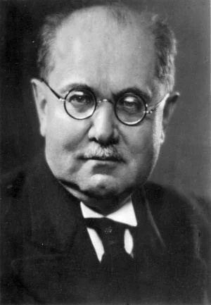

:::
:::

## Zes semiotische functies van taal

::: columns
::: {.column width="80%" .font80}
1. de [referent]{.alert2} van het bericht (de buitentalige werkelijkheid waarover gesproken wordt) $\rightarrow$ de [*referentiële*]{.alert2} taalfunctie: beschrijvend, verhalend
2. de [zender]{.alert2} (spreker/schrijver) van het bericht $\rightarrow$ de [*emotieve*]{.alert2} taalfunctie: uitdrukking gevend aan de houding van de zender
3. de [ontvanger]{.alert2} (hoorder/lezer) van het bericht $\rightarrow$ de [*conatieve*]{.alert2} taalfunctie: het gedrag van de ontvanger beïnvloedend (bevelen, verzoeken, etc.)
4. het [kanaal]{.alert2} (medium) van het bericht $\rightarrow$ de [*fatische*]{.alert2} taalfunctie: openen en vrij houden van het communicatiekanaal ("hallo?", "hallo!")
5. de [code]{.alert2} (taal, tekensysteem) van het bericht $\rightarrow$ de [*metalinguïstische*]{.alert2} taalfunctie: commentaar gevend bij het semiotische systeem waarin de boodschap vervat is (b.v. preciseringen)
6.  het [bericht]{.alert2} zelf $\rightarrow$ de [*poëtische*]{.alert2} taalfunctie: aandacht trekkend op de interne (formele of inhoudelijke) organisatie van het bericht
   
:::

::: {.column width="20%"}
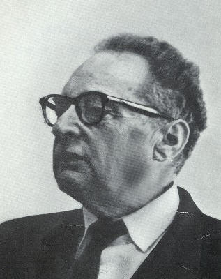

:::
:::

    

## Ontwikkeling van pragmatiek als zelfstandige discipline

::: columns
::: {.column width="60%"}
Als grammatica in se een gedecontextualiseerde module is, dan wil pragmatiek net wél de betekenis van [taaluitingen]{.alert2} bestuderen [in context]{.alert2}.

dwz.

* ook *performance* (niet enkel *competence*)
* ook context

(@) A: *Ik heb best wel honger.*  
    B:  *Ik ken een leuke plek.*

:::

::: {.column width="40%"}

:::
:::

## Pragmatische theorieën

Drie hoofdbenaderingen

* Taalhandelingstheorie (Speech Act Theory)
* Logische pragmatiek
* Conversatie- en discoursanalyse

## Taalhandelingstheorie (Speech Act Theory)

::: columns
::: {.column width="80%"}
* Grondlegger: John Austin (*How to do things with words*, 1962)

* Basisidee: spreken is niet alleen beschrijven, het is ook doen
* Taal wordt gebruikt voor verschillende dingen:
    * informatie geven
    * informatie vragen
    * een bevel geven
    * waarschuwen
    * ...

* Sprekers hebben een [communicatieve intentie]{.alert2}
* Taalhandelingstheorie beschrijft die intentie

:::

::: {.column width="20%"}
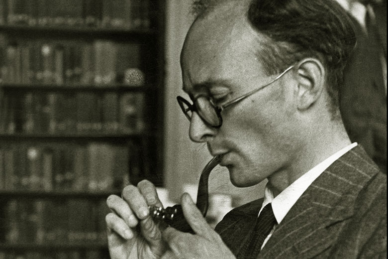

:::
:::

## Taalhandelingstheorie: basisbegrippen
    

* [Performatieve]{.alert2} werkwoorden, zoals *beloven*, die (wanneer gebruikt in de juiste context) doen wat ze zeggen
* [Locutionaire]{.alert2} taalhandeling: beschrijvende waarde van een uitspraak, de "letterlijke betekenis"
* [Illocutionaire]{.alert2} taalhandeling: de intentie van de uitspraak, wat wil de uitspraak teweegbrengen? (beloven, dreigen, excuseren, ...)
* [Perlocutionaire]{.alert2} taalhandeling: het effect van de uitspraak, welk resultaat bereikt de spreker bij de hoorder?
* [Felicity conditions]{.alert2}: de voorwaarden waaraan voor een geslaagde taalhandeling voldaan moet zijn 
* [Indirecte]{.alert2} taalhandeling: taalhandeling waarbij de illocutionaire waarde oppervlakkig gezien anders is dan bedoeld
     
## Logische pragmatiek

::: columns
::: {.column width="80%"}
* Grondlegger: Paul Grice (*Logic and Conversation*, 1975)

* Basisidee: de letterlijke betekenis van een uiting kan de basis zijn voor allerlei [implicaties]{.alert2} die minder onvermijdelijk zijn dan logische implicaties ([conversationele implicatuur]{.alert2})
* Extra betekenis kan verklaard worden door rationele conversatieregels die sprekers in acht nemen

:::

::: {.column width="20%"}
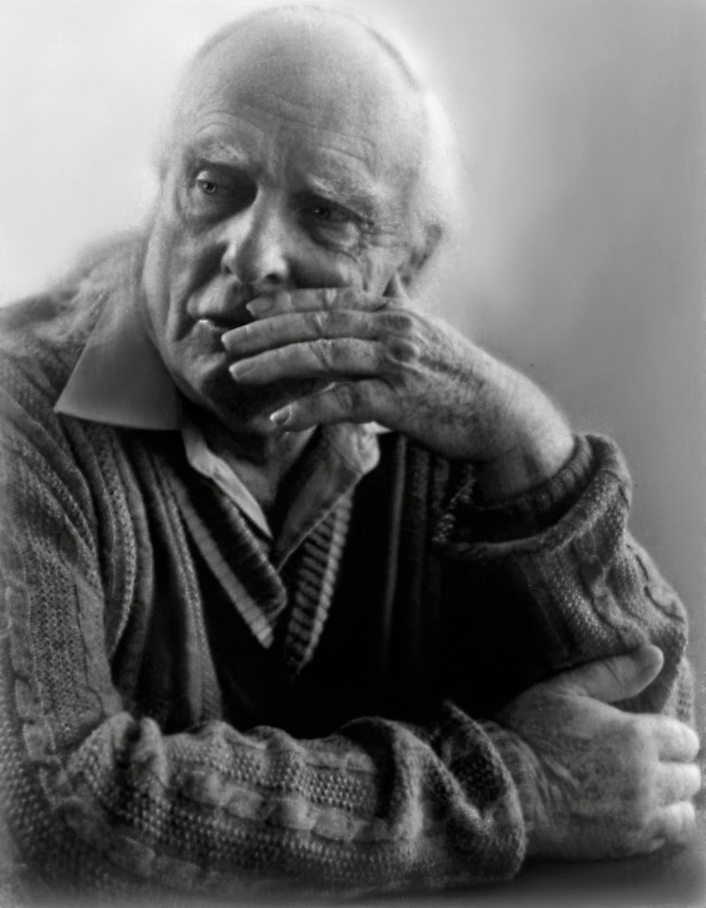

:::
:::

## Conversationele implicatuur: voorbeelden

(@) A: *Ik heb best wel honger.*  
    B:  *Ik ken een leuke plek.*

  
(@) *Jan heeft al drie verschillende banen gehad.*

$\rightarrow$ impliceert niet meer dan drie  
maar merk op: de implicatie is opzegbaar:  *Hij heeft er al vier gehad, om precies te zijn.*

## Conversationele implicatuur: principes

[Cooperative Principle]{.alert2}

> Make your contribution such as is required, at the stage at which it occurs, by the accepted purpose or direction of the talk exchange in which you are engaged. (Grice 1975: 26)

::: {.fragment}
Conversationele maximes preciseren het coöperatieve principe:

* [Quality]{.alert2}: "try to make your contribution one that is *true* (do not say what you believe to be false or for which you have no evidence)"
* [Quantity]{.alert2}: "make your contribution as *informative* as is required and do not make it more informative than is required"
* [Relation]{.alert2}: "be *relevant*"
* [Manner]{.alert2}: "be *perspicuous* (avoid obscurity and ambiguity, be orderly)"

:::

## Relevance Theory

::: columns
::: {.column width="80%"}
* Uit de ideeën van Grice groeit een nieuwere theorie, "Relevance Theory" (Dan Sperber & Deirdre Wilson, *Relevance*, 1986,  1995)

> [E]very utterance conveys the information that it is relevant enough for it to be worth the addressee's effort to process it.

::: {.fragment}
(@) Susan told me that her kiwis were too sour.

* [explicatuur]{.alert2}: Kan bv. zijn dat ze meedeed aan een wedstrijd en de jury vond haar kiwi's te zuur.  
  $\rightarrow$ veel context wordt afgeleid uit de uiting zelf, ervan uitgaande dat de uiting maximaal relevant is geuit.
* [implicatuur]{.alert2}: Susan is vedrdietig.  
  $\rightarrow$ afleiden door verder te denken wat de uiting communicatief wil bewerkstelligen.
* (grens niet altijd even duidelijk)

:::

:::

::: {.column width="20%"}
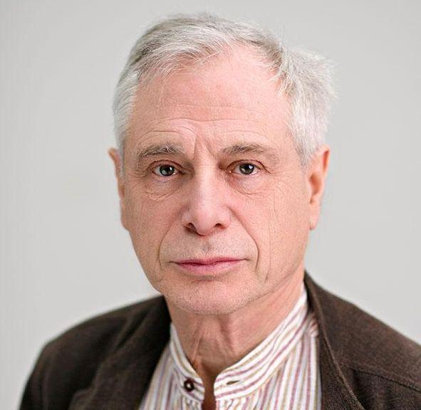

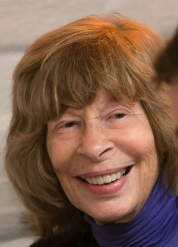

:::
:::

## Discoursanalyse

* Onderzoek naar structurerende elementen van teksten en conversaties
    * [discourse markers]{.alert2}: signaalwoorden die specifieke functies vervullen in opbouw van een tekst (voegwoorden zoals *want, maar*, partikels zoals *eh, nou, wel*, uitdrukkingen als *zie je, weet je*)
   * [informatiestructuur]{.alert2}: onderscheid thema/rhema (topic/comment); hoe wordt nieuwe informatie gesignaleerd?
   * beurtwisseling: welke principes bepalen de afwisseling van beurten ('turns') in een conversatie, en hoe worden die gesignaleerd?
   
3 perspectieven:

* [DA]{.alert2} (Discourse Analysis): taal is een sociale interactie, door uitingen op tekstniveau te bestuderen krijg je meer inzicht
* [CA]{.alert2} (Conversation Analysis): meest typische vorm van DA
* [CDA]{.alert2} (Critical Discourse Analysis): machtsverhoudingen bestuderen en hoe die zich uiten in taalgebruik

## Conversatieanalysie (CA)

::: columns
::: {.column width="60%"}
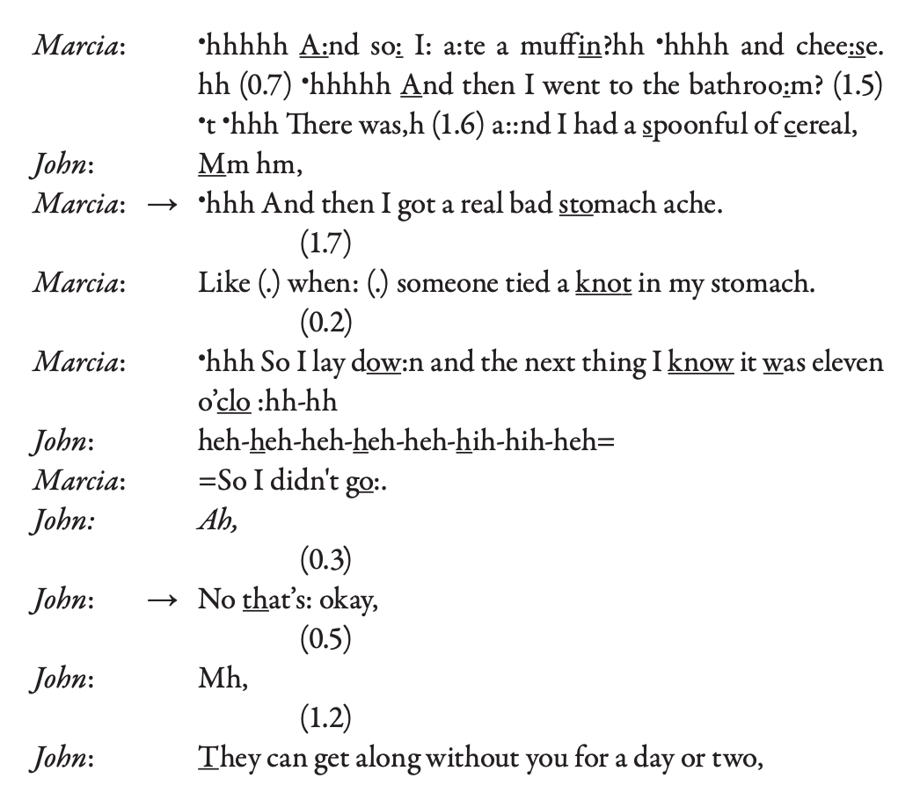

:::

::: {.column width="40%"}

Veel conventies

* = 'no gap between lines'
* \(\.\) 'tiny gap'
* : 'verlenging'
* _ 'nadruk'

(Jefferson conventies)

:::
:::

 

## Toepassingen

* 8 december: Line Winkelmans over de discourse marker *allee*
* 15 december: Kaat De Gueldre over problemen met de taalwet, wat blijkt uit multimodale discoursanalyse

